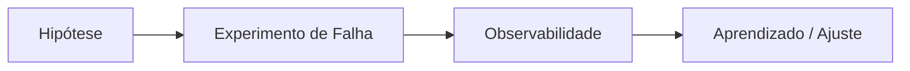

# Chaos Engineering

## 1. O que é

Chaos Engineering é uma disciplina que consiste em introduzir falhas controladas em sistemas de produção ou ambientes próximos a ele para descobrir vulnerabilidades e validar a resiliência. Em vez de esperar que algo quebre de forma inesperada, a equipe provoca falhas intencionalmente, como desligar instâncias, simular latência ou perder pacotes, para observar o comportamento do sistema sob estresse real.

Também é chamado de resilience testing, fault injection ou controlled failure testing. O princípio é aprender com falhas antes que elas afete o cliente de forma crítica.

## 2. Por que existe (o problema que resolve)

O problema que resolve é a limitação da análise estática e dos testes convencionais. Um sistema pode parecer resiliente em laboratório, mas falhar em produção por causa de fatores complexos: dependências invisíveis, gargalos de rede, comportamento de carga inesperado e padrões de falha não previstos. Chaos Engineering permite validar hipóteses de resiliência com experimentos controlados.

Esse conceito foi popularizado por empresas como Netflix, que desenvolveram ferramentas como o Chaos Monkey para testar a capacidade de suportar falhas de instância.

## 3. Como funciona

O fluxo é:

1. A equipe define uma hipótese de resiliência.
2. Ela escolhe uma falha a ser injetada.
3. O experimento é executado sob controle.
4. O sistema é observado para ver se a hipótese se confirma.
5. Os problemas encontrados são corrigidos e o experimento é repetido.

Componentes envolvidos:

- Experimento: falha controlada injetada.
- Observabilidade: métricas, logs, traces e alertas.
- Orquestrador de caos: executa o experimento.
- Equipe de engenharia e operação: avalia o impacto.

## 4. Casos de uso reais

- Netflix, Google, Amazon e outras empresas com ambientes distribuidos enormes.
- Plataformas de pagamento e e-commerce com requisitos de alta disponibilidade.
- Sistemas com múltiplos microsserviços e dependências complexas.
- Infraestrutura em nuvem com auto-scaling e failover.

Quando não usar:

- Quando o sistema não possui observabilidade suficiente.
- Quando a falha controlada pode causar risco significativo ao negócio.
- Quando a equipe ainda não tem processo claro de rollback e contenção.

## 5. Cenários práticos e trade-offs

Cenário 1: Reinicialização de instância

- O experimento simula a morte de uma instância e mede o comportamento do sistema.
- Trade-offs: melhora confiança na resiliência, mas pode perturbá-la temporariamente.

Cenário 2: Latência artificial

- O experimento adiciona latência em uma dependência para observar o efeito em cascata.
- Trade-offs: revela problemas reais, mas pode impactar clientes sem controle rigoroso.

Cenário 3: Falha de rede parcial

- O experimento simula perda de pacotes ou isolamento de um nó.
- Trade-offs: ajuda a validar recuperação, mas exige isolamento cuidadoso e monitoramento.

Trade-offs gerais:

- Resiliência: aumenta muito.
- Risco operacional: existe, mesmo com controle.
- Complexidade: exige planejamento, automação e cultura de aprendizado.
- Custo: demanda observabilidade e vezes de execução.

## 6. Diagrama e fluxo visual

a) Diagrama em Mermaid



b) Prompt para geração de imagem

“Create a conceptual illustration of chaos engineering. Show a controlled fault injection experiment in a distributed system, with monitoring dashboards and a team analyzing the impact of the induced failure.”

## 7. Exemplo aplicado — Java + Spring

```java
package com.example.chaos;

import org.springframework.stereotype.Service;

@Service
public class PaymentService {
    public String charge(String orderId) {
        return "Charged " + orderId;
    }
}
```

Pontos-chave:

- O experimento em si pode ser rodado por ferramentas externas ou por automação em ambiente controlado.
- O ponto principal é validar comportamento sob falha, não apenas o sucesso normal.

## 8. Exemplo aplicado — TypeScript + NestJS

```ts
import { Injectable } from '@nestjs/common';

@Injectable()
class PaymentService {
  charge(orderId: string): string {
    return `Charged ${orderId}`;
  }
}
```

Pontos-chave:

- O exemplo mostra o serviço principal; em produção, a experimentação seria feita por infraestrutura e ferramentas de fault injection.
- O conceito é mais sobre testar o sistema do que alterar o código de negócio.

## 9. Comparação e armadilhas comuns

Comparação rápida:

- Chaos Engineering x testes de unidade: testes unitários validam comportamento esperado; chaos engineering valida comportamento sob falha real.
- Chaos Engineering x load testing: o load test aumenta volume; o chaos engineering introduz falhas específicas.

Erros comuns:

1. Fazer experimentos sem clareza sobre o impacto esperado.
2. Ignorar observabilidade antes de começar.
3. Tratar o experimento como “teste de estresse” e não como uma hipótese de resiliência.

## 10. Perguntas para fixação

1. Qual hipótese de resiliência você validaria primeiro em um sistema crítico?
2. Como você evitaria que um experimento de caos impactasse clientes reais?
3. O que diferencia chaos engineering de um simples teste de carga?
