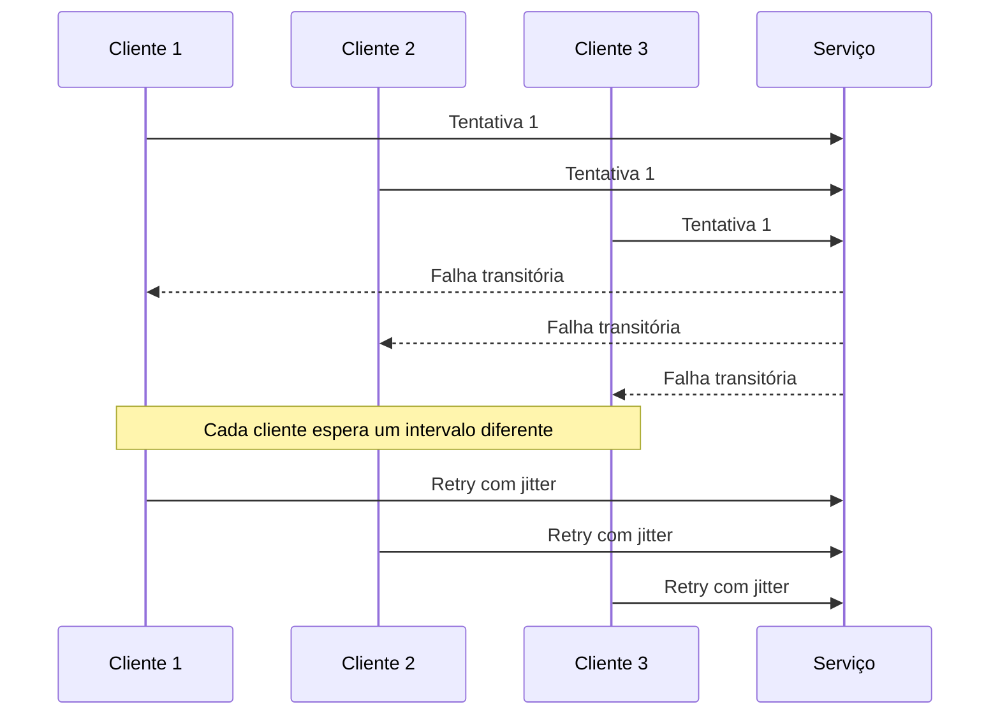

# Jitter

## 1. O que é

Jitter é a introdução de uma variação aleatória ou controlada no tempo, no intervalo ou na distribuição de eventos para evitar sincronização excessiva entre componentes. Em sistemas distribuídos, ele é usado principalmente para desalinhar tentativas simultâneas, reprocessamentos, refreshes de cache, cron jobs e reconexões.

A ideia central é simples: em vez de todos os clientes ou processos tentarem algo ao mesmo tempo, o sistema espalha essas ações no tempo. Isso reduz picos de carga, melhora a resiliência e evita que uma falha temporária se transforme em uma onda de sobrecarga coletiva.

Nomes alternativos e sinônimos usados no mercado:

- Randomized delay
- Stochastic delay
- Jittered interval
- Randomized backoff
- Delay spreading
- Desynchronization

Variações/tipos mais comuns:

- Full Jitter
- Equal Jitter
- Decorrelated Jitter
- Jitter em Retry
- Jitter em Cache TTL
- Jitter em Cron Jobs
- Jitter em Reconexões

## 2. Por que existe (o problema que resolve)

O problema que jitter resolve é a sincronização indesejada entre múltiplos clientes ou processos. Quando vários componentes tentam a mesma operação ao mesmo tempo, o sistema pode entrar em um padrão de pico coordenado: muitos requests chegando juntos, muitas tentativas simultâneas, muitos workers reprocessando ao mesmo tempo e muitos jobs iniciando na mesma janela.

Esse fenômeno é especialmente comum em:

- retries após falhas transitórias
- reconexões após quedas de rede
- refresh de cache em múltiplos nós
- execução de cron jobs em várias instâncias

Antes de usar jitter, sistemas frequentemente entravam em um efeito em cascata. Uma falha inicial fazia com que muitos clientes tentassem novamente ao mesmo tempo, aumentando a carga sobre a dependência e prolongando o problema. Esse comportamento ficou famoso em ambientes de retry storm e em sistemas com sincronização de recuperação.

O conceito é amplamente usado em redes, protocolos de comunicação, sistemas distribuídos e arquiteturas de resiliência. Em produção, ele se tornou uma técnica essencial para reduzir colisão de tentativas e melhorar a estabilidade sob picos e degradação.

## 3. Tipos e características

### Full Jitter

Como funciona:

- O atraso é escolhido aleatoriamente dentro de um intervalo definido.
- Exemplo: um atraso entre 0 ms e 500 ms, escolhido ao acaso para cada tentativa.

Prós específicos:

- Muito eficaz para quebrar sincronização entre múltiplos clientes.
- Simples de entender e implementar.

Contras específicos:

- Pode gerar espera muito curta em alguns casos, reduzindo o efeito de proteção.
- Pode ser menos previsível para fins de observabilidade e testes.

Camada de infraestrutura:

- Aplicação, clientes HTTP, bibliotecas de retry e sistemas de fila.

Quando escolher:

- Quando o objetivo principal é desalinhar tentativas e evitar picos simultâneos.

### Equal Jitter

Como funciona:

- O atraso é calculado como uma mistura entre um atraso base e uma variação aleatória.
- Exemplo: atraso = base + jitter aleatório / 2.

Prós específicos:

- Mantém um limite mínimo de espera, o que pode ser melhor que full jitter em alguns cenários.
- Reduz o risco de tentativas muito rápidas.

Contras específicos:

- Menos agressivo na desincronização do que full jitter puro.
- Requer ajuste mais fino para não ficar muito previsível.

Camada de infraestrutura:

- Aplicação e middleware de retry.

Quando escolher:

- Quando se quer um equilíbrio entre dispersão e tempo mínimo de espera.

### Decorrelated Jitter

Como funciona:

- O atraso de cada tentativa é calculado com base no atraso anterior, mas com uma componente aleatória que impede a sincronização.
- É mais sofisticado que full jitter e equal jitter.

Prós específicos:

- Mais robusto em ambientes com múltiplos clientes e falhas recorrentes.
- Evita que todos os clientes converjam para o mesmo padrão de retry.

Contras específicos:

- Mais complexo de implementar e explicar.
- Pode ser difícil de depurar sem boa observabilidade.

Camada de infraestrutura:

- Aplicação, SDKs, gateways, middleware e sistemas distribuídos.

Quando escolher:

- Em sistemas de larga escala onde retry storm e sincronização são riscos reais.

### Jitter em Retry

Como funciona:

- O jitter é aplicado ao intervalo entre tentativas de uma operação após falha.
- É usado frequentemente junto com exponential backoff.

Prós específicos:

- Reduz retry storm.
- Melhora a chance de recuperação do downstream.

Contras específicos:

- Pode aumentar a latência total da operação.
- Pode complicar políticas de SLA se não forem bem calibradas.

Camada de infraestrutura:

- Aplicação e clientes remotos.

Quando escolher:

- Quando a operação depende de serviços externos ou instáveis.

### Jitter em Cache TTL

Como funciona:

- O TTL de um item em cache é “esticado” ou “desalinhar” com uma variação aleatória para que múltiplos nós não expirem ao mesmo tempo.

Prós específicos:

- Evita que vários nós recarreguem o mesmo valor simultaneamente.
- Reduz picos de carga em origem de dados.

Contras específicos:

- Pode reduzir a eficiência do cache em alguns cenários se a dispersão for muito alta.
- Requer cuidado para não prejudicar a consistência esperada.

Camada de infraestrutura:

- Cache distribuído, edge e camadas de aplicação.

Quando escolher:

- Em sistemas com cache distribuído e múltiplos nós atualizando ao mesmo tempo.

### Jitter em Cron Jobs

Como funciona:

- A execução de jobs agendados é deslocada por um intervalo aleatório ou controlado para evitar que todos os workers iniciem ao mesmo tempo.

Prós específicos:

- Evita sobrecarga simultânea em horários de execução.
- Melhora a estabilidade de pipelines e tarefas periódicas.

Contras específicos:

- Pode degradar a previsibilidade do agendamento.
- Requer bom controle para não quebrar SLAs de job.

Camada de infraestrutura:

- Orquestração de jobs, schedulers e workers.

Quando escolher:

- Quando vários nós ou containers executam a mesma tarefa programada.

### Jitter em Reconexões

Como funciona:

- Depois de uma falha de conexão, o cliente espera um intervalo aleatório antes de tentar se reconectar.

Prós específicos:

- Evita que vários nós tentem reconectar ao mesmo tempo.
- Reduz colisões em serviços que voltam ao ar.

Contras específicos:

- Pode aumentar o tempo de recuperação percebido.
- Pode causar atraso em operações críticas se a reconexão demorar demais.

Camada de infraestrutura:

- Rede, transporte, clientes de conexão e brokers.

Quando escolher:

- Quando a reconexão de múltiplos nós pode gerar um novo pico de pressão.

## 4. Como funciona (mecanismo interno)

O mecanismo interno de jitter é relativamente simples, mas pode ter detalhes importantes:

1. Um evento é programado para acontecer.
2. Em vez de ocorrer exatamente no tempo previsto, ele recebe um atraso adicional ou variável.
3. Esse atraso é calculado por uma função de distribuição, que pode ser:
   - uniforme
   - exponencial
   - decorrelated
   - adaptativa
4. O evento é então executado em um momento diferente, reduzindo a sincronização.

Componentes envolvidos:

- Gerador de aleatoriedade: define o valor do jitter.
- Estratégia de delay: define se o jitter será adicionado a um valor base ou substituído por ele.
- Scheduler: controla o tempo real de execução.
- Política de retry ou de refresh: combina jitter com a lógica de repetição.
- Observabilidade: mede se o comportamento está desalinhando corretamente.

Estratégias comuns:

- Full jitter: delay = random(0, maxDelay)
- Equal jitter: delay = baseDelay + random(0, baseDelay / 2)
- Decorrelated jitter: delay = random(minDelay, previousDelay * multiplier)

Essas estratégias são normalmente usadas junto com backoff, mas o conceito vai além: qualquer evento sincronizado pode se beneficiar de jitter.

## 5. Onde e como se aplica na prática

### Nível de máquina/processo único

Jitter pode existir dentro de um processo simples, por exemplo:

- um worker que tenta reprocessar uma mensagem depois de erro
- um scheduler local que espalha execução de tarefas em um único nó
- uma aplicação que reabre conexões com um atraso aleatório

### Nível de infraestrutura on-premise/self-managed

Ferramentas concretas e padrões reais:

- NGINX e HAProxy: podem ajudar a distribuir carga e reduzir sincronização em backends
- Envoy: oferece políticas de retry e timeouts que podem ser combinadas com jitter em gateways
- Kafka: consumidores podem aplicar estratégias de retry e reprocessamento espaçado
- RabbitMQ: redelivery e requeue podem ser distribuídos no tempo
- Redis: TTL jitter e rebalancing de conexões podem reduzir picos

### Nível de nuvem/managed service

Serviços e plataformas reais:

- AWS: SQS, Lambda, EventBridge, ECS, EKS
- GCP: Cloud Pub/Sub, Cloud Run, GKE
- Azure: Service Bus, Functions, AKS

Na nuvem, jitter é frequentemente usado em:

- retry de chamadas a APIs gerenciadas
- reprocessamento de mensagens em filas gerenciadas
- execução de jobs em múltiplas instâncias
- reconexões automáticas de clientes distribuídos

### Nível de orquestração/Kubernetes

No Kubernetes, jitter aparece em:

- CronJobs com horários desviados para evitar simultaneidade
- controllers de reconciliação e retries
- service mesh como Istio, onde políticas de retry podem incluir delay e jitter
- autoscaling e rebalancing, que podem ser suavizados para evitar picos

## 6. Casos de uso reais e quando NÃO usar

Casos de uso reais:

1. Retry de APIs externas: um cliente tenta chamar uma API de pagamento e usa full jitter para evitar retry storm.
2. Cache distribuído: vários nós expirando uma chave ao mesmo tempo podem gerar pico de carga; jitter no TTL ajuda a desalinhar isso.
3. Cron jobs: múltiplos workers executando a mesma tarefa às 03:00 podem levar a sobrecarga; jitter distribui o início.
4. Reconexões em brokers: centenas de clientes tentando se conectar após uma queda podem gerar colisão; jitter reduz essa pressão.
5. Reprocessamento de mensagens: consumidores de fila reprocessam mensagens falhas com intervalo aleatório.

Quando NÃO usar ou evitar:

- Quando a operação precisa ser extremamente determinística e previsível.
- Quando o atraso aleatório pode violar SLA ou deadline rígido.
- Quando o sistema já é suficientemente distribuído e o jitter não traz benefício real.
- Quando a operação é de baixa importância e a aleatoriedade não compensa a complexidade.
- Quando a causa do problema não é sincronização, e sim uma falha estrutural ou um gargalo real.

## 7. Cenários práticos e trade-offs

### Cenário 1: Retry storm em API externa

1. A API cai temporariamente.
2. Milhares de clientes tentam novamente ao mesmo tempo.
3. Sem jitter, a dependência é inundada.
4. Com full jitter ou decorrelated jitter, as tentativas são espalhadas.
5. A recuperação é mais estável e a latência média melhora.

### Cenário 2: Expiração simultânea de cache

1. Vários nós compartilham o mesmo valor em cache.
2. O TTL expira ao mesmo tempo em todos.
3. Todos tentam recarregar simultaneamente.
4. Com jitter no TTL, cada nó recarrega em um momento diferente.
5. A origem de dados sofre menos pico de carga.

### Cenário 3: Falha de reconexão em cluster

1. O broker fica indisponível por alguns segundos.
2. Vários clientes tentam reconectar ao mesmo tempo.
3. O serviço retorna a carga de forma sincronizada.
4. Com jitter nas reconexões, a recuperação é mais suave.
5. A tendência de thundering herd é reduzida.

Tabela de trade-offs:

| Tipo | Latência | Consistência | Custo operacional | Complexidade | Resiliência |
| --- | --- | --- | --- | --- | --- |
| Full Jitter | Baixa a média | Boa | Baixo | Baixa | Alta |
| Equal Jitter | Média | Boa | Baixo a médio | Baixa a média | Alta |
| Decorrelated Jitter | Média a alta | Boa | Médio | Média | Muito alta |
| Jitter em Retry | Média | Boa, se idempotente | Médio | Média | Alta |
| Jitter em Cache TTL | Média | Boa, mas depende do TTL | Baixo a médio | Média | Alta |
| Jitter em Cron Jobs | Média | Boa | Baixo | Baixa | Média |
| Jitter em Reconexões | Média | Boa | Baixo | Baixa a média | Alta |

## 8. Diagrama e fluxo visual

### a) Diagrama em Mermaid



### b) Prompt para geração de imagem

“Create a conceptual illustration of jitter in distributed systems. Show multiple clients retrying a request to a service after a temporary failure, each waiting a different randomized delay to avoid synchronization, with a monitoring dashboard and a cloud architecture background.”

## 9. Exemplo aplicado — Java + Spring

Abaixo um exemplo simples com Spring Boot usando exponential backoff com jitter.

```java
package com.example.orders;

import java.util.concurrent.ThreadLocalRandom;
import java.util.concurrent.TimeUnit;

public class RetryWithJitter {
    public static void main(String[] args) throws Exception {
        RetryWithJitter service = new RetryWithJitter();
        service.callWithRetry();
    }

    public void callWithRetry() throws Exception {
        int maxAttempts = 5;
        int baseDelayMs = 200;

        for (int attempt = 1; attempt <= maxAttempts; attempt++) {
            try {
                doWork();
                System.out.println("Success on attempt " + attempt);
                return;
            } catch (RuntimeException ex) {
                if (attempt == maxAttempts) {
                    throw ex;
                }

                int exponentialDelay = baseDelayMs * (1 << (attempt - 1));
                int jitter = ThreadLocalRandom.current().nextInt(0, 150);
                int totalDelay = exponentialDelay + jitter;

                System.out.println("Attempt " + attempt + " failed. Waiting " + totalDelay + "ms before retry.");
                TimeUnit.MILLISECONDS.sleep(totalDelay);
            }
        }
    }

    private void doWork() {
        throw new RuntimeException("Temporary failure");
    }
}
```

Pontos-chave:

- O atraso cresce exponencialmente.
- O jitter adiciona aleatoriedade para desalinhar as tentativas.
- Esse padrão é útil em clientes, workers e integrações externas.

## 10. Exemplo aplicado — TypeScript + NestJS

```ts
import { Injectable } from '@nestjs/common';

@Injectable()
export class PaymentService {
  async charge(orderId: string): Promise<string> {
    return this.retryWithJitter(async () => {
      throw new Error('Temporary gateway failure');
    }, 4);
  }

  private async retryWithJitter<T>(
    operation: () => Promise<T>,
    maxAttempts: number,
    baseDelayMs = 200,
  ): Promise<T> {
    let attempt = 0;

    while (true) {
      try {
        return await operation();
      } catch (error) {
        attempt++;
        if (attempt >= maxAttempts) {
          throw error;
        }

        const exponentialDelay = baseDelayMs * Math.pow(2, attempt - 1);
        const jitter = Math.floor(Math.random() * 100);
        const totalDelay = exponentialDelay + jitter;

        await new Promise(resolve => setTimeout(resolve, totalDelay));
      }
    }
  }
}
```

Pontos-chave:

- O código usa exponential backoff e jitter.
- O valor aleatório evita que todos os retries sejam sincronizados.
- Em produção, seria adequado encapsular isso em um utilitário reutilizável.

## 11. Comparação e armadilhas comuns

### Diferença com conceitos parecidos

- Jitter vs Backoff: backoff define o crescimento do atraso; jitter adiciona aleatoriedade ao atraso.
- Jitter vs Randomização arbitrária: jitter não é apenas “esperar um tempo aleatório”; ele é uma técnica de distribuição controlada para reduzir sincronização.
- Jitter vs Rate limiting: jitter espalha eventos no tempo; rate limiting limita a quantidade de eventos por unidade de tempo.

### Erros comuns de implementação

1. Usar jitter sem um valor base ou limite seguro: pode gerar delays muito curtos ou muito longos.
2. Aplicar jitter em operações que exigem determinismo estrito: pode prejudicar testes e previsibilidade.
3. Ignorar idempotência nas retries: mesmo com jitter, reexecuções podem causar efeitos colaterais.
4. Não combinar com observabilidade: sem métricas, é difícil validar se o jitter realmente está reduzindo picos.

## 12. Perguntas para fixação

1. Qual é a diferença prática entre full jitter e equal jitter?
2. Por que decorrelated jitter é geralmente mais robusto que full jitter em sistemas distribuídos?
3. Como jitter ajuda a reduzir retry storm?
4. Em que cenários jitter em cache TTL é mais útil do que jitter em retry?
5. Como você compararia jitter em reconexões com jitter em cron jobs em termos de benefício operacional?
