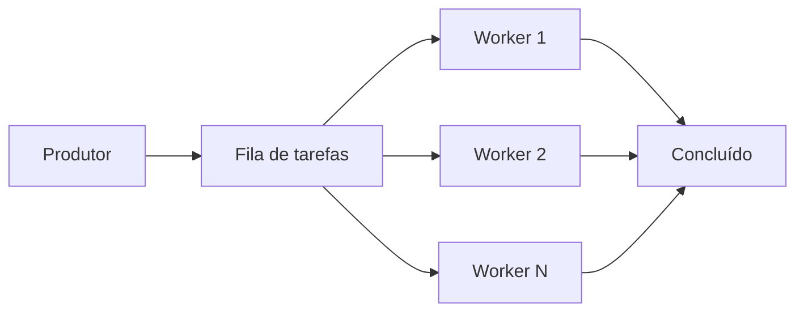

## 1. O que é

Worker pool é um padrão de arquitetura de concorrência em que um conjunto fixo ou elástico de workers executa tarefas retiradas de uma fila compartilhada.

Sinônimos: thread pool, worker pool, worker pool pattern, pool de trabalhadores.

Tipos/camadas:

- Fixed worker pool
- Dynamic worker pool
- Bounded worker pool
- Unbounded worker pool
- Fork-join pool

## 2. Por que existe (o problema que resolve)

O padrão surgiu para controlar o uso de recursos em sistemas com muitas tarefas concorrentes. Antes dele, programas iniciavam threads ou processos para cada trabalho, resultando em overhead excessivo, contenção e esgotamento de CPU/memória.

A prática foi consolidada em servidores web e sistemas de processamento em lote, onde o gerenciamento manual de threads era insustentável.

## 3. Tipos e características

### Fixed worker pool

Como funciona: mantém número fixo de workers que processam tarefas da fila.
Prós: previsibilidade de recursos.
Contras: pode subutilizar CPU em cargas baixas ou ficar saturado em picos.
Camada: aplicação/runtime.
Quando usar: quando você conhece a capacidade de threads e deseja limitar concorrência.

### Dynamic worker pool

Como funciona: ajusta o número de workers de acordo com a carga.
Prós: melhor aproveitamento de recursos.
Contras: necessidade de política de escala e risco de overprovision.
Camada: aplicação/runtime.
Quando usar: em sistemas com carga variável.

### Bounded worker pool

Como funciona: usa limites na fila e número de workers para evitar crescimento infinito.
Prós: protege o sistema de overload.
Contras: rejeita ou bloqueia tarefas quando lotado.
Camada: aplicação.
Quando usar: quando é necessário controlar carga e evitar OOM.

### Unbounded worker pool

Como funciona: aceita tarefas infinitamente e cria workers conforme necessário.
Prós: alta throughput potencial.
Contras: pode esgotar recursos rapidamente.
Camada: aplicação.
Quando usar: apenas quando o sistema tem garantia de tráfego controlado.

### Fork-join pool

Como funciona: divide tarefas em subtarefas recursivas e une resultados.
Prós: eficiente para processamento paralelo de divide-and-conquer.
Contras: nem sempre ideal para I/O bound.
Camada: aplicação.
Quando usar: em algoritmos de processamento paralelo, como busca ou transformação de dados.

## 4. Como funciona (mecanismo interno)

Componentes:

- Queue de tarefas
- Workers (threads, processos, corrotinas)
- Scheduler / dispatcher
- Estratégia de enfileiramento

Fluxo:

1. Produtor agenda tarefa na fila.
2. Dispatcher atribui a tarefa a um worker livre.
3. Worker executa a tarefa e sinaliza conclusão.
4. Worker retorna ao pool e busca nova tarefa.

Algoritmos/estratégias:

- Round-robin ou FIFO para distribuição de tarefas.
- Backpressure ou rejeição quando a fila atinge limite.
- Keep-alive e timeout de workers ociosos.

## 5. Onde e como se aplica na prática

### Nível de máquina/processo único

Em Java, `ExecutorService` (`ThreadPoolExecutor`) é um worker pool local; em Node.js, um worker pool pode ser implementado com `worker_threads` ou `bull`.

### Nível de infraestrutura on-premise/self-managed

Ferramentas: RabbitMQ, Kafka, Celery, Resque, Sidekiq — todos usam pools de workers para processar filas.

### Nível de nuvem/managed service

AWS: AWS Batch, Amazon SQS + AWS Lambda com concurrency control.
GCP: Cloud Tasks, Cloud Run with concurrency settings.
Azure: Azure Functions com host concurrency, Azure Service Bus.

### Nível de orquestração/Kubernetes

Kubernetes: Jobs e CronJobs, Horizontal Pod Autoscaler e custom controllers podem atuar como worker pools para processar filas.

## 6. Casos de uso reais e quando NÃO usar

### Casos de uso reais

1. Apache Kafka consumers: consumer group é um pool de workers que processa partições.
2. Java thread pool em Tomcat para requisições HTTP.
3. Celery workers processando tarefas assíncronas.
4. Kubernetes cron-job com pods workers para ETL.

### Quando NÃO usar ou evitar

- Sistemas estritamente I/O-bound com event loop eficiente: thread pool pode ser ineficiente.
- Cenários sem controle de fila: worker pool não resolve origem de overload.
- Aplicações CPU-bound com muitos context switches: worker pool precisa ser limitado.
- Tarefas curtas demais com overhead alto de despacho: use processamento batched.

## 7. Cenários práticos e trade-offs

### Cenário 1: pico de mensagens

Um sistema de processamento de pedidos enfileira eventos no Kafka. Um bounded worker pool processa eventos até a capacidade do serviço.

### Cenário 2: falha de worker

Um worker trava durante a execução. O scheduler detecta a falha e reenvia a tarefa após timeout.

### Cenário 3: crescimento elástico

Em uma carga variável, um dynamic pool expande workers até o limite máximo e contrai quando o backlog diminui.

| Tipo | Latência | Consistência | Custo operacional | Complexidade de implementação | Resiliência |
|---|---|---|---|---|---|
| Fixed | Médio | Alto | Médio | Baixo | Alto |
| Dynamic | Baixo | Alto | Médio | Alto | Alto |
| Bounded | Médio | Alto | Médio | Médio | Alto |
| Unbounded | Baixo | Baixo | Alto | Baixo | Baixo |
| Fork-join | Baixo | Alto | Médio | Médio | Médio |

## 8. Diagrama e fluxo visual

a) Mermaid:



b) Prompt de imagem:
"Worker pool architecture with a task queue feeding multiple workers in parallel, showing controlled concurrency and task dispatch in a scalable backend system."

## 9. Exemplo aplicado — Java + Spring

```java
@Configuration
public class WorkerPoolConfig {

  @Bean
  public ThreadPoolTaskExecutor taskExecutor() {
    ThreadPoolTaskExecutor executor = new ThreadPoolTaskExecutor();
    executor.setCorePoolSize(10);
    executor.setMaxPoolSize(50);
    executor.setQueueCapacity(100);
    executor.setThreadNamePrefix("worker-");
    executor.initialize();
    return executor;
  }
}

@Service
public class TaskService {
  private final ThreadPoolTaskExecutor executor;

  public TaskService(ThreadPoolTaskExecutor executor) {
    this.executor = executor;
  }

  public void submitTask(Runnable task) {
    executor.execute(task);
  }
}
```

Comentários: o `ThreadPoolTaskExecutor` encapsula um worker pool com tamanho básico e fila limitada.

## 10. Exemplo aplicado — TypeScript + NestJS

```ts
@Injectable()
export class WorkerPoolService {
  private readonly workers = new Set<Worker>();
  private readonly taskQueue: Array<() => void> = [];
  private readonly maxWorkers = 10;

  submitTask(task: () => void) {
    if (this.workers.size < this.maxWorkers) {
      this.spawnWorker(task);
    } else {
      this.taskQueue.push(task);
    }
  }

  private spawnWorker(task: () => void) {
    const worker = new Worker('./worker-task.js');
    this.workers.add(worker);
    worker.on('message', () => {
      this.workers.delete(worker);
      if (this.taskQueue.length) {
        this.spawnWorker(this.taskQueue.shift()!);
      }
    });
    worker.postMessage(task.toString());
  }
}
```

Comentários: este exemplo mostra um pool simples de workers Node.js que controla a criação de threads e bufferiza tarefas.

## 11. Comparação e armadilhas comuns

Comparação com event loop: worker pool é concorrência baseada em threads/processos, enquanto event loop usa um único thread com multiplexação.

Erros comuns:

- criar mais workers que cores disponíveis: aumenta overhead de contexto.
- não limitar a fila: risco de OOM.
- usar um pool sem backpressure: tarefas crescem indefinidamente.
- não reprocessar tarefas que falham: perda silenciosa de trabalho.

## 12. Perguntas para fixação

1. Qual a diferença entre fixed worker pool e dynamic worker pool?
2. Em que situação você escolheria um bounded pool em vez de unbounded?
3. Como um worker pool ajuda a proteger um serviço CPU-bound?
4. Por que tarefas curtas demais podem ser problemáticas em um worker pool?
5. Como você implementa timeout e retry em um worker pool?
