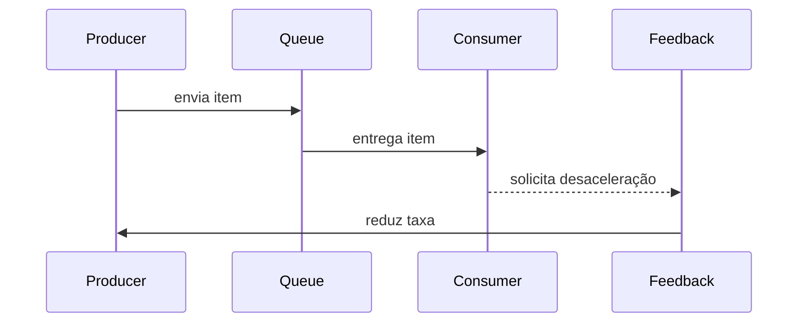

# Backpressure

## 1. O que é

Backpressure é um comportamento de controle de fluxo que sinaliza ao produtor para desacelerar quando o consumidor ou o sistema intermediário está sobrecarregado.

Sinônimos: controle de fluxo, flow control, congestion control.

Tipos/camadas:

- Feedback-based backpressure (chave direta)
- Queue-length-based throttling
- Window-based flow control
- Load shedding / rejection

## 2. Por que existe (o problema que resolve)

Backpressure resolve o problema de sistemas que aceitam trabalho mais rápido do que conseguem processar. Sem ele, filas crescem indefinidamente, OOM ocorre, latência explode e serviços entram em collapse.

A origem prática vem de redes TCP e de sistemas de mensageria, onde é necessário regular a produção de pacotes/tarefas para evitar congestionamento.

## 3. Tipos e características

### Feedback-based backpressure

Como funciona: o consumidor envia sinais ao produtor para reduzir a taxa.
Prós: ajusta dinamicamente à capacidade real.
Contras: requer circuito de comunicação.
Camada: aplicação/rede.
Quando usar: em pipelines de eventos e streaming.

### Queue-length-based throttling

Como funciona: usa o comprimento da fila para aplicar limites ou rejeições.
Prós: simples de implementar.
Contras: pode causar picos de rejeição abruptos.
Camada: aplicação.
Quando usar: em sistemas com filas claras e limites de buffer.

### Window-based flow control

Como funciona: define quantas mensagens/tarefas podem estar em voo simultaneamente.
Prós: controla concorrência precisa.
Contras: exige bookkeeping de janelas.
Camada: aplicação/rede.
Quando usar: em protocolos de stream e backends HTTP.

### Load shedding / rejection

Como funciona: descarta ou rejeita trabalho quando o sistema está saturado.
Prós: protege o sistema de overload.
Contras: pode perder trabalho.
Camada: aplicação.
Quando usar: quando disponibilidade deve ser priorizada sobre completude.

## 4. Como funciona (mecanismo interno)

Componentes:

- Produtor
- Consumidor
- Buffer/queue
- Sinal de controle (ACK/NACK, tokens, métricas)

Fluxo:

1. Produtor envia itens.
2. Consumidor processa items conforme capacidade.
3. Quando o buffer ultrapassa limite, o consumidor sinaliza desaceleração.
4. O produtor reduz taxa ou rejeita novas entradas.

Algoritmos/estratégias:

- TCP congestion window.
- Reactive Streams `request(n)`.
- Token bucket e rate limiters.
- Backoff exponencial.

## 5. Onde e como se aplica na prática

### Nível de máquina/processo único

Em um único processo, bibliotecas como Akka Streams e Reactor implementam backpressure no pipeline de processamento.

### Nível de infraestrutura on-premise/self-managed

Ferramentas: Kafka com consumidores que controlam offset commit, RabbitMQ com prefetch count, NGINX com `limit_req`.

### Nível de nuvem/managed service

AWS: Kinesis + Lambda com batch windows, SQS com visibility timeout e dead-letter queue.
GCP: Pub/Sub com flow control, Dataflow.
Azure: Event Hubs e Service Bus com prefetch e throttle.

### Nível de orquestração/Kubernetes

Kubernetes: configure `horizontalPodAutoscaler` e `pod disruption budgets`; use Envoy/Linkerd com circuit breakers e rate limits para aplicar backpressure ao tráfego.

## 6. Casos de uso reais e quando NÃO usar

### Casos de uso reais

1. Kafka streams: consumidores usam offset commit para desacelerar produção.
2. Akka HTTP: usa Reactive Streams para aplicar backpressure no pipeline.
3. NGINX ingress: `limit_req` rejeita excesso de requisições.
4. AWS SQS + Lambda: controle de batch size e concurrency.

### Quando NÃO usar ou evitar

- Quando todo trabalho é crítico e não pode ser perdido: use persistência e retry em vez de rejection.
- Em sistemas com baixa carga e latência ultrabaixa: overhead de controle pode ser desnecessário.
- Sem visibilidade de capacidade: backpressure cego pode reduzir throughput desnecessariamente.
- Em pipelines de leitura de dados em tempo real sem controle do produtor.

## 7. Cenários práticos e trade-offs

### Cenário 1: pico de ingestão

Uma API de upload recebe burst de solicitações. O sistema aplica queue-length throttling e envia 429 para os clientes quando o buffer enche.

### Cenário 2: falha de downstream

Um banco de dados fica lento. O consumidor aplica load shedding e o produtor reduz a taxa de eventos.

### Cenário 3: pipeline paralelo

Um pipeline de processamento usa window-based backpressure para limitar quantos itens estão em voo e manter latência estável.

| Tipo | Latência | Consistência | Custo operacional | Complexidade de implementação | Resiliência |
|---|---|---|---|---|---|
| Feedback-based | Baixo | Alto | Médio | Alto | Alto |
| Queue-length | Médio | Médio | Baixo | Médio | Médio |
| Window-based | Baixo | Alto | Médio | Alto | Alto |
| Load shedding | Baixo | Baixo | Baixo | Médio | Alto |

## 8. Diagrama e fluxo visual

a) Mermaid:



b) Prompt de imagem:
"Illustration of backpressure in a distributed system with producers, consumer queues, and feedback signals slowing down ingestion to prevent overload."

## 9. Exemplo aplicado — Java + Spring

```java
@Service
public class BackpressureService {

  private final Semaphore semaphore = new Semaphore(100);

  public void process(Task task) {
    if (!semaphore.tryAcquire()) {
      throw new RejectedExecutionException("System overloaded");
    }
    try {
      doWork(task);
    } finally {
      semaphore.release();
    }
  }

  private void doWork(Task task) {
    // processamento da tarefa
  }
}
```

Comentários: o `Semaphore` atua como controle de janela e evita que mais de 100 tarefas estejam em execução simultânea.

## 10. Exemplo aplicado — TypeScript + NestJS

```ts
@Injectable()
export class BackpressureService {
  private availableTokens = 100;

  acquire(): boolean {
    if (this.availableTokens <= 0) {
      return false;
    }
    this.availableTokens -= 1;
    return true;
  }

  release() {
    this.availableTokens += 1;
  }

  async handleTask(task: Task) {
    if (!this.acquire()) {
      throw new HttpException('Service overloaded', HttpStatus.TOO_MANY_REQUESTS);
    }
    try {
      await this.process(task);
    } finally {
      this.release();
    }
  }
}
```

Comentários: o serviço NestJS aplica backpressure local como tokens de capacidade e retorna 429 quando saturado.

## 11. Comparação e armadilhas comuns

Comparação com rate limiting: rate limiting impede chamadas acima de uma taxa fixa, enquanto backpressure ajusta dinamicamente conforme a capacidade do consumidor.

Erros comuns:

- rejeitar sem sinalizar ao produtor: provoca retries descontrolados.
- usar backpressure apenas no frontend: ignora saturação interna.
- definir limites muito baixos: reduz throughput.
- não monitorar filas e tempos de espera: esconde o comportamento de congestionamento.

## 12. Perguntas para fixação

1. Qual é a diferença entre backpressure e rate limiting?
2. Quando usar load shedding em vez de throttling?
3. Como window-based flow control funciona em um pipeline de streaming?
4. Por que é perigoso aplicar backpressure sem visibilidade de recursos?
5. Como implementar um feedback de desaceleração entre produtor e consumidor?

___

Ex.:

Se o Kafka manda 10000 eps (eventos por segundo), mas meu Worker / Consumer so tem a capacidade (que pode ser definida na configuracao), pra somente 500 eps, posso tomar um erro de OutMemory. A memoria explode.

Configurando no Worker / Consumer, eu limito a quantidade de informacoes pode me enviar, para evitar sobrecargas.

___

Estratégias reais para lidar com backpressure

1. Limitar a entrada (admission control)

Rate limiting no gateway/API (token bucket, sliding window) — rejeita ou atrasa requisições acima da capacidade
Bulkhead pattern — isola pools de recursos (threads, conexões) por tipo de cliente/operação, pra um consumidor lento não derrubar todo mundo

1. Propagar backpressure de forma explícita

Reactive Streams / Project Reactor (WebFlux) — Flux/Mono com onBackpressureBuffer, onBackpressureDrop, onBackpressureLatest. O subscriber sinaliza quanto consegue processar (request(n)), e o publisher respeita isso
Em vez de empilhar tudo num buffer infinito, você define explicitamente: bufferizar até X, dropar o mais antigo, dropar o mais novo, ou aplicar sample

1. Filas com limite (bounded queues) + política de rejeição

ThreadPoolExecutor com ArrayBlockingQueue limitado + RejectedExecutionHandler (ex: CallerRunsPolicy pra aplicar backpressure no próprio caller)
Em Kafka: usar token bucket no consumer pra não estourar downstream (que você já vem estudando)

1. Circuit Breaker + timeout agressivo

Resilience4j: se o downstream tá degradado, abre o circuito rápido em vez de deixar requisições se acumularem esperando

1. Load shedding

Quando a fila/buffer atinge um limite, descarta requisições de baixa prioridade (ex: retries, batch jobs) pra proteger o tráfego crítico (ex: originação de crédito em produção)

1. Escalar o consumidor

Auto-scaling horizontal (K8s HPA baseado em lag de fila/CPU) — ataca a causa raiz quando é volume real, não só pico transitório

> Prática comum: combinar token bucket no consumer Kafka (rate limiting) + Circuit Breaker pro downstream (ex: chamada ao Bacen) + bounded queue com CallerRunsPolicy no processamento assíncrono, e monitorar consumer lag no Dynatrace pra saber quando escalar.
