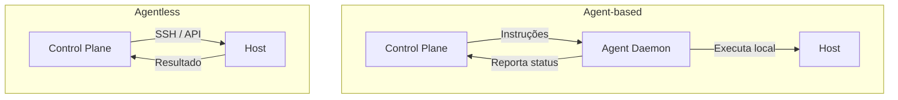

# Agent vs Agentless Deployment

## 1. O que é

Agent vs agentless deployment descreve duas abordagens para **automatizar deploy e gerenciamento de infraestrutura/aplicações**: com agent (um processo/daemon instalado em cada host gerenciado) ou sem agent (comunicação remota via APIs, SSH ou protocolos padrão sem software persistente no host).

No mercado, você também verá os termos agent-based vs agentless, pull-based vs push-based deployment, e exemplos concretos: Ansible (agentless), Puppet/Chef (agent), Kubernetes (agent via kubelet), AWS SSM (agentless via API), Datadog/Nagios (agent).

## 2. Por que existe (o problema que resolve)

Automatizar deploy em dezenas ou milhares de servidores exige um mecanismo de comunicação entre o sistema de controle e os hosts. Agent-based surgiu primeiro: instalar um daemon que recebe instruções e executa localmente (Puppet, Chef, Nagios). Agentless surgiu como alternativa para reduzir footprint, simplificar atualização e evitar dependência de daemon rodando em cada host (Ansible via SSH, Terraform via API de cloud).

O problema que resolve é a escolha de como o sistema de deploy se comunica e controla hosts de destino.

## 3. Como funciona

### Agent-based

1. **Instalar agent** em cada host (kubelet, Puppet agent, monitoring agent).
2. **Control plane** envia instruções ao agent (push ou pull).
3. **Agent executa** localmente: deploy, config change, health report.
4. **Agent reporta** status ao control plane.

### Agentless

1. **Control plane** conecta remotamente (SSH, WinRM, cloud API).
2. **Executa comandos** ou aplica mudanças sem software persistente no host.
3. **Coleta resultado** da execução remota.
4. **Sem daemon** permanece no host após execução.

Componentes envolvidos:

- **Agent-based**: control plane, agent daemon, host.
- **Agentless**: control plane, protocolo remoto (SSH/API), host.
- **Ambos**: artefato de deploy, pipeline, observabilidade.

## 4. Casos de uso reais

- **Agent**: Kubernetes (kubelet em cada node), Puppet/Chef em datacenter, Datadog agent para métricas.
- **Agentless**: Ansible playbooks via SSH, Terraform apply via AWS API, GitHub Actions deploy via SSH.
- **Híbrido**: AWS Systems Manager (agent opcional, funciona agentless via API também).
- **Agent**: Spinnaker com Rosco + agent em cada cloud account.
- **Agentless**: ArgoCD (pull model — cluster puxa manifests, sem agent customizado).

Quando não usar agent:

- Ambientes efêmeros (serverless, containers) onde instalar daemon é impraticável.
- Restrições de segurança que proíbem software adicional em hosts.
- Infraestrutura gerenciada via API de cloud (agentless é natural).

Quando não usar agentless:

- Hosts sem conectividade de rede estável para SSH/API.
- Necessidade de monitoramento contínuo e reativo (agent é melhor para estado persistente).
- Ambientes air-gapped onde agent com pull model é mais confiável.

## 5. Cenários práticos e trade-offs

**Cenário 1: Deploy com Ansible (agentless) em 500 VMs**

- Playbook SSH executa deploy em paralelo; sem agent instalado.
- Trade-offs: simples, sem footprint, mas SSH pode ser lento e menos resiliente.

**Cenário 2: Deploy com Kubernetes (agent via kubelet)**

- `kubectl apply` → API server → kubelet em cada node puxa imagem e inicia pod.
- Trade-offs: robusto, self-healing, mas kubelet é agent obrigatório em cada node.

**Cenário 3: Agent desatualizado após upgrade do control plane**

- Puppet agent v5 incompatível com Puppet server v7; 200 hosts param de receber deploys.
- Trade-offs: agent exige ciclo de atualização coordenado em todos os hosts.

Trade-offs gerais:

- **Footprint**: agent consome CPU/RAM em cada host; agentless não.
- **Resiliência**: agent pode operar offline e sincronizar depois; agentless exige conectividade.
- **Manutenção**: agent precisa ser atualizado em todos os hosts; agentless atualiza apenas control plane.
- **Segurança**: agent é superfície de ataque adicional; agentless depende de credenciais SSH/API.
- **Latência**: agent local executa instantaneamente; agentless depende de latência de rede.

## 6. Diagrama e fluxo visual

a) Diagrama em Mermaid



b) Prompt para geração de imagem

"Create a comparison diagram of agent-based vs agentless deployment: left side showing a control plane communicating with agent daemons installed on each server, right side showing a control plane connecting directly via SSH/API without any installed agent software."

## 7. Exemplo aplicado — Java + Spring

```java
package com.example.agentdeploy;

import org.springframework.boot.SpringApplication;
import org.springframework.boot.autoconfigure.SpringBootApplication;
import org.springframework.web.bind.annotation.*;
import org.springframework.beans.factory.annotation.Value;
import org.springframework.stereotype.Service;

@SpringBootApplication
public class AgentDeployApplication {
    public static void main(String[] args) {
        SpringApplication.run(AgentDeployApplication.class, args);
    }
}

// Simula endpoint que um agent (kubelet-like) consultaria para obter instruções de deploy
@RestController
class DeployInstructionController {
    @Value("${deploy.target-version:1.0.0}")
    private String targetVersion;

    // Agent-based: agent puxa instruções periodicamente
    @GetMapping("/agent/instructions")
    public DeployInstruction getInstructions() {
        return new DeployInstruction(targetVersion, "myapp:" + targetVersion, "RUNNING");
    }

    // Agent reporta status após executar deploy
    @PostMapping("/agent/report")
    public void reportStatus(@RequestBody AgentReport report) {
        // Control plane registra: host X está na versão Y
    }

    record DeployInstruction(String version, String image, String desiredState) {}
    record AgentReport(String hostId, String currentVersion, String status) {}
}
```

Pontos-chave:

- Modelo pull: agent consulta `/agent/instructions` — padrão Kubernetes/kubelet.
- Agent reporta status — control plane tem visibilidade do estado de cada host.

## 8. Exemplo aplicado — TypeScript + NestJS

```ts
import { Controller, Get, Post, Body, Module } from '@nestjs/common';
import { NestFactory } from '@nestjs/core';
import { ConfigService, ConfigModule } from '@nestjs/config';
import { exec } from 'child_process';
import { promisify } from 'util';

const execAsync = promisify(exec);

// Agentless: control plane executa deploy remotamente via SSH
@Injectable()
class AgentlessDeployService {
  constructor(private config: ConfigService) {}

  async deployToHost(host: string, version: string) {
    const sshKey = this.config.get('SSH_KEY_PATH', '~/.ssh/id_rsa');
    const command = `ssh -i ${sshKey} deploy@${host} "docker pull myapp:${version} && docker stop myapp && docker run -d --name myapp myapp:${version}"`;
    const { stdout, stderr } = await execAsync(command);
    return { host, version, stdout, stderr, method: 'agentless-ssh' };
  }
}

@Controller('deploy')
class DeployController {
  constructor(private deployService: AgentlessDeployService) {}

  @Post('agentless')
  async deploy(@Body() body: { host: string; version: string }) {
    return this.deployService.deployToHost(body.host, body.version);
  }
}

@Module({
  imports: [ConfigModule.forRoot()],
  providers: [AgentlessDeployService],
  controllers: [DeployController],
})
class AppModule {}

async function bootstrap() {
  const app = await NestFactory.create(AppModule);
  await app.listen(3000);
}
bootstrap();
```

Pontos-chave:

- Deploy agentless executa comando SSH remoto — sem daemon no host de destino.
- Cada deploy é conexão pontual; sem estado persistente no host.

## 9. Comparação e armadilhas comuns

Comparação rápida:

- **Agent vs. Agentless**: agent instala daemon persistente; agentless usa conexão remota pontual.
- **Pull vs. Push**: agent frequentemente puxa instruções (kubelet); agentless frequentemente empurra comandos (Ansible push mode).

Armadilhas comuns:

1. **Agent desatualizado**: versão do agent incompatível com control plane após upgrade.
2. **SSH key rotation em agentless**: credenciais expiradas quebram todos os deploys.
3. **Escolher agent para serverless**: instalar daemon em Lambda/Fargate é impossível — use agentless.

## 10. Perguntas para fixação

1. Por que Kubernetes usa modelo agent-based (kubelet) em vez de agentless?
2. Em que cenários Ansible (agentless) é preferível a Puppet (agent-based)?
3. Como você gerenciaria atualização de agents em fleet de 10.000 hosts?
