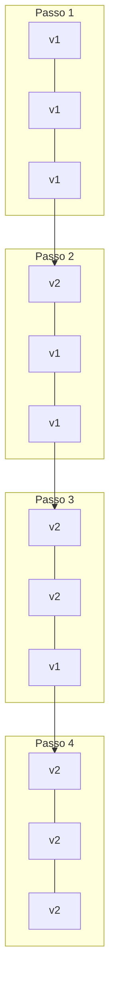

# Rolling Deployment

## 1. O que é
Rolling deployment é a estratégia de atualização gradual em que novas instâncias da aplicação são criadas e integradas ao pool de servidores **uma a uma (ou em lotes pequenos)**, enquanto instâncias antigas são removidas progressivamente. Em nenhum momento todo o pool fica offline, mas versões antiga e nova coexistem temporariamente.

No mercado, você também verá os termos rolling update, rolling restart, gradual rollout e incremental replacement. É a estratégia padrão do Kubernetes (`RollingUpdate`) e de muitos load balancers.

## 2. Por que existe (o problema que resolve)
Deploys all-at-once causavam downtime total; blue-green exigia o dobro de infraestrutura. Rolling deployment surgiu como meio-termo: atualização sem downtime significativo, sem duplicar todo o ambiente. É especialmente adequado para fleets grandes onde manter 100% de capacidade extra seria custoso.

O problema que resolve é balancear disponibilidade, custo e simplicidade operacional durante atualizações.

## 3. Como funciona
Fluxo típico:
1. **Configurar parâmetros**: `maxSurge` (quantas instâncias extras podem existir) e `maxUnavailable` (quantas podem ficar offline).
2. **Criar nova instância**: com a versão nova do artefato.
3. **Health check**: validar que a nova instância está saudável.
4. **Adicionar ao pool**: load balancer começa a enviar tráfego.
5. **Remover instância antiga**: drenar e terminar uma instância da versão anterior.
6. **Repetir**: até que 100% das instâncias estejam na nova versão.

Componentes envolvidos:
- **Orchestrator** (Kubernetes Deployment, ASG): controla ritmo do rolling.
- **Load balancer**: distribui tráfego entre versões coexistindo.
- **Health checks**: gate para adicionar/remover instâncias.
- **Readiness probe**: garante que instância nova aceita tráfego apenas quando pronta.

## 4. Casos de uso reais
- Rolling update de Deployment no Kubernetes com 10 réplicas.
- Auto Scaling Group na AWS com launch template atualizado gradualmente.
- Deploy de API stateless com backward-compatible API contract.
- Atualização de fleet de NGINX/Envoy com configuração nova.
- Rolling restart após mudança de secret ou configuração.

Quando não usar:
- Breaking changes de API ou schema que exigem migração coordenada (ambas versões não podem coexistir).
- Aplicações onde qualquer instância com versão antiga processando tráfego causa inconsistência grave.
- Quando rollback instantâneo é requisito — rolling demora para reverter todas as instâncias.

## 5. Cenários práticos e trade-offs
**Cenário 1: Rolling com maxUnavailable=1 em fleet de 5**
- Uma instância antiga sai, uma nova entra; capacidade nunca cai abaixo de 4/5.
- Trade-offs: seguro para capacidade, mas deploy completo leva N ciclos.

**Cenário 2: Breaking API change durante rolling**
- v1 e v2 coexistem; clientes recebem respostas incompatíveis dependendo da instância.
- Trade-offs: exige API versioning ou feature flags para compatibilidade.

**Cenário 3: Instância nova falha health check repetidamente**
- Rolling trava; versões antiga e nova ficam em estado misto indefinidamente.
- Trade-offs: exige alertas e política de abort/rollback automático.

Trade-offs gerais:
- **Downtime**: zero (se configurado corretamente), mas capacidade reduzida temporariamente.
- **Custo**: `maxSurge` pode exigir instâncias extras transitórias.
- **Velocidade**: mais lento que big-bang; mais rápido que blue-green em custo.
- **Compatibilidade**: exige que v1 e v2 coexistam sem conflito.

## 6. Diagrama e fluxo visual
a) Diagrama em Mermaid



b) Prompt para geração de imagem

"Create a rolling deployment diagram showing a row of server instances gradually changing from blue (old version) to green (new version) one at a time, with a load balancer distributing traffic across the mixed fleet."

## 7. Exemplo aplicado — Java + Spring
```java
package com.example.rolling;

import org.springframework.boot.SpringApplication;
import org.springframework.boot.autoconfigure.SpringBootApplication;
import org.springframework.boot.availability.AvailabilityChangeEvent;
import org.springframework.boot.availability.ReadinessState;
import org.springframework.context.ApplicationContext;
import org.springframework.context.event.EventListener;
import org.springframework.boot.context.event.ApplicationReadyEvent;
import org.springframework.stereotype.Component;
import org.springframework.web.bind.annotation.GetMapping;
import org.springframework.web.bind.annotation.RestController;

@SpringBootApplication
public class RollingApplication {
    public static void main(String[] args) {
        SpringApplication.run(RollingApplication.class, args);
    }
}

@RestController
class ApiController {
    @GetMapping("/api/data")
    public ApiResponse data() {
        // API backward-compatible: v1 e v2 podem coexistir no rolling
        return new ApiResponse("ok", 1); // version field para clientes adaptarem
    }

    record ApiResponse(String status, int apiVersion) {}
}

@Component
class ReadinessPublisher {
    @EventListener(ApplicationReadyEvent.class)
    public void onReady(ApplicationContext context) {
        // Sinaliza readiness — K8s adiciona ao pool do rolling update
        AvailabilityChangeEvent.publish(context, ReadinessState.ACCEPTING_TRAFFIC);
    }
}
```

Pontos-chave:
- `ReadinessState.ACCEPTING_TRAFFIC` controla quando a instância entra no pool do rolling.
- Campo `apiVersion` na resposta permite clientes detectarem versão durante coexistência.

## 8. Exemplo aplicado — TypeScript + NestJS
```ts
import { Controller, Get, Injectable, Module, OnApplicationBootstrap } from '@nestjs/common';
import { NestFactory } from '@nestjs/core';
import { HealthCheck, HealthCheckService, HealthIndicator, HealthIndicatorResult } from '@nestjs/terminus';

@Injectable()
class ReadinessIndicator extends HealthIndicator {
  private acceptingTraffic = false;

  markReady() { this.acceptingTraffic = true; }

  async isReady(): Promise<HealthIndicatorResult> {
    return this.getStatus('readiness', this.acceptingTraffic);
  }
}

@Controller('api')
class ApiController {
  @Get('data')
  data() {
    return { status: 'ok', apiVersion: 1 };
  }
}

@Controller('health')
class HealthController {
  constructor(private health: HealthCheckService, private readiness: ReadinessIndicator) {}

  @Get('ready')
  @HealthCheck()
  ready() {
    return this.health.check([() => this.readiness.isReady()]);
  }
}

@Module({ controllers: [ApiController, HealthController], providers: [ReadinessIndicator] })
class AppModule implements OnApplicationBootstrap {
  constructor(private readiness: ReadinessIndicator) {}

  onApplicationBootstrap() {
    // Simula warm-up antes de aceitar tráfego no rolling
    setTimeout(() => this.readiness.markReady(), 3000);
  }
}

async function bootstrap() {
  const app = await NestFactory.create(AppModule);
  await app.listen(3000);
}
bootstrap();
```

Pontos-chave:
- Readiness só fica `true` após warm-up — evita que rolling envie tráfego cedo demais.
- API backward-compatible é pré-requisito para rolling seguro.

## 9. Comparação e armadilhas comuns
Comparação rápida:
- **Rolling vs. Blue-green**: rolling atualiza gradualmente no mesmo pool; blue-green troca tráfego entre dois pools completos.
- **Rolling vs. Canary**: canary envia fração pequena de tráfego para validar; rolling substitui instâncias sem controle fino de tráfego.

Armadilhas comuns:
1. **Breaking changes com rolling**: v1 e v2 incompatíveis causam erros intermitentes.
2. **maxUnavailable muito alto**: capacidade cai abaixo do aceitável durante deploy.
3. **Sem abort policy**: rolling travado em estado misto sem alerta nem rollback.

## 10. Perguntas para fixação
1. Como `maxSurge` e `maxUnavailable` afetam velocidade e segurança de um rolling deploy?
2. Quais mudanças de aplicação são incompatíveis com rolling deployment?
3. Como você detectaria e abortaria um rolling deploy que está degradando métricas?
