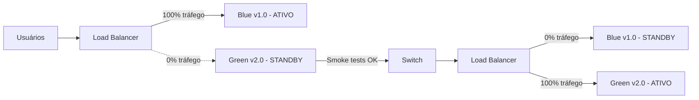

# Blue-Green Deployment

## 1. O que é

Blue-green deployment é a estratégia em que **dois ambientes idênticos e completos** — blue (ativo) e green (standby) — coexistem em paralelo. A nova versão é deployada no ambiente inativo (green); após validação, o tráfego é redirecionado instantaneamente do blue para o green. O ambiente anterior permanece disponível para rollback imediato.

No mercado, você também verá os termos red-black deployment (variação de nomenclatura), A/B environment swap e dual environment deployment. É uma das estratégias mais usadas para zero-downtime com rollback rápido.

## 2. Por que existe (o problema que resolve)

Rolling deployment expõe versões antiga e nova simultaneamente ao tráfego, exigindo backward compatibility. In-place deployment causa downtime. Blue-green surgiu para oferecer switch atômico de tráfego: ou 100% na versão antiga, ou 100% na nova — sem estado misto. Popularizado em operações de grande escala (ex: práticas da Netflix, Spotify) onde rollback em segundos é requisito.

O problema que resolve é zero-downtime com rollback instantâneo, à custa de infraestrutura duplicada.

## 3. Como funciona

Fluxo típico:

1. **Estado inicial**: blue (v1) recebe 100% do tráfego; green (v2) está idle ou inexistente.
2. **Deploy no green**: nova versão é deployada no ambiente green sem afetar tráfego.
3. **Smoke tests**: validação no green via testes internos ou tráfego de teste.
4. **Switch**: load balancer, DNS ou service mesh redireciona 100% do tráfego para green.
5. **Monitor**: observar métricas pós-switch por período definido.
6. **Cleanup ou rollback**: se OK, blue é descomissionado ou mantido standby; se falha, switch de volta para blue.

Componentes envolvidos:

- **Dois pools completos**: blue e green com mesma capacidade.
- **Load balancer / DNS / Ingress**: controla switch de tráfego.
- **Database**: deve suportar ambas versões (migração expand-contract).
- **Observabilidade**: métricas para decisão de rollback.

## 4. Casos de uso reais

- Deploy de API crítica com SLA de 99.99% e rollback em < 30 segundos.
- Switch de ambiente em AWS com ALB target groups (blue/green).
- Deploy de aplicação com AWS CodeDeploy blue-green.
- Spinnaker pipeline com red-black (sua nomenclatura para blue-green).
- Migração de versão major com validação completa antes do switch.

Quando não usar:

- Recursos limitados que não suportam dobrar infraestrutura.
- Aplicações stateful com sessão presa ao ambiente (sem sticky session ou state externalization).
- Quando o banco de dados não suporta schema compatível com ambas versões.

## 5. Cenários práticos e trade-offs

**Cenário 1: Switch bem-sucedido**

- Green validado, switch em 1 segundo, blue mantido 24h como standby.
- Trade-offs: zero downtime, rollback instantâneo, mas 2x custo transitório.

**Cenário 2: Regressão detectada 10 minutos após switch**

- Switch de volta para blue em segundos; usuários afetados por 10 minutos.
- Trade-offs: rollback rápido, mas blast radius de 10 min de tráfego na versão ruim.

**Cenário 3: Schema de banco incompatível**

- v2 exige coluna que v1 não conhece; deploy no green quebra ao receber tráfego.
- Trade-offs: exige migração expand-contract antes do blue-green.

Trade-offs gerais:

- **Custo**: ~2x infraestrutura durante transição.
- **Rollback**: instantâneo (switch de tráfego).
- **Complexidade de dados**: schema e sessões devem ser compatíveis.
- **DNS TTL**: se switch via DNS, TTL alto atrasa propagação.

## 6. Diagrama e fluxo visual

a) Diagrama em Mermaid



b) Prompt para geração de imagem

"Create a blue-green deployment diagram with two parallel server environments: blue (active, receiving all traffic) and green (idle, with new version deployed). Show a load balancer switching all traffic from blue to green in an instant cutover."

## 7. Exemplo aplicado — Java + Spring

```java
package com.example.bluegreen;

import org.springframework.boot.SpringApplication;
import org.springframework.boot.autoconfigure.SpringBootApplication;
import org.springframework.beans.factory.annotation.Value;
import org.springframework.web.bind.annotation.GetMapping;
import org.springframework.web.bind.annotation.RestController;

@SpringBootApplication
public class BlueGreenApplication {
    public static void main(String[] args) {
        SpringApplication.run(BlueGreenApplication.class, args);
    }
}

@RestController
class EnvironmentController {
    @Value("${deployment.slot:blue}")
    private String deploymentSlot;

    @Value("${app.version:1.0}")
    private String appVersion;

    // Identifica qual slot (blue/green) está respondendo
    @GetMapping("/environment")
    public EnvironmentInfo environment() {
        return new EnvironmentInfo(deploymentSlot, appVersion);
    }

    record EnvironmentInfo(String slot, String version) {}
}

// ALB target group switch (conceitual via AWS CLI):
// aws elbv2 modify-listener --listener-arn $ARN \
//   --default-actions Type=forward,TargetGroupArn=$GREEN_TG_ARN
```

Pontos-chave:

- `deployment.slot` identifica blue ou green — essencial para validação pré-switch.
- Switch é operação de infra (ALB/DNS), não de código.

## 8. Exemplo aplicado — TypeScript + NestJS

```ts
import { Controller, Get, Module } from '@nestjs/common';
import { NestFactory } from '@nestjs/core';
import { ConfigModule, ConfigService } from '@nestjs/config';

@Controller('environment')
class EnvironmentController {
  constructor(private config: ConfigService) {}

  @Get()
  info() {
    return {
      slot: this.config.get('DEPLOYMENT_SLOT', 'blue'),
      version: this.config.get('APP_VERSION', '1.0'),
    };
  }
}

@Module({
  imports: [ConfigModule.forRoot()],
  controllers: [EnvironmentController],
})
class AppModule {}

async function bootstrap() {
  const app = await NestFactory.create(AppModule);
  await app.listen(3000);
}
bootstrap();

// Smoke test pré-switch no green (script da esteira):
// GREEN_URL=https://green.internal.example.com
// curl -f $GREEN_URL/environment # valida slot=green, version=2.0
// # Após OK: atualizar ingress/service selector para green
```

Pontos-chave:

- Smoke test no green valida versão antes do switch de tráfego.
- `DEPLOYMENT_SLOT` diferencia ambientes no mesmo cluster.

## 9. Comparação e armadilhas comuns

Comparação rápida:

- **Blue-green vs. Rolling**: blue-green faz switch atômico; rolling coexistência gradual.
- **Blue-green vs. Canary**: canary envia fração de tráfego; blue-green faz switch 0%→100%.

Armadilhas comuns:

1. **Esquecer compatibilidade de schema**: v1 e v2 devem funcionar com mesmo banco.
2. **Descomissionar blue cedo demais**: impossibilita rollback rápido.
3. **Sessões in-memory**: usuários perdem sessão no switch se estado é local.

## 10. Perguntas para fixação

1. Como você garantiria compatibilidade de banco de dados em um blue-green deploy?
2. Quando blue-green é preferível a rolling, e vice-versa?
3. Como você validaria o ambiente green antes de fazer o switch de tráfego?
