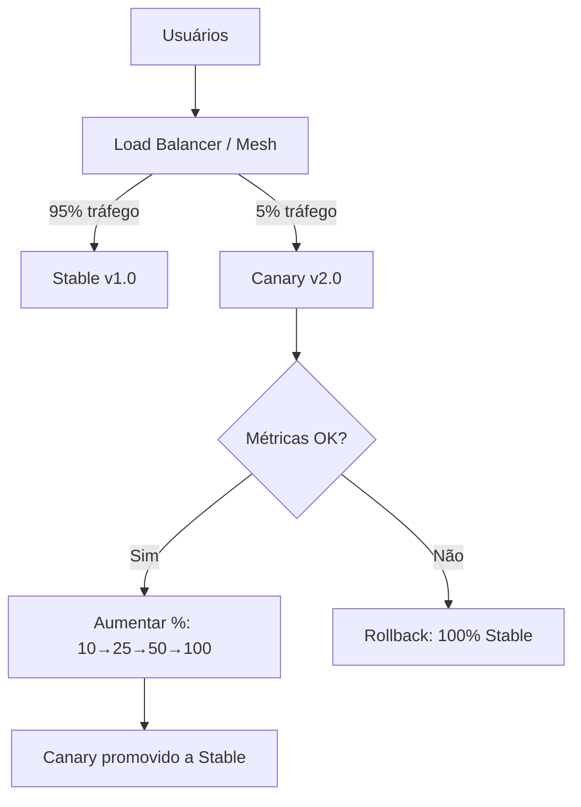

# Canary Release Deployment

## 1. O que é

Canary release deployment é a estratégia de liberar uma nova versão para uma **fração pequena e controlada do tráfego** (tipicamente 1-5%) antes de expandir gradualmente para 100%. O nome vem da prática de mineiros que levavam canários para detectar gás tóxico — a versão nova é o "canário" que revela problemas antes de afetar todos os usuários.

No mercado, você também verá os termos canary deployment, progressive delivery, phased rollout e traffic splitting. É a estratégia preferida de empresas como Google, Netflix e LaunchDarkly para releases de alto risco.

## 2. Por que existe (o problema que resolve)

Blue-green faz switch atômico 0→100%, expondo todos os usuários de uma vez se houver regressão. Rolling substitui instâncias mas não controla finamente qual usuário recebe qual versão. Canary surgiu para limitar blast radius: testar em produção com tráfego real, mas com impacto mínimo. Ferramentas como Flagger, Argo Rollouts e Spinnaker automatizaram análise de métricas durante expansão gradual.

O problema que resolve é validação em produção com risco controlado e rollback automático baseado em dados.

## 3. Como funciona

Fluxo típico:

1. **Deploy canary**: pequeno conjunto de instâncias com v2 é criado.
2. **Traffic split**: 5% do tráfego vai para canary; 95% permanece em stable.
3. **Metric analysis**: error rate, latência p99, throughput comparados entre canary e stable.
4. **Promotion ou abort**: se métricas OK, aumenta para 10% → 25% → 50% → 100%; se degradou, rollback automático.
5. **Full promotion**: canary torna-se stable; instâncias antigas são removidas.

Componentes envolvidos:

- **Service mesh / Ingress** (Istio, NGINX, Traefik): traffic splitting por peso.
- **Canary controller** (Flagger, Argo Rollouts): automação de promoção/abort.
- **Metrics backend** (Prometheus, Datadog): análise comparativa.
- **Observabilidade**: dashboards canary vs. stable em tempo real.

## 4. Casos de uso reais

- Deploy de mudança em algoritmo de recomendação com impacto em receita.
- Release de nova versão de API com validação de latência p99.
- Rollout de feature de pagamento com 1% de tráfego inicial.
- Deploy de mudança em query SQL com monitoramento de error rate.
- Progressive delivery com Argo Rollouts e análise Prometheus.

Quando não usar:

- Mudanças que exigem 100% de tráfego para validar (ex: mudança visual global).
- Ambientes sem observabilidade para comparar métricas canary vs. stable.
- Breaking changes onde qualquer tráfego na versão nova causa erro.

## 5. Cenários práticos e trade-offs

**Cenário 1: Canary saudável, promoção gradual**

- 5% → 25% → 50% → 100% ao longo de 2 horas; zero impacto perceptível.
- Trade-offs: máxima segurança, mas deploy completo leva horas.

**Cenário 2: Error rate do canary 3x maior que stable**

- Flagger aborta automaticamente; tráfego volta 100% para stable em segundos.
- Trade-offs: apenas 5% dos usuários afetados, mas exige métricas confiáveis.

**Cenário 3: Métricas OK mas reclamação de usuários VIP no canary**

- Canary passa em métricas agregadas, mas segmento específico sofre.
- Trade-offs: exige canary por segmento (header, cookie, tenant) além de métricas globais.

Trade-offs gerais:

- **Blast radius**: mínimo — ideal para mudanças de alto risco.
- **Velocidade**: lento — promoção gradual leva tempo.
- **Complexidade**: exige traffic splitting, métricas e automação.
- **Representatividade**: 5% pode não capturar edge cases de todo o tráfego.

## 6. Diagrama e fluxo visual

a) Diagrama em Mermaid



b) Prompt para geração de imagem

"Create a canary deployment diagram showing a load balancer splitting traffic: 95% to stable servers (blue) and 5% to a small canary group (green). Include a metrics dashboard comparing error rates between the two groups."

## 7. Exemplo aplicado — Java + Spring

```java
package com.example.canary;

import org.springframework.boot.SpringApplication;
import org.springframework.boot.autoconfigure.SpringBootApplication;
import org.springframework.beans.factory.annotation.Value;
import org.springframework.web.bind.annotation.GetMapping;
import org.springframework.web.bind.annotation.RestController;
import io.micrometer.core.instrument.MeterRegistry;
import io.micrometer.core.instrument.Timer;

@SpringBootApplication
public class CanaryApplication {
    public static void main(String[] args) {
        SpringApplication.run(CanaryApplication.class, args);
    }
}

@RestController
class PaymentController {
    private final Timer paymentTimer;
    private final String deploymentTrack;

    PaymentController(MeterRegistry registry,
                      @Value("${deployment.track:stable}") String track) {
        this.deploymentTrack = track;
        // Métrica separada por track — essencial para análise canary
        this.paymentTimer = Timer.builder("payment.process")
            .tag("track", track)
            .register(registry);
    }

    @GetMapping("/payment/process")
    public String process() {
        return paymentTimer.record(() -> {
            // Lógica de pagamento — canary pode ter algoritmo diferente
            return "processed by " + deploymentTrack;
        });
    }
}
```

Pontos-chave:

- Tag `track` (stable/canary) nas métricas permite comparação automática pelo Flagger/Argo.
- `deployment.track` injetada via env var diferencia instâncias canary de stable.

## 8. Exemplo aplicado — TypeScript + NestJS

```ts
import { Controller, Get, Injectable, Module } from '@nestjs/common';
import { NestFactory } from '@nestjs/core';
import { Counter, Histogram, Registry } from 'prom-client';

@Injectable()
class MetricsService {
  private registry = new Registry();
  private requestDuration: Histogram;
  private errorCounter: Counter;

  constructor() {
    const track = process.env.DEPLOYMENT_TRACK ?? 'stable';
    this.requestDuration = new Histogram({
      name: 'http_request_duration_seconds',
      help: 'Request duration',
      labelNames: ['track', 'route'],
      registers: [this.registry],
    });
    this.errorCounter = new Counter({
      name: 'http_errors_total',
      help: 'Total errors',
      labelNames: ['track'],
      registers: [this.registry],
    });
    this.track = track;
  }

  private track: string;

  recordRequest(route: string, durationMs: number) {
    this.requestDuration.labels(this.track, route).observe(durationMs / 1000);
  }

  recordError() {
    this.errorCounter.labels(this.track).inc();
  }

  async getMetrics() {
    return this.registry.metrics();
  }
}

@Controller('api')
class ApiController {
  constructor(private metrics: MetricsService) {}

  @Get('data')
  async data() {
    const start = Date.now();
    try {
      return { track: process.env.DEPLOYMENT_TRACK, data: 'ok' };
    } catch (e) {
      this.metrics.recordError();
      throw e;
    } finally {
      this.metrics.recordRequest('/api/data', Date.now() - start);
    }
  }
}

@Module({ providers: [MetricsService], controllers: [ApiController] })
class AppModule {}

async function bootstrap() {
  const app = await NestFactory.create(AppModule);
  await app.listen(3000);
}
bootstrap();
```

Pontos-chave:

- Métricas Prometheus com label `track` permitem query: `rate(http_errors_total{track="canary"})`.
- Comparação canary vs. stable é base para promoção ou abort automático.

## 9. Comparação e armadilhas comuns

Comparação rápida:

- **Canary vs. Blue-green**: canary é gradual e baseado em métricas; blue-green é switch atômico.
- **Canary vs. Feature flag**: canary roteia tráfego por infraestrutura; feature flag roteia por código/config.

Armadilhas comuns:

1. **Métricas insuficientes**: canary passa com baixo volume estatisticamente insignificante.
2. **Canary não representativo**: 5% de tráfego pode não incluir workloads críticos.
3. **Promoção manual sem critérios**: operador promove por impatience, ignorando degradação sutil.

## 10. Perguntas para fixação

1. Quais métricas você usaria para decidir promoção automática de um canary?
2. Como um canary de 1% pode falhar em detectar um bug que só aparece com carga alta?
3. Quando canary é preferível a blue-green para uma mudança de alto risco?
