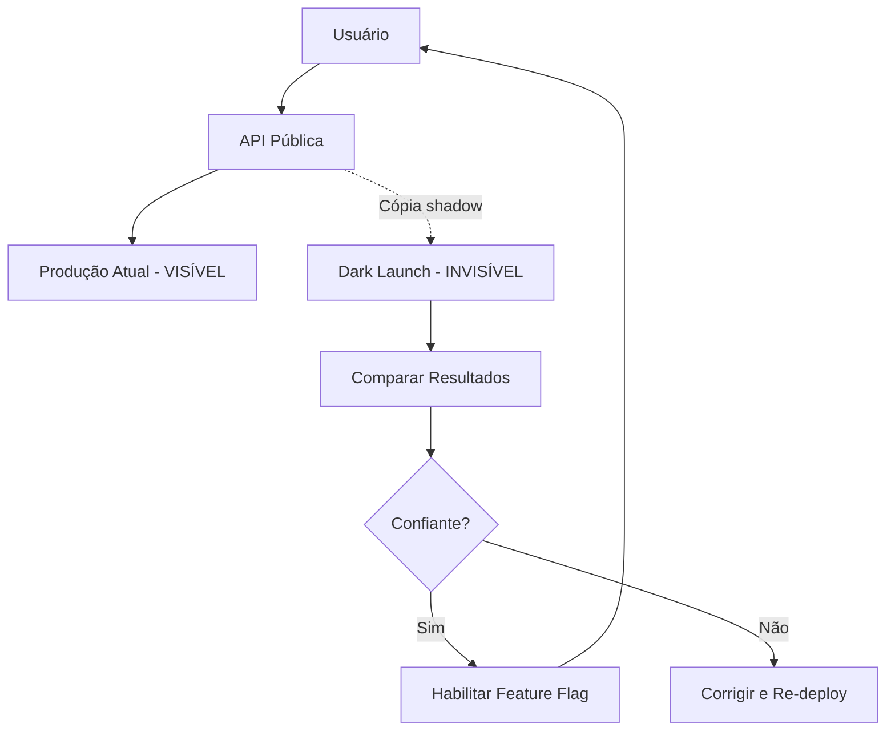

# Dark Launch

## 1. O que é

Dark launch é a estratégia de **deployar uma nova funcionalidade em produção sem torná-la visível ou utilizável pelos usuários finais**. O código está em execução no ambiente de produção, processando dados reais (frequentemente em shadow/mirror), mas a feature não é exposta na UI, API pública ou fluxo do usuário. É "escuro" porque os usuários não sabem que existe.

No mercado, você também verá os termos dark deployment, silent launch, feature in production (dark) e pre-release in prod. Dark launch é frequentemente combinado com feature flags e shadow testing.

## 2. Por que existe (o problema que resolve)

Testar em staging nunca reproduz 100% das condições de produção: volume de tráfego, dados reais, latência de rede, configuração de infra. Dark launch surgiu para validar código em produção com dados e carga reais, sem expor usuários a funcionalidades incompletas ou instáveis. Popularizado por Facebook (lançamento de features em produção desabilitadas) e práticas de continuous delivery avançado.

O problema que resolve é validação em produção real sem impacto ao usuário final.

## 3. Como funciona

Fluxo típico:

1. **Deploy com feature desabilitada**: código novo em produção, flag `false`.
2. **Shadow execution** (opcional): código processa cópia de requisições reais em background.
3. **Coleta de métricas**: latência, error rate, resultado do processamento shadow.
4. **Comparação**: resultado shadow vs. produção atual.
5. **Habilitação gradual**: quando confiante, flag muda para `true` para subset de usuários.
6. **Full launch**: feature visível para todos.

Componentes envolvidos:

- **Feature flag**: controla visibilidade e execução.
- **Shadow/mirror infrastructure**: duplica requisições para processamento paralelo.
- **Observabilidade**: métricas de shadow vs. production.
- **UI/API gateway**: bloqueia exposição ao usuário.

## 4. Casos de uso reais

- Novo algoritmo de feed deployado em shadow; compara ranking com algoritmo atual.
- Nova tela de checkout em produção mas inacessível (rota não linkada).
- API v2 deployada; recebe cópia de tráfego v1 via proxy para validação.
- Feature de pagamento testada com transações shadow (sem cobrança real).
- ML model em produção processando predições shadow para comparar acurácia.

Quando não usar:

- Features que não podem ser isoladas (mudança global de infra).
- Quando shadow processing consome recursos proibitivos (2x custo de compute).
- Dados sensíveis onde processamento shadow viola compliance (LGPD, PCI).

## 5. Cenários práticos e trade-offs

**Cenário 1: Shadow de algoritmo de recomendação**

- Novo algoritmo processa mesmas requisições; resultado comparado offline; 0% impacto ao usuário.
- Trade-offs: validação real, mas 2x compute durante período de shadow.

**Cenário 2: Dark launch com bug de performance**

- Feature shadow consome 3x memória; detectado antes de habilitar para usuários.
- Trade-offs: bug encontrado sem impacto ao usuário, mas shadow pode afetar recursos compartilhados.

**Cenário 3: Habilitação prematura**

- Feature habilitada antes de shadow validation completa; bug afeta usuários.
- Trade-offs: exige critérios objetivos para sair do dark launch.

Trade-offs gerais:

- **Validação real**: produção com dados e carga reais.
- **Custo**: shadow processing duplica compute/network.
- **Complexidade**: feature flags, shadow infra, comparação de resultados.
- **Compliance**: processamento de dados reais em shadow pode violar regulamentações.

## 6. Diagrama e fluxo visual

a) Diagrama em Mermaid



b) Prompt para geração de imagem

"Create a dark launch diagram showing user requests going to the visible production system, while a hidden copy of requests is silently processed by a new dark-launched feature in the background, with metrics comparing both paths."

## 7. Exemplo aplicado — Java + Spring

```java
package com.example.darklaunch;

import org.springframework.boot.SpringApplication;
import org.springframework.boot.autoconfigure.SpringBootApplication;
import org.springframework.beans.factory.annotation.Value;
import org.springframework.scheduling.annotation.Async;
import org.springframework.scheduling.annotation.EnableAsync;
import org.springframework.stereotype.Service;
import org.springframework.web.bind.annotation.*;

@SpringBootApplication
@EnableAsync
public class DarkLaunchApplication {
    public static void main(String[] args) {
        SpringApplication.run(DarkLaunchApplication.class, args);
    }
}

@Service
class RecommendationService {
    @Value("${feature.new-algorithm-enabled:false}")
    private boolean newAlgorithmEnabled;

    public String getRecommendations(String userId) {
        // Algoritmo atual — visível ao usuário
        return legacyRecommend(userId);
    }

    @Async
    public void shadowRecommend(String userId) {
        if (!newAlgorithmEnabled) {
            // Dark launch: processa em background, resultado descartado
            String shadowResult = newAlgorithmRecommend(userId);
            logShadowComparison(userId, shadowResult);
        }
    }

    private String legacyRecommend(String userId) { return "legacy-results"; }
    private String newAlgorithmRecommend(String userId) { return "new-results"; }
    private void logShadowComparison(String userId, String shadow) {
        // Métricas: comparar shadow vs. legacy para decisão de launch
    }
}

@RestController
class FeedController {
    private final RecommendationService recService;

    FeedController(RecommendationService recService) { this.recService = recService; }

    @GetMapping("/feed")
    public String feed(@RequestParam String userId) {
        recService.shadowRecommend(userId); // dark launch em paralelo
        return recService.getRecommendations(userId); // resposta do algoritmo atual
    }
}
```

Pontos-chave:

- `shadowRecommend` executa em `@Async` — não bloqueia resposta ao usuário.
- Feature flag controla quando shadow vira produção visível.

## 8. Exemplo aplicado — TypeScript + NestJS

```ts
import { Controller, Get, Injectable, Module, Query } from '@nestjs/common';
import { NestFactory } from '@nestjs/core';

@Injectable()
class RecommendationService {
  getVisible(userId: string) {
    return { algorithm: 'legacy', results: ['item1', 'item2'] };
  }

  async shadowProcess(userId: string) {
    if (process.env.FEATURE_NEW_ALGORITHM === 'true') return; // já lançado

    // Dark launch: processa mas não retorna ao usuário
    const shadowResult = await this.newAlgorithm(userId);
    console.log(`[SHADOW] user=${userId} result=${JSON.stringify(shadowResult)}`);
  }

  private async newAlgorithm(userId: string) {
    return { algorithm: 'new', results: ['itemA', 'itemB'] };
  }
}

@Controller('feed')
class FeedController {
  constructor(private recService: RecommendationService) {}

  @Get()
  async feed(@Query('userId') userId: string) {
    this.recService.shadowProcess(userId); // fire-and-forget shadow
    return this.recService.getVisible(userId); // usuário vê apenas legacy
  }
}

@Module({ providers: [RecommendationService], controllers: [FeedController] })
class AppModule {}

async function bootstrap() {
  const app = await NestFactory.create(AppModule);
  await app.listen(3000);
}
bootstrap();
```

Pontos-chave:

- Shadow é fire-and-forget — não afeta latência da resposta ao usuário.
- Log de comparação shadow alimenta decisão de quando habilitar feature.

## 9. Comparação e armadilhas comuns

Comparação rápida:

- **Dark launch vs. Shadow deployment**: dark launch enfatiza invisibilidade ao usuário; shadow enfatiza processamento paralelo de tráfego.
- **Dark launch vs. Feature flag**: feature flag é o mecanismo; dark launch é a estratégia de usar flag desabilitada em prod.

Armadilhas comuns:

1. **Shadow afetando produção**: bug no shadow consome recursos compartilhados (CPU, DB connections).
2. **Dados sensíveis em shadow**: processar PII em shadow sem consentimento viola LGPD.
3. **Nunca habilitar**: dark launch vira código morto em produção por meses.

## 10. Perguntas para fixação

1. Como dark launch difere de deploy em staging com dados de produção anonimizados?
2. Quais métricas você coletaria durante dark launch para decidir o go-live?
3. Como você isolaria shadow processing para não afetar produção?
