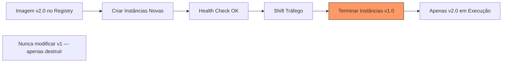

# Immutable Deployment

## 1. O que é
Immutable deployment é a estratégia em que instâncias de infraestrutura **nunca são modificadas após criação** — para atualizar, cria-se novas instâncias com a nova versão e destrói-se as antigas. Não há SSH para patch, não há `apt upgrade` em produção, não há edição de arquivos no servidor rodando.

No mercado, você também verá os termos immutable infrastructure, cattle not pets, replace-not-patch e golden image deployment. É o paradigma central de containers, serverless e infraestrutura como código moderna.

## 2. Por que existe (o problema que resolve)
Deployments mutáveis (in-place) acumulam config drift: cada servidor evolui de forma ligeiramente diferente ao longo do tempo, tornando debugging e reprodução de problemas quase impossíveis. O conceito de immutable infrastructure foi popularizado por Chad Fowler (2013) e adotado massivamente com Docker e Kubernetes, onde pods são efêmeros e substituíveis.

O problema que resolve é consistência, reprodutibilidade e eliminação de "snowflake servers" — servidores únicos e frágeis que ninguém ousa tocar.

## 3. Como funciona
Fluxo típico:
1. **Build**: nova imagem Docker ou AMI é construída com versão pinada de tudo.
2. **Publish**: artefato imutável é publicado no registry com tag versionada.
3. **Provision**: novas instâncias são criadas a partir do artefato (novos pods, novas VMs, novas Lambdas).
4. **Traffic shift**: load balancer ou service mesh direciona tráfego para novas instâncias.
5. **Verify**: health checks e métricas validam as novas instâncias.
6. **Destroy**: instâncias antigas são terminadas — nunca atualizadas.

Componentes envolvidos:
- **Container image / AMI**: artefato imutável e versionado.
- **Orchestrator** (Kubernetes, ECS, Nomad): cria e destrói instâncias.
- **IaC** (Terraform, Pulumi): define infraestrutura declarativa.
- **Registry** (ECR, GCR, Harbor): armazena imagens imutáveis.
- **Load balancer**: gerencia transição de tráfego.

## 4. Casos de uso reais
- Deploy de microserviços em Kubernetes com rolling update de pods.
- Lambda functions com publicação de nova versão e shift de alias.
- AMI baking com Packer para fleet de EC2 auto-scaling.
- GitOps com ArgoCD: mudança no manifest → novos pods, pods antigos terminados.
- Deploy de aplicações em Cloud Run ou Fargate.

Quando não usar:
- Sistemas stateful com dados locais que não podem ser perdidos (bancos de dados, message brokers com storage local).
- Ambientes onde o custo de criar/destruir instâncias é proibitivo (VMs lentas para provisionar).
- Legado que depende de configuração manual persistente no host.

## 5. Cenários práticos e trade-offs
**Cenário 1: Rolling update imutável no Kubernetes**
- Novos pods sobem com imagem v2; pods v1 são terminados gradualmente.
- Trade-offs: zero config drift, mas exige aplicação stateless e startup rápido.

**Cenário 2: Rollback imutável**
- Tag `v1.2.3` é re-deployada; novos pods sobem com imagem antiga em minutos.
- Trade-offs: rollback rápido e confiável, mas exige que imagens antigas estejam no registry.

**Cenário 3: StatefulSet com volume persistente**
- Pod é recriado mas volume EBS persiste; dados sobrevivem, binário é novo.
- Trade-offs: dados persistem, mas migração de schema deve ser backward-compatible.

Trade-offs gerais:
- **Consistência**: todos os ambientes idênticos ao artefato — debugging simplificado.
- **Custo de provisionamento**: criar/destruir instâncias consome tempo e recursos transitórios.
- **Startup time**: aplicação deve iniciar rápido; cold start é penalidade.
- **Storage**: estado deve estar externalizado (DB, S3, Redis) — não no filesystem local.

## 6. Diagrama e fluxo visual
a) Diagrama em Mermaid



b) Prompt para geração de imagem

"Create an immutable infrastructure diagram showing old server instances being destroyed while new identical instances are created from a versioned container image. Emphasize replace-not-patch with no modifications to running servers."

## 7. Exemplo aplicado — Java + Spring
```java
package com.example.immutable;

import org.springframework.boot.SpringApplication;
import org.springframework.boot.autoconfigure.SpringBootApplication;
import org.springframework.boot.context.event.ApplicationReadyEvent;
import org.springframework.context.event.EventListener;
import org.springframework.web.bind.annotation.GetMapping;
import org.springframework.web.bind.annotation.RestController;

@SpringBootApplication
public class ImmutableApplication {
    public static void main(String[] args) {
        // Toda configuração via env vars — nada escrito em disco em runtime
        SpringApplication.run(ImmutableApplication.class, args);
    }
}

@RestController
class ImmutableController {
    private final String imageTag = System.getenv().getOrDefault("IMAGE_TAG", "unknown");

    @GetMapping("/info")
    public ImageInfo info() {
        // Identidade vem do artefato imutável, não de modificações locais
        return new ImageInfo(imageTag, "immutable");
    }

    record ImageInfo(String tag, String deploymentModel) {}
}

// Startup rápido é crítico em deploy imutável — lazy init onde possível
class FastStartupConfig {
    @EventListener(ApplicationReadyEvent.class)
    public void onReady() {
        // Pré-aquece caches essenciais após readiness
    }
}
```

Pontos-chave:
- `IMAGE_TAG` injetada no deploy identifica o artefato imutável — nunca alterada em runtime.
- Startup rápido é crítico: instâncias antigas são destruídas assim que novas estão prontas.

## 8. Exemplo aplicado — TypeScript + NestJS
```ts
import { Controller, Get, Module, OnApplicationBootstrap } from '@nestjs/common';
import { NestFactory } from '@nestjs/core';

@Controller('info')
class InfoController {
  @Get()
  info() {
    return {
      imageTag: process.env.IMAGE_TAG ?? 'unknown',
      deploymentModel: 'immutable',
      hostname: process.env.HOSTNAME, // Pod name no K8s — efêmero por design
    };
  }
}

@Module({ controllers: [InfoController] })
class AppModule implements OnApplicationBootstrap {
  onApplicationBootstrap() {
    // Warm-up pós-startup — instância será destruída no próximo deploy
    console.log(`Instance ${process.env.HOSTNAME} ready with tag ${process.env.IMAGE_TAG}`);
  }
}

async function bootstrap() {
  const app = await NestFactory.create(AppModule, { logger: ['error', 'warn'] });
  await app.listen(3000);
}
bootstrap();

// kubernetes deployment.yaml (conceitual):
// spec.template.spec.containers[0].image: myapp:v2.0.0  # tag imutável
// spec.strategy.type: RollingUpdate
```

Pontos-chave:
- `HOSTNAME` no Kubernetes é o pod name — confirma modelo efêmero/imutável.
- Imagem com tag fixa (`v2.0.0`), nunca `latest` — essencial para rollback confiável.

## 9. Comparação e armadilhas comuns
Comparação rápida:
- **Immutable vs. In-place**: immutable cria/destrói; in-place modifica o mesmo host.
- **Immutable vs. Blue-green**: ambos criam instâncias novas; blue-green mantém ambas temporariamente para switch instantâneo.

Armadilhas comuns:
1. **Tag `latest`**: impossibilita rollback e rastreabilidade.
2. **Estado no filesystem local**: perdido quando instância é destruída.
3. **Startup lento**: rolling update fica preso com instâncias antigas por muito tempo.

## 10. Perguntas para fixação
1. Por que "pets vs. cattle" é metáfora central para immutable deployment?
2. Como você armazenaria estado de aplicação em arquitetura immutable?
3. O que acontece com rollback se você usa tag `latest` no registry?
