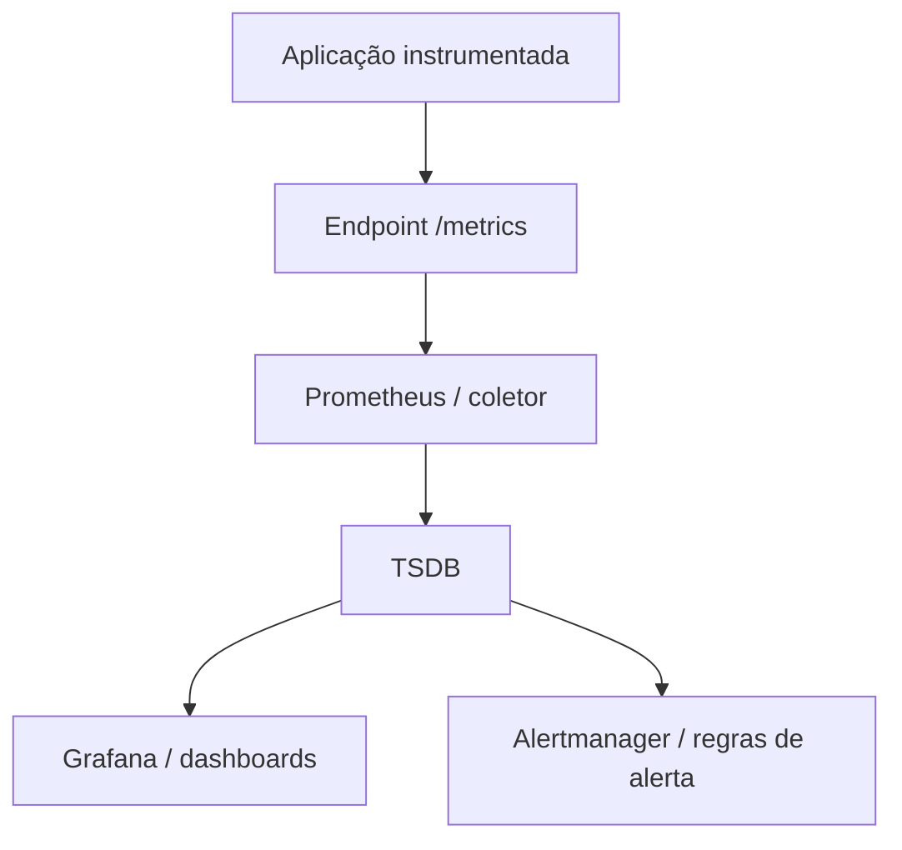

# Métricas

## 1. O que é
Métricas são medidas quantitativas sobre o comportamento de software e infraestrutura, geralmente armazenadas como séries temporais e utilizadas para análise, alertas e controle de desempenho.

Sinônimos / nomes alternativos:
- Time series metrics
- Telemetry metrics
- System metrics
- Business metrics
- Instrumentação de métricas

Variações / camadas reconhecidas:
- Counters
- Gauges
- Histograms
- Summaries
- Timers
- Labels / dimensions

## 2. Por que existe (o problema que resolve)
Antes de métricas como prática consolidada, equipes dependiam de logs e dashboards estáticos para entender desempenho e disponibilidade. Essas abordagens não permitiam analisar tendências, calcular SLOs ou configurar alertas eficazes de forma automática.

A evolução veio de ferramentas como Graphite, StatsD, Prometheus e, mais tarde, OpenTelemetry. Elas trouxeram a ideia de coletar dados numéricos contínuos para converter comportamento em sinais observáveis.

## 3. Tipos e características

### 3.1 Counter
Como funciona:
- Um counter é um valor crescente que só incrementa.
- Exemplo: número de requisições recebidas.

Prós:
- Ideal para contagem de eventos discretos.
- Fácil de agregar e calcular taxas.

Contras:
- Não decresce; não serve para medir valores instantâneos.

Camada:
- Aplicação / instrumentação.

Quando usar:
- Contagem de erros, requisições, eventos processados.

### 3.2 Gauge
Como funciona:
- Um gauge representa um valor que pode subir e descer.
- Exemplo: uso de CPU, número de conexões ativas.

Prós:
- Reflete estado atual.
- Útil para recursos em tempo real.

Contras:
- Valores temporários podem ser voláteis.

Camada:
- Aplicação / infraestrutura.

Quando usar:
- Uso de memória, latência atual, tamanho de fila.

### 3.3 Histogram
Como funciona:
- Divide valores em buckets e conta ocorrências por bucket.
- Exemplo: latências de requisição distribuídas.

Prós:
- Permite percentis e distribuição.
- Bom para latência e tamanhos de payload.

Contras:
- Consome mais armazenamento.
- Escolher buckets errados distorce resultados.

Camada:
- Aplicação / monitoramento.

Quando usar:
- Medir latência, duração de consultas, tamanho de filas.

### 3.4 Summary
Como funciona:
- Agrega contagem e soma de valores em um intervalo, geralmente com percentis calculados localmente.

Prós:
- Disponível em Prometheus e outras ferramentas.

Contras:
- Percentis agregados entre instâncias são imprecisos.

Camada:
- Aplicação / instrumentação.

Quando usar:
- Quando precisa de percentis locais com baixa cardinalidade.

### 3.5 Labels / dimensions
Como funciona:
- Cada métrica pode ter dimensões adicionais (por exemplo, `service`, `region`, `status_code`).

Prós:
- Filtragem flexível.

Contras:
- Alta cardinalidade causa explosão de séries.

Camada:
- Aplicação / coleta.

Quando usar:
- Separar métricas por serviço, região ou usuário.

## 4. Como funciona (mecanismo interno)

1. Instrumentação: o código cria métricas usando bibliotecas como Micrometer, Prometheus client ou OpenTelemetry.
2. Exposição: métricas são expostas em um endpoint HTTP (`/metrics`) ou enviadas via push gateway.
3. Coleta: um sistema de scraping (Prometheus) ou um pipeline push captura os dados.
4. Armazenamento: os dados são armazenados em um TSDB (Prometheus, InfluxDB, Cloud Monitoring).
5. Consulta: dashboards e alertas obtêm valores por meio de consultas.
6. Agregação: métricas são agregadas por tempo e por label.

Componentes:
- Biblioteca de instrumentação
- Exportador ou endpoint de exposição
- Coletor/scraper
- Banco de dados de séries temporais
- Interface de visualização e alerta

Estratégias:
- Pull vs push
- Bucketing de histogramas
- Amostragem de métricas de alta frequência
- Cardinalidade controlada por labels

## 5. Onde e como se aplica na prática

### Nível de máquina/processo único
- Use `Micrometer` ou `Dropwizard Metrics` em um serviço Spring Boot que expõe `/actuator/prometheus`.
- Em Node/NestJS, use `prom-client` para expor métricas via HTTP.
- Em um processo isolado, métricas ajudam a entender uso local de CPU, heap e latência.

### Nível on-premise/self-managed
- Prometheus scraping métricas de aplicativos e exportadores.
- Graphite com statsd para contagem e gauges.
- InfluxDB + Telegraf para armazenamento de séries temporais.
- Grafana para dashboards.

### Nível de nuvem/managed service
- AWS CloudWatch Metrics com custom metrics e namespaces.
- GCP Cloud Monitoring com métricas customizadas e dashboards.
- Azure Monitor Metrics e Application Insights.
- Datadog Metrics, New Relic, Dynatrace.

### Nível de orquestração/Kubernetes
- Prometheus Operator e ServiceMonitor para coletar métricas de pods.
- Kube-state-metrics para métricas de estado do cluster.
- Horizontal Pod Autoscaler baseado em métricas customizadas ou CPU.
- OpenTelemetry Collector como sidecar ou daemonset.

## 6. Casos de uso reais e quando NÃO usar

### Casos de uso reais
- E-commerce: contagem de requisições, latência de checkout e taxa de conversão. Tipo: counters e histograms.
- Plataforma de streaming: gauge de conexões ativas e histogram de latência do buffer.
- Banco digital: métricas de transações por segundo e filas de processamento. Tipo: counters e summaries.
- SaaS B2B: uso de recursos por tenant com labels de `customer_id`.
- Infra Kubernetes: métricas de CPU, memória e status de pods para autoscaling.

### Quando NÃO usar ou evitar
- Não use métricas para eventos de alta cardinalidade que deveriam ser logs (por exemplo, detalhes de transação individual).
- Evite summaries para métricas que precisam ser agregadas em múltiplas instâncias. Use histograms em vez disso.
- Não criar labels dinâmicos sem controle: `user_id` como label em alta cardinalidade causa explosão de séries.
- Evite coletar métricas com resolução muito fina se não houver capacidade de armazenamento.

## 7. Cenários práticos e trade-offs

### Cenário 1: Visão de SLA de latência
Um serviço expõe tempo de resposta usando histogramas. A equipe consulta percentis 95 e 99 para saber se o SLA está dentro do limite.

### Cenário 2: Escala de pico em Black Friday
Durante um pico de tráfego, o contador de requisições e o gauge de fila de mensagens permitem dimensionar horizontalmente os workers e detectar saturação de memória.

### Cenário 3: Falha de cardinalidade alta
A equipe adiciona o label `session_id` em uma métrica. Posteriormente, o TSDB explode em milhões de séries, causando lentidão e custos imprevistos. A correção é remover o label e guardar esse detalhe em logs.

### Tabela de trade-offs

| Tipo | Latência | Consistência | Custo operacional | Complexidade | Resiliência |
|---|---|---|---|---|---|
| Counter | Muito baixa | Alta | Baixo | Baixa | Alta |
| Gauge | Muito baixa | Média | Baixo | Baixa | Média |
| Histogram | Média | Alta | Médio | Médio | Alta |
| Summary | Média | Média | Médio | Médio | Média |

## 8. Diagrama e fluxo visual



**Prompt de imagem em inglês**

"Create a conceptual diagram of metrics collection for modern applications: instrumented service exposing metrics, a Prometheus scraper, a time-series database, and dashboards with alerts. Show counters, gauges, histograms, and labels in a cloud-native observability style."

## 9. Exemplo aplicado — Java + Spring

`pom.xml` dependencies:

```xml
<dependency>
  <groupId>io.micrometer</groupId>
  <artifactId>micrometer-registry-prometheus</artifactId>
  <version>1.11.0</version>
</dependency>
<dependency>
  <groupId>org.springframework.boot</groupId>
  <artifactId>spring-boot-starter-actuator</artifactId>
</dependency>
```

`application.yml`:

```yaml
management:
  endpoints:
    web:
      exposure:
        include: prometheus,health
  metrics:
    enable:
      all: true
```

`OrderMetrics.java`:

```java
import io.micrometer.core.instrument.Counter;
import io.micrometer.core.instrument.DistributionSummary;
import io.micrometer.core.instrument.MeterRegistry;
import org.springframework.stereotype.Component;

@Component
public class OrderMetrics {
  private final Counter requestCounter;
  private final DistributionSummary latencySummary;

  public OrderMetrics(MeterRegistry registry) {
    this.requestCounter = Counter.builder("orders.requests.total")
      .description("Total de pedidos processados")
      .register(registry);

    this.latencySummary = DistributionSummary.builder("orders.latency.ms")
      .description("Latência de processamento de pedidos")
      .baseUnit("milliseconds")
      .register(registry);
  }

  public void recordRequest() {
    requestCounter.increment();
  }

  public void recordLatency(double millis) {
    latencySummary.record(millis);
  }
}
```

Pontos-chave:
- `Micrometer` é a camada de instrumentação e `Prometheus` é o backend.
- O endpoint `/actuator/prometheus` é coletado pelo Prometheus.
- `DistributionSummary` permite analisar distribuição de latência.

## 10. Exemplo aplicado — TypeScript + NestJS

`package.json`:

```json
"dependencies": {
  "@nestjs/common": "^10.0.0",
  "@nestjs/core": "^10.0.0",
  "prom-client": "^14.0.0"
}
```

`metrics.service.ts`:

```ts
import { Injectable } from '@nestjs/common';
import { Counter, Gauge, Histogram, register } from 'prom-client';

@Injectable()
export class MetricsService {
  private requestCounter = new Counter({
    name: 'orders_requests_total',
    help: 'Total de pedidos processados',
    labelNames: ['status'],
  });

  private processingLatency = new Histogram({
    name: 'orders_processing_latency_ms',
    help: 'Latência de processamento de pedidos',
    buckets: [50, 100, 250, 500, 1000],
  });

  recordRequest(status: string) {
    this.requestCounter.labels(status).inc();
  }

  recordLatency(ms: number) {
    this.processingLatency.observe(ms);
  }

  getMetrics() {
    return register.metrics();
  }
}
```

`metrics.controller.ts`:

```ts
import { Controller, Get, Header } from '@nestjs/common';
import { MetricsService } from './metrics.service';

@Controller('metrics')
export class MetricsController {
  constructor(private readonly metricsService: MetricsService) {}

  @Get()
  @Header('Content-Type', 'text/plain; version=0.0.4')
  async metrics() {
    return this.metricsService.getMetrics();
  }
}
```

Pontos-chave:
- `prom-client` expõe métricas no formato esperado pelo Prometheus.
- É possível adicionar labels fixos e histograms para percentis.
- O endpoint `/metrics` é o ponto de coleta.

## 11. Comparação e armadilhas comuns

### Comparação com logs
- Métricas são agregadas e numéricas, enquanto logs são eventos detalhados.
- Use métricas para sinais de saúde e logs para investigação profunda.

### Comparação com tracing
- Tracing mostra fluxo causal entre serviços.
- Métricas mostram volume e latência agregada.

### Erros comuns
- Alta cardinalidade de labels: causa explosão de séries e degradação do TSDB.
- Usar `user_id` ou `session_id` como label em vez de log: transforma métricas em logs mal dimensionados.
- Buckets mal escolhidos em histogramas: distorcem percentis.
- Não instrumentar códigos críticos: gera lacunas e perda de confiança.

## 12. Perguntas para fixação

- Qual a diferença entre counter e gauge e quando usar cada um?
- Por que labels de alta cardinalidade são perigosos em sistemas de métricas?
- Quando histograms são melhores do que summaries?
- Como métricas se encaixam em práticas de SLO e alerting?
- Qual é a diferença entre pull e push na coleta de métricas?
