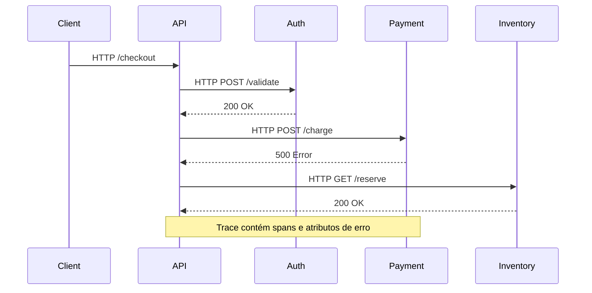

# Distributed Tracing

## 1. O que é

O tracing distribuído (ou rastreamento distribuído) é um método para monitorar, registrar e acompanhar requisições de ponta a ponta à medida que elas passam por vários microsserviços, APIs e bancos de dados. Seus componentes principais são os traces (o caminho completo da requisição), os spans (cada etapa individual) e a

Sinônimos / nomes alternativos:

- Trace context
- End-to-end tracing
- Request tracing
- Transaction tracing
- Causal tracing

Variações / camadas reconhecidas:

- Trace propagation (W3C TraceContext, B3, Jaeger)
- Sampling strategies (head-based, tail-based, adaptive)
- Synchronous vs asynchronous spans
- In-process spans vs cross-process spans
- OpenTelemetry tracing vs Jaeger/Zipkin native

## 2. Por que existe (o problema que resolve)

Em arquiteturas monolíticas, a observação da execução era simples porque o fluxo permanecia em um processo. Com microserviços, cada requisição pode atravessar dezenas de serviços, tornando difícil entender onde a latência ou erro ocorreu.

O problema se manifestou em empresas como Google, Netflix e Twitter. O paper "Dapper: A Large-Scale Distributed Systems Tracing Infrastructure" e as ferramentas Zipkin e Jaeger popularizaram a solução.

Antes do tracing distribuído, equipes dependiam de logs separados e correlação manual por IDs de requisição. Isso resultava em respostas lentas a incidentes e baixa visibilidade de dependências.

## 3. Tipos e características

### 3.1 Head-based sampling

Como funciona:

- Avalia cada trace no início do pedido.
- Decide se coleta ou descarta o trace inteiro.

Prós:

- Simples e eficiente.
- Bom para reduzir custo inicial.

Contras:

- Pode perder eventos raros ou falhas posteriores.

Camada:

- Instrumentação de aplicação / biblioteca de tracing.

Quando usar:

- Quando o volume é alto e o custo precisa ser limitado.

### 3.2 Tail-based sampling

Como funciona:

- Coleta spans temporariamente e decide após ver o resultado do trace.
- Prioriza traces que realmente falharam ou ultrapassaram latência.

Prós:

- Mais preciso para capturar problemas reais.
- Evita descartar erros importantes.

Contras:

- Requer buffer e maior custo de armazenamento temporário.

Camada:

- Coletor / backend.

Quando usar:

- Em produção para encontrar falhas e saturação com menos ruído.

### 3.3 Synchronous tracing

Como funciona:

- Contexto de trace é propagado imediatamente em chamadas HTTP/GRPC.
- Spans são abertos e fechados enquanto o fluxo está ativo.

Prós:

- Visibilidade completa da cadeia de chamada.

Contras:

- Pode aumentar latência de aplicações sensíveis.

Camada:

- Aplicação / transporte.

Quando usar:

- Em serviços que precisam de visibilidade detalhada de chamadas.

### 3.4 Asynchronous tracing

Como funciona:

- Spans em tarefas assíncronas são correlacionados por contextos explícitos.
- Exemplo: filas, workers e callbacks.

Prós:

- Captura fluxos sem bloqueio direto.

Contras:

- Requer propagação manual ou bibliotecas avançadas.

Camada:

- Aplicação / middleware.

Quando usar:

- Para pipelines de eventos, jobs em background e mensageria.

### 3.5 Protocolos de propagação

Como funciona:

- W3C TraceContext, B3 e Jaeger definem headers e formatos.

Prós:

- Compatibilidade entre ferramentas.

Contras:

- Misturar protocolos exige tradução no coletor.

Camada:

- Transporte / rede.

Quando usar:

- W3C TraceContext para compatibilidade moderna.
- B3 em ambientes Zipkin legados.

## 4. Como funciona (mecanismo interno)

1. Criação de trace: um request de entrada gera um `trace_id` e um `root span`.
2. Propagação: o contexto de trace é enviado em headers HTTP ou metadados RPC.
3. Criação de spans filhos: cada chamada de serviço adiciona um span com timestamps.
4. Enriquecimento: spans recebem atributos como `http.method`, `db.statement`, `status_code`.
5. Exportação: os spans são enviados para um coletor via OTLP, Jaeger, Zipkin ou Kafka.
6. Coleta e armazenamento: o coletor agrupa spans por `trace_id` e armazena no backend.
7. Consulta e visualização: UI exibe trace waterfall e latências por serviço.

Componentes:

- Instrumentação da aplicação
- Propagador de contexto
- SDK de tracing
- Exportador / coletor
- Backend de trace
- Interface de análise

Algoritmos/estratégias:

- W3C TraceContext e B3 para propagação de headers.
- Amostragem head-based / tail-based.
- Mapeamento de spans e parent-child.
- Enriquecimento de atributos de rede e banco.

## 5. Onde e como se aplica na prática

### Nível de máquina/processo único

- Em uma aplicação Spring Boot, spans locais ajudam a medir tempo de execução de métodos.
- Em Node/NestJS, tracer local pode instrumentar chamadas de banco e redis.
- Útil para diagnosticar performance antes de distribuir o serviço.

### Nível on-premise/self-managed

- Jaeger e Zipkin como coletores e backends.
- OpenTelemetry Collector para unificar traces e exportar para múltiplos backends.
- Elastic APM Server autogerencia traces no stack Elastic.

### Nível de nuvem/managed service

- AWS X-Ray oferece traces distribuídos com segment documents.
- GCP Cloud Trace captura latência de aplicações instrumentadas.
- Azure Monitor Application Insights tem suporte a trace distributed.
- Datadog APM e New Relic Distributed Tracing.

### Nível de orquestração/Kubernetes

- Istio/Envoy injetam headers de trace automaticamente em tráfego mTLS.
- OpenTelemetry Collector como DaemonSet/sidecar.
- K8s Service Mesh permite visualizar dependências de serviço com tracing.

## 6. Casos de uso reais e quando NÃO usar

### Casos de uso reais

- Netflix: entender latência de chamadas entre serviços de recomendação, inventário e catálogo. Tipo: tracing síncrono com W3C/B3.
- Uber: rastrear requisições de mobilidade que atravessam matching, pricing e dispatch. Tipo: tail-based sampling para capturar erros.
- Shopify: diagnosticar falhas de checkout com spans de front-end a back-end. Tipo: trace propagation em HTTP e banco.
- Plataforma serverless: correlacionar funções AWS Lambda, API Gateway e DynamoDB. Tipo: tracing assíncrono com AWS X-Ray.
- Kubernetes service mesh: detectar problemas de latência entre pods com Istio.

### Quando NÃO usar ou evitar

- Em aplicações monolíticas pequenas sem dependências distribuídas, a sobrecarga do tracing pode ser desnecessária.
- Em sistemas de alta taxa sem amostragem, os dados podem crescer rapidamente e consumir recursos.
- Se não houver mecanismo de propagação de contexto, o trace ficará fragmentado e perde utilidade.
- Não use spans excessivamente detalhados em loops internos; isso gera ruído e custo.

## 7. Cenários práticos e trade-offs

### Cenário 1: Pedido falho em várias services

Uma requisição de checkout percorre `api-gateway -> auth -> cart -> payment -> inventory`. Com traces, é possível ver que `payment` foi mais lento e que a falha ocorreu ao chamar o gateway de pagamentos.

### Cenário 2: Picos de tráfego e amostragem

Durante um pico, o sistema usa head-based sampling de 10% para reduzir ingestão. Depois, detecta erro elevado e muda para tail-based sampling para capturar traces de falha.

### Cenário 3: Falha de contexto em filas

Uma mensagem enviada para Kafka perde o `trace_id` porque o produtor não o propaga no header. O trace fica truncado no backend e não há visão completa do fluxo assíncrono.

### Tabela de trade-offs

| Tipo / variação | Latência | Consistência | Custo operacional | Complexidade | Resiliência |
|---|---|---|---|---|---|
| Head-based sampling | Baixa | Média | Baixo | Baixa | Média |
| Tail-based sampling | Média | Alta | Médio | Médio | Alta |
| Synchronous tracing | Média | Alta | Médio | Médio | Alta |
| Asynchronous tracing | Média | Média | Médio | Alta | Alta |

## 8. Diagrama e fluxo visual



**Prompt de imagem em inglês**

"Create a conceptual illustration of distributed tracing across microservices: a client request flowing through API gateway, auth, payment, inventory, with trace IDs and spans visualized as a waterfall diagram. Use modern cloud-native observability style with service mesh and span metadata."

## 9. Exemplo aplicado — Java + Spring

`pom.xml` dependencies:

```xml
<dependency>
  <groupId>io.opentelemetry</groupId>
  <artifactId>opentelemetry-api</artifactId>
  <version>1.33.0</version>
</dependency>
<dependency>
  <groupId>io.opentelemetry</groupId>
  <artifactId>opentelemetry-sdk</artifactId>
  <version>1.33.0</version>
</dependency>
<dependency>
  <groupId>io.opentelemetry</groupId>
  <artifactId>opentelemetry-exporter-otlp</artifactId>
  <version>1.33.0</version>
</dependency>
```

`OpenTelemetryConfig.java`:

```java
import io.opentelemetry.api.GlobalOpenTelemetry;
import io.opentelemetry.api.trace.Tracer;
import io.opentelemetry.sdk.OpenTelemetrySdk;
import io.opentelemetry.sdk.trace.SdkTracerProvider;
import io.opentelemetry.sdk.trace.export.BatchSpanProcessor;
import io.opentelemetry.exporter.otlp.trace.OtlpGrpcSpanExporter;
import org.springframework.context.annotation.Bean;
import org.springframework.context.annotation.Configuration;

@Configuration
public class OpenTelemetryConfig {
  @Bean
  public Tracer tracer() {
    OtlpGrpcSpanExporter exporter = OtlpGrpcSpanExporter.builder()
      .setEndpoint("http://localhost:4317")
      .build();

    SdkTracerProvider tracerProvider = SdkTracerProvider.builder()
      .addSpanProcessor(BatchSpanProcessor.builder(exporter).build())
      .build();

    OpenTelemetrySdk openTelemetry = OpenTelemetrySdk.builder()
      .setTracerProvider(tracerProvider)
      .buildAndRegisterGlobal();

    return openTelemetry.getTracer("com.example.orders");
  }
}
```

`OrderController.java`:

```java
import io.opentelemetry.api.trace.Span;
import io.opentelemetry.api.trace.Tracer;
import org.springframework.web.bind.annotation.PostMapping;
import org.springframework.web.bind.annotation.RestController;

@RestController
public class OrderController {
  private final Tracer tracer;

  public OrderController(Tracer tracer) {
    this.tracer = tracer;
  }

  @PostMapping("/checkout")
  public String checkout() {
    Span span = tracer.spanBuilder("checkout.order").startSpan();
    try {
      span.setAttribute("service.name", "order-service");
      // lógica de checkout
      return "ok";
    } catch (Exception ex) {
      span.recordException(ex);
      span.setStatus(StatusCode.ERROR);
      throw ex;
    } finally {
      span.end();
    }
  }
}
```

Pontos-chave:

- `OtlpGrpcSpanExporter` envia spans ao coletor OpenTelemetry.
- O span root `checkout.order` é criado e atributos são adicionados.
- Em produção, o collector agrupa spans de múltiplos serviços.

## 10. Exemplo aplicado — TypeScript + NestJS

`package.json`:

```json
"dependencies": {
  "@nestjs/common": "^10.0.0",
  "@nestjs/core": "^10.0.0",
  "@opentelemetry/api": "^1.0.4",
  "@opentelemetry/sdk-node": "^0.35.0",
  "@opentelemetry/auto-instrumentations-node": "^0.35.0"
}
```

`tracing.ts`:

```ts
import { NodeSDK } from '@opentelemetry/sdk-node';
import { getNodeAutoInstrumentations } from '@opentelemetry/auto-instrumentations-node';
import { OTLPTraceExporter } from '@opentelemetry/exporter-trace-otlp-http';

const sdk = new NodeSDK({
  traceExporter: new OTLPTraceExporter({ url: 'http://localhost:4318/v1/traces' }),
  instrumentations: [getNodeAutoInstrumentations()],
});

sdk.start();
```

`app.controller.ts`:

```ts
import { Controller, Post } from '@nestjs/common';
import { trace } from '@opentelemetry/api';

@Controller('orders')
export class OrdersController {
  @Post('checkout')
  checkout() {
    const tracer = trace.getTracer('orders-service');
    const span = tracer.startSpan('checkout.order');
    try {
      span.setAttribute('service.name', 'orders-service');
      return { status: 'ok' };
    } finally {
      span.end();
    }
  }
}
```

Pontos-chave:

- A instrumentação automática captura chamadas HTTP e de banco.
- O exporter OTLP envia spans ao collector.
- O tracer manual cria spans de alto nível.

## 11. Comparação e armadilhas comuns

### Comparação com logs

- Logs registram eventos e estado, enquanto tracing mostra fluxo causal.
- Tracing é o melhor para localizar onde a requisição ficou lenta.

### Comparação com métricas

- Métricas dão sinais agregados de saúde.
- Tracing dá detalhamento por transação.

### Erros comuns

- Não propagar headers de trace (`traceparent`, `b3`) em chamadas HTTP. Consequência: trace fragmentado.
- Amostragem muito baixa que descarta erros. Consequência: incapacidade de analisar falhas reais.
- Criar spans excessivamente pequenos em loops. Consequência: ruído e custo de armazenamento.
- Não instrumentar tarefas assíncronas. Consequência: ausência de visão em pipelines baseados em filas.

## 12. Perguntas para fixação

- O que é um span e como ele se relaciona a um trace?
- Quando você escolheria tail-based sampling em vez de head-based sampling?
- Como o W3C TraceContext difere do B3?
- Por que distributed tracing é importante em arquiteturas de microsserviços?
- Como solucionar um trace fragmentado em um ambiente de filas e workers?
