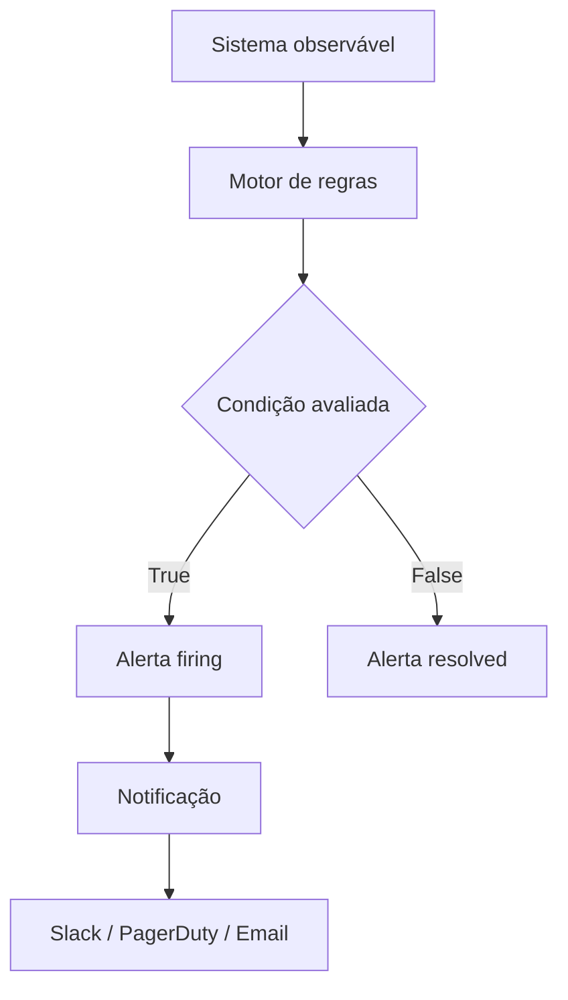

# Alerting

## 1. O que é

Alerting é o processo de detectar condições anômalas em sistemas observáveis e notificar pessoas ou serviços para ação imediata.

Sinônimos / nomes alternativos:

- Monitoring alerts
- Incident alerting
- Alert management
- Rule-based alerting
- Anomaly detection alerting

Variações / camadas reconhecidas:

- Threshold-based alerting
- Anomaly-based alerting
- Composite alerting
- Heartbeat / availability alerting
- Rate-based alerting
- Log-based alerting

## 2. Por que existe (o problema que resolve)

Alerting existe porque equipes não podem observar manualmente dashboards 24/7. Quando algo quebra, é preciso ser notificado rapidamente para reduzir tempo de recuperação.

Historicamente, sistemas como Nagios e PagerDuty tornaram evidente que apenas coletar métricas não basta; é preciso executar regras e enviar notificações. Alerting também surgiu como prática central em SRE para manter SLOs e evitar que problemas pequenos se tornem incidentes críticos.

## 3. Tipos e características

### 3.1 Threshold-based alerting

Como funciona:

- Avalia um valor de métrica contra um limite fixo ou dinâmico.
- Exemplo: `CPU > 85% por 5 minutos`.

Prós:

- Simples de configurar.
- Fácil de entender.

Contras:

- Pode gerar muitos falsos positivos em variações normais.

Camada:

- Monitoramento / aplicação de regras.

Quando usar:

- Em métricas de recursos estáveis, como uso de memória ou latência de endpoint.

### 3.2 Anomaly-based alerting

Como funciona:

- Usa algoritmos estatísticos ou ML para detectar desvios esperados.
- Exemplo: aumento inesperado de erro 500 em relação ao histórico.

Prós:

- Menos dependente de limites fixos.
- Detecta padrões novos.

Contras:

- Requer mais dados e ajuste.

Camada:

- Plataforma de monitoramento / análise.

Quando usar:

- Em ambientes dinâmicos onde padrões de carga variam.

### 3.3 Composite alerting

Como funciona:

- Combina múltiplas condições.
- Exemplo: `erro 500 > 5% E latência > 1s`.

Prós:

- Reduz ruído.
- Foca em problemas específicos.

Contras:

- Mais complexo de configurar e depurar.

Camada:

- Regras de alerta.

Quando usar:

- Para detectar condições reais que envolvem múltiplos sinais.

### 3.4 Heartbeat / availability alerting

Como funciona:

- Verifica se um serviço envia um sinal regular.
- Exemplo: uma job cron que reporta sua execução a cada 60s.

Prós:

- Detecta falhas silenciosas.

Contras:

- Não informa automaticamente a causa.

Camada:

- Infraestrutura / disponibilidade.

Quando usar:

- Em pipelines, jobs agendados e serviços sem tráfego constante.

### 3.5 Log-based alerting

Como funciona:

- Analisa logs em tempo real para padrões de erro ou anomalia.
- Exemplo: `count(error) > 10 em 1 min`.

Prós:

- Útil quando métricas não cobrem todos os casos.

Contras:

- Depende de logs de boa qualidade e ingestão em tempo real.

Camada:

- Logs / observabilidade.

Quando usar:

- Para alertas sobre exceções específicas ou auditoria.

## 4. Como funciona (mecanismo interno)

1. Definição de regra: a equipe cria uma condição baseada em métricas, logs ou traces.
2. Agregação: o sistema calcula o valor relevante para o intervalo de tempo.
3. Avaliação contínua: a regra é avaliada periodicamente.
4. Disparador: se a condição se mantiver, a política entra em alerta.
5. Aggregation de estado: o alerta muda de `firing` para `resolved`.
6. Notificação: o alerta é enviado a canais como e-mail, Slack, PagerDuty, Opsgenie.
7. Escalação: regras de roteamento e urgência são aplicadas.

Componentes:

- Fonte de sinais (métricas, logs, traces)
- Engine de regras
- Motor de avaliação temporal
- Canal de notificação
- Roteador e gerenciador de silenciamento

Estratégias / algoritmos:

- Janela de tempo com agregações (avg, sum, max)
- Detecção de anomalias baseada em histórico
- Avaliação de múltiplas condições (AND/OR)
- Rate limiting e deduplication de alertas

## 5. Onde e como se aplica na prática

### Nível de máquina/processo único

- Um serviço local expõe métricas e uma ferramenta pode alertar se o tempo de resposta ultrapassar um limite.
- Soluções simples: scripts de shell que verificam logs e enviam notificações.

### Nível on-premise/self-managed

- Prometheus Alertmanager para alertas baseados em métricas.
- Grafana Alerting para regras combinadas em dashboards.
- Zabbix, Nagios e Sensu para monitoramento de host e serviço.

### Nível de nuvem/managed service

- AWS CloudWatch Alarms para métricas de EC2, RDS e custom metrics.
- GCP Cloud Monitoring Alerts para Cloud Run, GKE e VMs.
- Azure Monitor Alerts para Application Insights e recursos Azure.
- Datadog Monitors, New Relic Alerts e PagerDuty.

### Nível de orquestração/Kubernetes

- PrometheusRule e Alertmanager em clusters Kubernetes.
- Grafana Loki + Grafana alerts para logs de pods.
- Kube-state-metrics e Node Exporter para alertas de saúde do cluster.
- Argo CD e Kubernetes Events como fontes de alertas.

## 6. Casos de uso reais e quando NÃO usar

### Casos de uso reais

- E-commerce: alerta de aumento de erro 500 durante Black Friday. Tipo: threshold-based.
- Plataforma SaaS: alerta de burn rate do SLO de latência. Tipo: composite alerting.
- Job ETL: alerta de falta de heartbeat em pipeline de dados. Tipo: heartbeat alert.
- Infra Kubernetes: alerta de `CrashLoopBackOff` em pod. Tipo: log-based ou metric-based.
- API pública: alerta de aumento súbito de latência com anomalias. Tipo: anomaly-based.

### Quando NÃO usar ou evitar

- Não use alertas sem runbook: um alerta sem ação causa alerta fatigue.
- Evite regras muito sensíveis em métricas volumosas: levam a ruído.
- Não dependa somente de um único tipo de alerta; combine métricas e logs.
- Evite regras que não consideram janelas de avaliação: um pico momentâneo pode disparar falso positivo.

## 7. Cenários práticos e trade-offs

### Cenário 1: Alerta de CPU em servidor crítico

Uma regra threshold dispara quando CPU > 80% por 3 minutos. O time recebe notificação e identifica processo abusivo antes que o serviço degrade.

### Cenário 2: Falha silenciosa de job

Um pipeline de ingestão não envia heartbeat. Heartbeat alert detecta a falha antes que dados sejam perdidos.

### Cenário 3: Detecção de anomalia em erros HTTP

Uma aplicação começa a retornar 502 de forma intermitente. Anomaly-based alerting identifica o aumento do erro sem precisar ajustar thresholds fixos.

### Tabela de trade-offs

| Tipo | Latência | Consistência | Custo operacional | Complexidade | Resiliência |
|---|---|---|---|---|---|
| Threshold-based | Baixa | Média | Baixo | Baixa | Média |
| Anomaly-based | Média | Alta | Médio | Alto | Alta |
| Composite | Média | Alta | Médio | Médio | Alta |
| Heartbeat | Baixa | Alta | Baixo | Média | Alta |
| Log-based | Média | Média | Médio | Médio | Média |

## 8. Diagrama e fluxo visual



**Prompt de imagem em inglês**

"Create a conceptual illustration of alerting in observability: a monitoring engine evaluating metrics and logs, triggering a firing alert, and sending notifications to Slack and PagerDuty. Show thresholds, anomaly detection, and a rule engine in a cloud operations dashboard style."

## 9. Exemplo aplicado — Java + Spring

`pom.xml` dependencies:

```xml
<dependency>
  <groupId>io.micrometer</groupId>
  <artifactId>micrometer-registry-prometheus</artifactId>
  <version>1.11.0</version>
</dependency>
<dependency>
  <groupId>org.springframework.boot</groupId>
  <artifactId>spring-boot-starter-actuator</artifactId>
</dependency>
```

`application.yml`:

```yaml
management:
  endpoints:
    web:
      exposure:
        include: prometheus,health
  metrics:
    enable:
      all: true
```

`OrderController.java`:

```java
import io.micrometer.core.instrument.Counter;
import org.springframework.web.bind.annotation.GetMapping;
import org.springframework.web.bind.annotation.RestController;

@RestController
public class OrderController {
  private final Counter errorCounter;

  public OrderController(MeterRegistry registry) {
    this.errorCounter = Counter.builder("orders.errors.total")
      .description("Total de erros de pedido")
      .register(registry);
  }

  @GetMapping("/checkout")
  public String checkout() {
    try {
      // lógica de checkout
      return "ok";
    } catch (Exception ex) {
      errorCounter.increment();
      throw ex;
    }
  }
}
```

`prometheus-rules.yml`:

```yaml
groups:
  - name: order-service-alerts
    rules:
      - alert: OrderErrorRateHigh
        expr: increase(orders_errors_total[5m]) > 10
        for: 2m
        labels:
          severity: critical
        annotations:
          summary: "Alta taxa de erros em Order Service"
          description: "Mais de 10 erros nos últimos 5 minutos."
```

```

Pontos-chave:
- A regra threshold-based detecta aumento de erros.
- O contador exposto por Micrometer serve como sinal de alerta.
- Alertmanager encaminha para canais como Slack ou PagerDuty.

## 10. Exemplo aplicado — TypeScript + NestJS

`package.json`:

```json
"dependencies": {
  "@nestjs/common": "^10.0.0",
  "@nestjs/core": "^10.0.0",
  "prom-client": "^14.0.0"
}
```

`metrics.service.ts`:

```ts
import { Injectable } from '@nestjs/common';
import { Counter, register } from 'prom-client';

@Injectable()
export class MetricsService {
  private readonly errorCounter = new Counter({
    name: 'orders_errors_total',
    help: 'Total de erros de pedido',
  });

  recordError() {
    this.errorCounter.inc();
  }

  async getMetrics() {
    return register.metrics();
  }
}
```

`alerting.controller.ts`:

```ts
import { Controller, Get, Header } from '@nestjs/common';
import { MetricsService } from './metrics.service';

@Controller('metrics')
export class AlertingController {
  constructor(private readonly metricsService: MetricsService) {}

  @Get()
  @Header('Content-Type', 'text/plain; version=0.0.4')
  async metrics() {
    return this.metricsService.getMetrics();
  }
}
```

Pontos-chave:

- O NestJS expõe métricas para Prometheus coletar.
- O alerta é definido no backend de monitoramento, não na aplicação.
- A métrica `orders_errors_total` é base para um alerta threshold.

## 11. Comparação e armadilhas comuns

### Comparação com dashboards

- Dashboards mostram estado atual e histórico.
- Alerting notifica quando uma condição requer ação imediata.

### Comparação com incident response

- Alerting é o gatilho inicial.
- Incident response é o processo que acontece após o alerta.

### Erros comuns

- Alertas sem runbook: equipes não sabem como responder.
- Regra muito sensível: causa alert fatigue.
- Notificação redundante em múltiplos canais: gera ruído.
- Não testar regras em produção: alertas podem nunca disparar ou disparar incorretamente.

## 12. Perguntas para fixação

- Qual a diferença entre threshold-based e anomaly-based alerting?
- Quando usar alertas compostos em vez de alertas simples?
- Por que heartbeat alerting é importante para jobs agendados?
- Quais são os riscos de não ter um runbook associado a um alerta?
- Como você evita alert fatigue no monitoramento de uma plataforma microservices?
