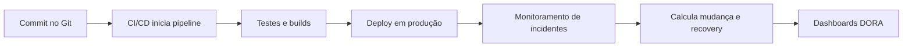

## 1. O que é

DORA Metrics são quatro métricas de entrega e operação definidas pelo DevOps Research and Assessment (DORA) para avaliar a performance de equipes de engenharia de software e a maturidade de entrega contínua.

Sinônimos: métricas DORA, métricas de entrega de software, DORA four metrics.

Tipos/camadas:

- Deployment Frequency
- Lead Time for Changes
- Change Failure Rate
- Mean Time to Recovery

## 2. Por que existe (o problema que resolve)

O problema que motivou as DORA Metrics foi a falta de indicadores objetivos para medir se uma equipe de engenharia entregava software rápido e de forma confiável. Antes disso, era comum usar apenas métricas de projeto (prazos, horas gastas) ou métricas de processo (tickets fechados), que não refletiam a performance real em produção.

O estudo da DORA foi publicado em pesquisa acadêmica e livros como "Accelerate" por Nicole Forsgren, Jez Humble e Gene Kim. O foco era entender por que algumas organizações conseguem lançar mudanças frequentes com baixa taxa de falha enquanto outras não.

## 3. Tipos e características

### Deployment Frequency

Como funciona: mede quantas vezes o código é implantado em produção ou em um ambiente de produção-like por unidade de tempo.
Prós: aponta velocidade de entrega.
Contras: não avalia qualidade nem impacto de cada deploy.
Camada: processo/entrega.
Quando usar: ideal para equipes que priorizam ciclos rápidos e práticas de CI/CD.

### Lead Time for Changes

Como funciona: mede o tempo entre o commit/pronto para deploy e a disponibilização em produção.
Prós: mostra eficiência da pipeline e do fluxo de trabalho.
Contras: pode ser enviesado por batchs de mudança muito grandes.
Camada: pipeline de CI/CD e integração.
Quando usar: útil para identificar gargalos na pipeline e reduzir batch size.

### Change Failure Rate

Como funciona: porcentagem de deploys que causam incidentes, rollback ou correções em produção.
Prós: mede a qualidade e estabilidade da entrega.
Contras: depende de uma definição clara do que conta como falha.
Camada: operação/produto.
Quando usar: para avaliar risco e eficácia dos controles de qualidade.

### Mean Time to Recovery (MTTR)

Como funciona: tempo médio para restaurar o serviço após uma falha relacionada a mudanças.
Prós: indica capacidade de resposta e resiliência.
Contras: pode mascarar problemas se incidentes pequenos e grandes forem tratados igualmente.
Camada: operação e incident response.
Quando usar: essencial quando o objetivo é melhorar a recuperação de produção.

## 4. Como funciona (mecanismo interno)

As DORA Metrics são coletadas a partir de sistemas de versionamento, pipelines de CI/CD, ferramentas de deploy e incident management.

Componentes:

- Repositório Git: identifica commits e merges.
- Sistema de CI/CD (Jenkins, GitHub Actions, GitLab CI, Azure DevOps): registra tempo de build, teste e deploy.
- Plataforma de deploy (Argo CD, Spinnaker, AWS CodeDeploy): registra implantações concluídas.
- Ferramenta de incidentes (PagerDuty, Opsgenie, Jira): identifica falhas e tempos de recuperação.

Algoritmos/estratégias:

- Deployment Frequency: contagem de deploys concluídos no período.
- Lead Time: diferença entre timestamp de merge/commit e timestamp de deploy bem-sucedido.
- Change Failure Rate: número de deploys com rollback/incidente dividido por total de deploys.
- MTTR: soma dos tempos de recuperação dividido pelo número de incidentes.

## 5. Onde e como se aplica na prática

### Nível de máquina/processo único

Em um projeto local, você pode calcular DORA Metrics usando hooks de Git para anotar commits e scripts que medem tempo de build e deploy em um ambiente de teste.

### Nível de infraestrutura on-premise/self-managed

Ferramentas reais: Jenkins, GitLab CI self-hosted, Spinnaker, Tekton, Jira Service Management. Use dashboards do Grafana com Prometheus para consolidar métricas e anotações de deploy.

### Nível de nuvem/managed service

AWS: AWS CodePipeline + CloudWatch + AWS X-Ray para correlacionar deploys; AWS DevOps Guru para insights.
GCP: Cloud Build + Cloud Deploy + Stackdriver Logging.
Azure: Azure DevOps Pipelines + Azure Monitor.

### Nível de orquestração/Kubernetes

Kubernetes: use Argo CD ou Flux para deploys GitOps, Prometheus para medir eventos de rollout, e ferramentas como Backstage para visualizar lead time por serviço.

## 6. Casos de uso reais e quando NÃO usar

### Casos de uso reais

1. Spotify: pipelines de CI/CD medem frequência de deploy e MTTR para serviços de microserviços.
2. Netflix: uso de deploys frequentíssimos e métricas de falha para manter baixa mudança de risco.
3. Shopify: rastreia lead time para mudanças em lojas online de alto volume.
4. Mercado Livre: monitora change failure rate em pipelines de entrega contínua com Kafka e Kubernetes.

### Quando NÃO usar ou evitar

- Equipes que ainda não têm pipeline automatizado: as métricas serão imprecisas sem deploys automatizados.
- Projetos monolíticos legados sem deploys frequentes: a frequência não reflete valor se o processo inteiro for manual.
- Ambientes em que incidentes não são classificados: sem dados de falha, change failure rate é inútil.
- Organizações que desejam apenas métricas de desempenho de software: DORA foca entrega e recuperação, não desempenho de aplicação.

## 7. Cenários práticos e trade-offs

### Cenário 1: pipeline otimizada para microserviço

Uma equipe usa GitHub Actions + Argo CD. O deploy é automatizado a cada merge em main, gerando Deployment Frequency alta e lead time baixo.

### Cenário 2: falha em produção

Um deploy configura incorretamente um configMap em Kubernetes. O monitor detecta erro e o rollback automático do Argo CD restaura o serviço em 10 minutos. Isso é contabilizado como change failure e MTTR.

### Cenário 3: pico de lançamento

Durante um lançamento de campanha, a equipe sustenta alta frequência de deploys e monitora change failure rate para evitar regressões. Alertas em CloudWatch disparam quando deploys falham.

| Tipo | Latência | Consistência | Custo operacional | Complexidade de implementação | Resiliência |
|---|---|---|---|---|---|
| Deployment Frequency | Baixa | N/A | Baixo | Baixo | Médio |
| Lead Time for Changes | Baixa | N/A | Baixo | Médio | Médio |
| Change Failure Rate | Médio | Médio | Médio | Médio | Alto |
| Mean Time to Recovery | Médio | Médio | Médio | Médio | Alto |

## 8. Diagrama e fluxo visual

a) Mermaid:



b) Prompt de imagem:
"Conceptual illustration of DORA metrics for high-performance engineering teams, showing deployment frequency, lead time for changes, change failure rate, and mean time to recovery with production pipelines, monitoring dashboards, and incident response workflow."

## 9. Exemplo aplicado — Java + Spring

```java
@RestController
@RequestMapping("/deploy")
public class DeployController {

  private final DeploymentService deploymentService;

  public DeployController(DeploymentService deploymentService) {
    this.deploymentService = deploymentService;
  }

  @PostMapping
  public ResponseEntity<String> deploy(@RequestBody DeployRequest request) {
    deploymentService.startDeploy(request);
    return ResponseEntity.accepted().body("Deploy iniciado");
  }
}
```

```java
@Service
public class DeploymentService {

  public void startDeploy(DeployRequest request) {
    // registra timestamps do pipeline e envia evento para um sistema de métricas
    Instant startedAt = Instant.now();
    // lógica de deploy com Jenkins/GitHub Actions ou API de Argo CD
    // persiste evento em banco ou envia para Prometheus
  }
}
```

Comentários: neste exemplo, a aplicação expõe pontos que permitem integrar com um pipeline e reportar timestamps para calcular lead time e frequency.

## 10. Exemplo aplicado — TypeScript + NestJS

```ts
@Controller('deploy')
export class DeployController {
  constructor(private readonly deploymentService: DeploymentService) {}

  @Post()
  async deploy(@Body() request: DeployRequest) {
    await this.deploymentService.startDeploy(request);
    return { status: 'deploy iniciado' };
  }
}
```

```ts
@Injectable()
export class DeploymentService {
  async startDeploy(request: DeployRequest) {
    const startedAt = new Date();
    // enviar evento para sistema de métricas ou webhook de CI
  }
}
```

Comentários: o serviço NestJS pode enviar eventos para ferramentas como Datadog, Prometheus ou Arctic para cálculo de DORA Metrics.

## 11. Comparação e armadilhas comuns

Comparação com métricas de performance de aplicação: DORA Metrics medem entrega e recuperação, enquanto SLIs/SLOs medem qualidade e disponibilidade de serviço.

Erros comuns:

- contar deploys manuais como igual aos automatizados: distorce deployment frequency.
- não correlacionar incidentes com deploys: falha na métrica change failure rate.
- usar lead time sem distinguir pipeline de build e deploy: oculta gargalos.
- tratar MTTR como tempo médio de outage absoluto sem separar falhas relacionadas a mudanças.

## 12. Perguntas para fixação

1. Quais são as quatro métricas DORA e o que cada uma mede?
2. Como você calcula o lead time for changes em um sistema GitOps com Argo CD?
3. Por que change failure rate e MTTR são complementares?
4. Quando uma alta deployment frequency pode ser enganosa?
5. Compare como DORA Metrics são coletadas em um ambiente self-managed versus um serviço gerenciado de nuvem.
