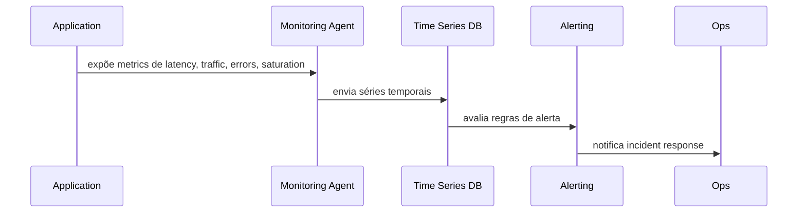

## 1. O que é
Golden Signals é um conjunto de quatro sinais de observabilidade definidos pelo Google SRE para monitorar a saúde de sistemas distribuídos: latency, traffic, errors e saturation.

Sinônimos: sinais dourados, golden metrics, four golden signals.

Tipos/camadas:
- Latency
- Traffic
- Errors
- Saturation

## 2. Por que existe (o problema que resolve)
A origem está no livro "Site Reliability Engineering" do Google e na necessidade de simplificar o monitoramento em serviços complexos. Antes dos Golden Signals, muitas equipes acumulavam métricas arbitrárias que não geravam alertas úteis e dificultavam a detecção de degradações reais.

A ideia é focar no conjunto mínimo de sinais que revelam se um serviço está respondendo com rapidez, se recebe demanda, se falha e se está pressionado.

## 3. Tipos e características
### Latency
Como funciona: mede o tempo de resposta das operações ou solicitações.
Prós: identifica degradações de experiência.
Contras: pode mascarar problemas de erro se apenas percentis baixos forem usados.
Camada: aplicação/transporte.
Quando usar: sempre, como sinal principal de desempenho.

### Traffic
Como funciona: mede a taxa de solicitação ou volume de trabalho.
Prós: ajuda a entender sazonalidade e demanda.
Contras: não indica qualidade nem saúde sozinha.
Camada: aplicação/rede.
Quando usar: para gerar contexto às outras três métricas.

### Errors
Como funciona: mede a taxa de falhas ou códigos de erro.
Prós: sinal direto de degradação.
Contras: pode ser muito reativo se não for correlacionado a causadores.
Camada: aplicação.
Quando usar: para definir alertas de falha e rollback.

### Saturation
Como funciona: mede o quão cheio está um recurso (CPU, memória, threads, conexões).
Prós: mostra limites antes da degradação.
Contras: exige métricas de recursos específicas por componente.
Camada: infraestrutura/recurso.
Quando usar: para capacidade e planejamento de escala.

## 4. Como funciona (mecanismo interno)
O mecanismo envolve coleta contínua de métricas e agregação em séries temporais.

Componentes:
- Instrumentação da aplicação (OpenTelemetry, Prometheus client, Micrometer)
- Agente de coleta (Prometheus node exporter, Datadog Agent)
- Timeseries database (Prometheus, InfluxDB, CloudWatch)
- Sistema de alerta (Alertmanager, Grafana, PagerDuty)

Algoritmos/estratégias:
- Latency: percentis 50/90/95/99 em histogramas ou summaries.
- Traffic: contadores e taxas de requisição por segundo.
- Errors: divisão de erros por total de requisições para obter taxa de erro.
- Saturation: dashboards de ocupação de CPU, memória, filas e conexões.

## 5. Onde e como se aplica na prática
### Nível de máquina/processo único
Uma aplicação local instrumentada com Micrometer ou OpenTelemetry pode expor métricas e benchmarks de latency, traffic, errors e saturation.

### Nível de infraestrutura on-premise/self-managed
Ferramentas reais: Prometheus + Grafana, Zircon/Elastic APM, Nagios, Zabbix. Use exporters para JVM, NGINX, Kafka e storage.

### Nível de nuvem/managed service
AWS: CloudWatch métricas de latency, request count, error count, CPU utilization. GCP: Cloud Monitoring + Cloud Trace. Azure: Application Insights + Azure Monitor.

### Nível de orquestração/Kubernetes
Kubernetes: use Prometheus Operator, kube-state-metrics e ServiceMonitor para coletar saturation de pods, erro de readiness e latency de ingressos. Istio: controla latency e errors no malha de serviço.

## 6. Casos de uso reais e quando NÃO usar
### Casos de uso reais
1. Google Search: latência de consulta e saturação de datacenters.
2. Netflix: traffic de streaming, erros de player e saturação de cache local.
3. Shopify: latência de checkout e erros de pagamento em pico.
4. Uber: traffic de solicitações de corrida e saturação de microserviços.

### Quando NÃO usar ou evitar
- Sistemas batch/offline sem latência sensível: latency ainda é útil, mas não como alerta primário.
- Aplicações puramente de backoffice com baixa demanda: traffic pode ser pouco informativo.
- Serviços sem métricas de recursos: saturation não é aplicável sem medição de filas ou CPU.
- Se a equipe depende apenas de logs: golden signals exigem instrumentação adicional.

## 7. Cenários práticos e trade-offs
### Cenário 1: degradação de latência
Uma API paginada começa a responder lentamente. Alertas em p95 latency disparam e a equipe identifica um índice de banco de dados faltando.

### Cenário 2: pico de tráfego
Durante uma promoção, traffic dispara. Saturation mostra filas de conexões e errors crescem, indicando necessidade de escalar.

### Cenário 3: falha de saturação
O pool de conexões do banco enche e a aplicação passa a retornar 503. O alerta de saturation permite escalar ou reduzir tráfego.

| Tipo | Latência | Consistência | Custo operacional | Complexidade de implementação | Resiliência |
|---|---|---|---|---|---|
| Latency | N/A | Alta | Médio | Médio | Alto |
| Traffic | N/A | Baixa | Baixo | Baixo | Médio |
| Errors | N/A | Alto | Médio | Médio | Alto |
| Saturation | N/A | Médio | Médio | Alto | Alto |

## 8. Diagrama e fluxo visual
a) Mermaid:


b) Prompt de imagem:
"Conceptual illustration of golden signals monitoring with latency, traffic, errors, and saturation displayed on a dashboard for distributed systems operations." 

## 9. Exemplo aplicado — Java + Spring
```java
@RestController
@RequestMapping("/api")
public class MonitoringController {

  private final MeterRegistry registry;

  public MonitoringController(MeterRegistry registry) {
    this.registry = registry;
  }

  @GetMapping("/items")
  public List<Item> getItems() {
    Timer.Sample sample = Timer.start(registry);
    try {
      return itemService.list();
    } finally {
      sample.stop(Timer.builder("api.latency").register(registry));
    }
  }
}
```

Comentários: a instrumentação com Micrometer registra latency. Errors são contados com Counter em exceções e saturation pode ser exposta via JVM metrics.

## 10. Exemplo aplicado — TypeScript + NestJS
```ts
@Controller('api')
export class ApiController {
  constructor(private readonly metricsService: MetricsService) {}

  @Get('items')
  async getItems() {
    const timer = this.metricsService.startTimer('api_latency');
    try {
      return await this.itemsService.findAll();
    } finally {
      timer.end();
    }
  }
}
```

Comentários: um serviço de métricas NestJS pode expor contadores e histogramas para Prometheus, permitindo monitorar golden signals.

## 11. Comparação e armadilhas comuns
Comparação com métricas de negócio: golden signals são operacionais e não medem receita ou adoção.

Erros comuns:
- usar apenas contadores de erros sem taxa relativa: não detecta aumento de erro em picos de tráfego.
- medir apenas média de latency: perde p95/p99 e degradações de experiência.
- não medir saturation de recursos internos: ignora conflitos de capacidade.
- tratar traffic como sinal de saúde por si só.

## 12. Perguntas para fixação
1. Quais são os quatro golden signals e por que cada um é importante?
2. Como você configura um alerta de saturation em Kubernetes para evitar 503?
3. Qual é a diferença entre latency e errors no contexto de observabilidade?
4. Por que traffic é necessário se já temos latency e errors?
5. Quando não faz sentido priorizar golden signals em um serviço offline?