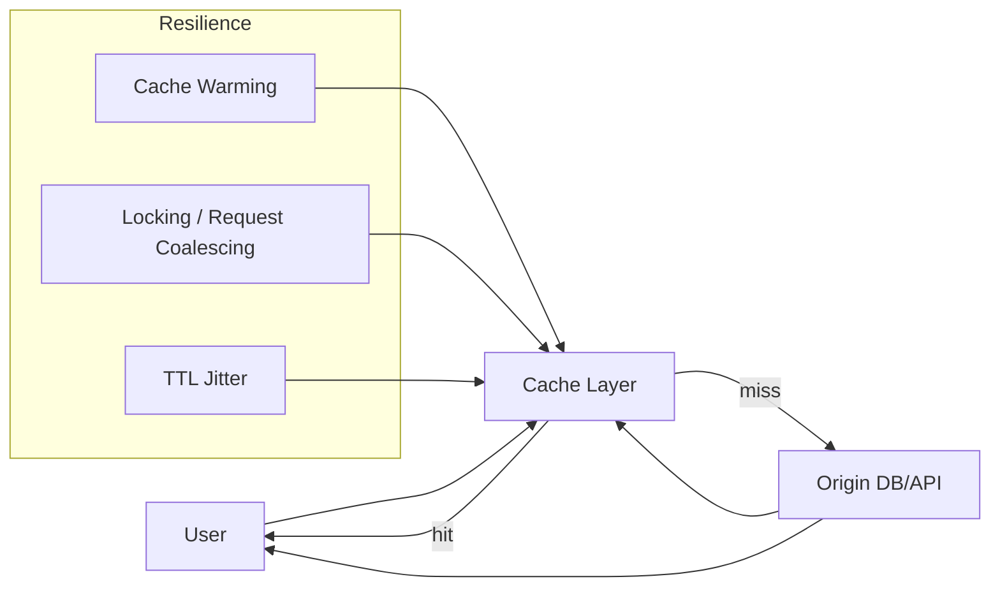

# Cache Resilience

## 1. O que é

Cache Resilience refere-se a um conjunto de padrões e estratégias que tornam sistemas capacitados a usar cache de forma estável perante falhas, cargas altas e cenários de degradação. O objetivo é manter baixa latência e alta disponibilidade sem sobrecarregar a origem de dados.

Termos correlatos usados no mercado:

- cache aside
- read through
- write through
- write behind
- cache warming
- cache stampede
- cache breakdown
- cache penetration
- request coalescing
- cache locking
- TTL jitter

Variações/tipos que serão detalhados na seção 3:

- Cache Aside
- Read Through
- Write Through
- Write Behind
- Cache Warming
- Cache Stampede
- Cache Breakdown
- Cache Penetration
- Locking
- Request Coalescing
- TTL
- TTL Jitter

## 2. Por que existe (o problema que resolve)

Cache Resilience existe porque cache não é apenas performance: é também um ponto de falha potencial. Sem estratégias de resiliência, caches podem criar problemas como:

- cache miss massivo que dispara tráfego de volta à origem (`cache stampede`);
- degradação quando a origem cai (`cache breakdown`);
- solicitações não sincronizadas para chaves expiradas ao mesmo tempo (`cache penetration`);
- escrita inconsistente entre cache e origem;
- dependência excessiva de caches em sistemas altamente críticos.

Antes desses padrões, a maioria dos sistemas usava cache de forma ad hoc, resultando em picos de carga, falhas em cascata e dados obsoletos. A prática consolidada de cache resilience emergiu a partir de sistemas de grande escala em empresas como Amazon, Netflix e Facebook, onde o uso intensivo de cache era crítico para latência e disponibilidade.

## 3. Tipos e características

### Cache Aside

- Como funciona: a aplicação primeiro lê da origem e só grava no cache após um `cache miss`. Em gravações, a aplicação atualiza a origem e invalida ou atualiza o cache.
- Prós: controle explícito; evita supersets de cache escritos indevidamente.
- Contras: maior complexidade de código; cache pode ficar desatualizado se invalidações falharem.
- Camada: aplicação e cache de dados (Redis, Memcached).
- Quando escolher: quando se quer controle explícito sobre leitura e escrita de cache.

### Read Through

- Como funciona: o cache sistema carrega dados automaticamente da origem em caso de `miss` e retorna ao cliente.
- Prós: simplifica a aplicação, centraliza lógica de carregamento.
- Contras: a origem ainda pode ficar sobrecarregada em picos de miss.
- Camada: cache proxy ou client library.
- Quando escolher: quando se deseja ocultar a lógica de cache do aplicativo.

### Write Through

- Como funciona: quando a aplicação grava dados, o cache é atualizado imediatamente junto com a origem.
- Prós: dados geralmente consistentes entre cache e origem.
- Contras: latência de gravação aumenta porque a operação espera o cache.
- Camada: cache layer e aplicação.
- Quando escolher: quando consistência read-after-write é importante.

### Write Behind

- Como funciona: a aplicação grava no cache e a persistência na origem é feita de forma assíncrona depois.
- Prós: gravações rápidas; alta performance para escrita.
- Contras: risco de perda de dados em falhas antes de persistir na origem.
- Camada: cache layer, background workers.
- Quando escolher: quando performance de escrita é mais importante que latência de persistência imediata.

### Cache Warming

- Como funciona: popula o cache proativamente antes de tráfego alto ou antes de expirar dados importantes.
- Prós: reduz cold starts e cache misses no momento crítico.
- Contras: pode consumir recursos antecipadamente.
- Camada: processamentos batch, pipelines de warming.
- Quando escolher: antes de eventos conhecidos ou deploys.

### Cache Stampede

- Como funciona: muitas requisições chegam ao mesmo tempo para uma mesma chave não presente no cache, sobrecarregando a origem.
- Prós de lidar com ele: evita tráfego de pico e saturação.
- Contras se não for tratado: pode causar queda da origem.
- Camada: cache, aplicação, middlewares.
- Quando escolher: sempre que há chaves com alta cardinalidade e carga concentrada.

### Cache Breakdown

- Como funciona: quando o cache falha ou expira em massa, o tráfego volta para a origem de forma abrupta.
- Prós de mitigação: mantém a origem estável durante eventos de falha de cache.
- Contras se não for tratado: picos de carga e tempo de resposta alto.
- Camada: cache, monitoramento e fallback.
- Quando escolher: em arquiteturas que dependem criticamente de cache para disponibilidade.

### Cache Penetration

- Como funciona: requisições chegam para chaves inexistentes ou inválidas e atravessam o cache, chegando direto na origem.
- Prós de mitigação: reduz carga de consultas inúteis.
- Contras se não for tratado: aumenta carga da origem e pode expor dados.
- Camada: cache, aplicação, validação.
- Quando escolher: quando o sistema recebe muitas consultas para chaves inválidas.

### Locking

- Como funciona: bloqueios distribuídos evitam múltiplas leituras concorrentes da mesma chave em miss.
- Prós: evita `cache stampede`.
- Contras: risco de deadlock e latência adicional.
- Camada: cache distribuído, Redis, Zookeeper.
- Quando escolher: quando há alto volume de misses simultâneos para uma mesma chave.

### Request Coalescing

- Como funciona: múltiplas requisições para a mesma chave compartilhada são agrupadas em uma única busca à origem.
- Prós: economiza recursos e reduz latência para casos de miss simultâneo.
- Contras: complexidade adicional e coordenação interna necessária.
- Camada: serviço de cache, middleware ou biblioteca de cliente.
- Quando escolher: em serviços com alta concorrência e muitos leitores da mesma chave.

### TTL

- Como funciona: cada item cacheado tem tempo de vida configurado e expira após esse período.
- Prós: garante eventual coerência; controla espaço de cache.
- Contras: expiração simultânea pode causar `cache breakdown`.
- Camada: cache engine (Redis, Memcached, CDN).
- Quando escolher: sempre que o dado tem validade temporal ou necessidade de refresco.

### TTL Jitter

- Como funciona: o TTL recebe uma variação aleatória, de modo que expira em momentos distintos entre nós.
- Prós: reduz eventos de expiração em massa e `cache stampede`.
- Contras: pode aumentar a incerteza sobre quando o dado será atualizado.
- Camada: cache, CDN, edge.
- Quando escolher: quando muitos nós compartilham as mesmas keys e expiração simultânea é um risco.

## 4. Como funciona (mecanismo interno)

O mecanismo de cache resilience envolve vários componentes:

1. Cache layer: Redis, Memcached, CDN, cache de aplicação.
2. Origem de dados: banco relacional, NoSQL, API externa.
3. Invalidação/atualização: atualiza cache após gravação ou expira entradas.
4. Locking/request coalescing: evita múltiplas leituras concorrentes para a mesma chave.
5. TTL e jitter: controla quando os dados expiram e espalha a expiração.
6. Fallbacks/safe reads: lê de dados antigos ou retornam respostas padrão em caso de falha de origem.

Algoritmos/estratégias comuns:

- Cache aside: lazy loading no primeiro acesso.
- Read through: cache carrega automaticamente no miss.
- Write through: atualização síncrona do cache na gravação.
- Write behind: persistência assíncrona.
- Lock-based mutex: trava chave durante refill.
- Request coalescing / singleflight: agrupa requisições concorrentes.
- TTL jitter: adiciona aleatoriedade ao tempo de expiração.

## 5. Onde e como se aplica na prática

### Nível de máquina/processo único

No nível local, cache resilience aparece em bibliotecas e frameworks usados por uma única instância:

- Guava Cache, Caffeine (Java)
- LocalMemoryCache (Node.js)
- Python `functools.lru_cache` com wrappers

Nesses casos, o cache atua dentro do processo e a estratégia de warming ou TTL permanece local.

### Nível de infraestrutura on-premise/self-managed

Ferramentas e padrões reais:

- Redis: cache de sessão, token, resultados de consulta.
- Memcached: caches simples de leitura/gravidade.
- Varnish: caching HTTP com invalidation e recarregamento.
- NGINX: cache de proxy reverso.

Aplica-se para:

- sync/async cache aside
- read through com proxy de cache
- cache warming em clusters de aplicação
- locking com `SETNX` em Redis

### Nível de nuvem/managed service

Serviços reais:

- AWS ElastiCache (Redis/Memcached), DynamoDB DAX, CloudFront, API Gateway cache
- GCP Memorystore, Cloud CDN, Cloud Tasks + cache
- Azure Cache for Redis, Azure CDN, Front Door

Em nuvem, a resiliência de cache é usada para:

- TTL jitter em edge/CDN
- cache aside em Redis gerenciado
- read through/write through em serviços de cache gerenciados
- cache warming antes de eventos de alta carga

### Nível de orquestração/Kubernetes

No Kubernetes, cache resilience pode ser aplicada com:

- Sidecars de cache ou proxies (Envoy + Redis)
- ConfigMaps / Secrets com TTL local
- Jobs de cache warming antes de deploys
- Service mesh integrando caching e rate limiting

## 6. Casos de uso reais e quando NÃO usar

Casos de uso reais:

1. E-commerce Black Friday — `Cache Warming` e `TTL Jitter` para evitar `cache breakdown` em picos.
2. API de catálogo de produtos — `Cache Aside` para leitura, `Write Through` em atualizações frequentemente lidas.
3. Busca de resultados em aplicativos de mídia — `Request Coalescing` para evitar múltiplas leituras da mesma query.
4. Autenticação / sessão em alta escala — `Cache Penetration` mitigado com armazenamento de valores negativos.

Quando NÃO usar:

- Em dados extremamente voláteis onde o cache introduz muita stale data.
- Em cargas muito baixas, onde o custo de complexidade do cache não compensa.
- Em operações de baixo volume e alta criticidade transacional sem fallback adequado.

## 7. Cenários práticos e trade-offs

### Cenário 1 — Cache Aside com hot key

1. Muitos clientes consultam uma mesma chave sem estar em cache.
2. O primeiro acesso consulta a origem e popula o cache.
3. Sem locking, vários clientes podem consultar a origem simultaneamente.
4. Com locking ou request coalescing, apenas uma consulta é executada.

### Cenário 2 — Cache Breakdown em expiração em massa

1. Um conjunto grande de entradas expira ao mesmo tempo.
2. Tráfego regressa à origem de forma abrupta.
3. `TTL Jitter` dispersa expirações e suaviza a carga.

### Cenário 3 — Cache Penetration por chaves inválidas

1. Um atacante ou bug consulta muitas chaves inexistentes.
2. Todas as requisições passam pelo cache e atingem a origem.
3. Armazenar `negative cache` ou validar chaves antes de procurar reduz o problema.

Tabela de trade-offs

| Tipo | Latência | Consistência | Custo operacional | Complexidade | Resiliência |
|---|---:|---|---:|---:|---:|
| Cache Aside | Baixa | Boa | Médio | Média | Alta |
| Read Through | Baixa | Boa | Médio | Média | Alta |
| Write Through | Média | Boa | Médio | Média | Alta |
| Write Behind | Baixa | Média | Médio | Alta | Média |
| Cache Warming | Baixa | Boa | Médio | Média | Alta |
| TTL Jitter | Baixa | Boa | Baixo | Baixa | Alta |

## 8. Diagrama e fluxo visual

### a) Diagrama em Mermaid



### b) Prompt para geração de imagem

"Create a conceptual illustration of cache resilience in distributed systems. Show a cache layer in front of a database, cache misses loading from origin, multiple resilience patterns like cache warming, request coalescing, TTL jitter and locks, with a cloud-native style."

## 9. Exemplo aplicado — Java + Spring

```java
package com.example.cache;

import java.time.Duration;
import java.util.concurrent.CompletableFuture;
import java.util.concurrent.ConcurrentHashMap;
import java.util.concurrent.ConcurrentMap;
import java.util.function.Supplier;

public class CacheAsideExample {
    private final ConcurrentMap<String, String> cache = new ConcurrentHashMap<>();
    private final ConcurrentMap<String, Object> locks = new ConcurrentHashMap<>();

    public String get(String key) {
        String value = cache.get(key);
        if (value != null) {
            return value;
        }

        Object lock = locks.computeIfAbsent(key, k -> new Object());
        synchronized (lock) {
            value = cache.get(key);
            if (value == null) {
                value = loadFromOrigin(key);
                if (value != null) {
                    cache.put(key, value);
                } else {
                    cache.put(key, "__NULL__");
                }
            }
        }
        locks.remove(key);
        return "__NULL__".equals(value) ? null : value;
    }

    private String loadFromOrigin(String key) {
        // simulate origin load
        return "value-for-" + key;
    }
}
```

Pontos-chave:

- `Cache Aside` carrega o cache somente no miss.
- Locking evita múltiplas leituras concorrentes durante miss.
- Negative cache (`__NULL__`) reduz cache penetration para chaves inexistentes.

## 10. Exemplo aplicado — TypeScript + NestJS

```ts
import { Injectable } from '@nestjs/common';

@Injectable()
export class CacheService {
  private cache = new Map<string, string | null>();
  private loading = new Map<string, Promise<string | null>>();

  async get(key: string): Promise<string | null> {
    if (this.cache.has(key)) {
      return this.cache.get(key) ?? null;
    }

    if (!this.loading.has(key)) {
      this.loading.set(key, this.loadAndCache(key));
    }

    return this.loading.get(key)!;
  }

  private async loadAndCache(key: string): Promise<string | null> {
    try {
      const value = await this.loadFromOrigin(key);
      this.cache.set(key, value);
      return value;
    } finally {
      this.loading.delete(key);
    }
  }

  private async loadFromOrigin(key: string): Promise<string | null> {
    return `value-for-${key}`;
  }
}
```

Pontos-chave:

- O Map `loading` implementa request coalescing.
- O cache local evita leituras repetidas.
- Esse padrão é útil para `cache aside` e `cache stampede`.

## 11. Comparação e armadilhas comuns

### Diferenças rápidas

- Cache Aside vs Read Through: `Cache Aside` deixa a aplicação gerenciar o carregamento; `Read Through` delega ao cache.
- Write Through vs Write Behind: `Write Through` é síncrono e mais consistente; `Write Behind` é mais rápido, porém arrisca perda de dados.

### Erros comuns

1. Não usar TTL Jitter e criar expiração em massa.
2. Ignorar `negative caching` em sistemas com chaves inexistentes.
3. Implementar `Write Behind` sem durabilidade suficiente.
4. Não monitorar cache hit ratio e origem load.

## 12. Perguntas para fixação

1. Quando você escolheria `Cache Aside` em vez de `Read Through`?
2. Como `TTL Jitter` ajuda a prevenir `Cache Breakdown`?
3. Qual é a diferença prática entre `Write Through` e `Write Behind`?
4. Como você mitiga `Cache Penetration` em uma API pública?
5. Quando request coalescing é preferível a simples locking de cache?
