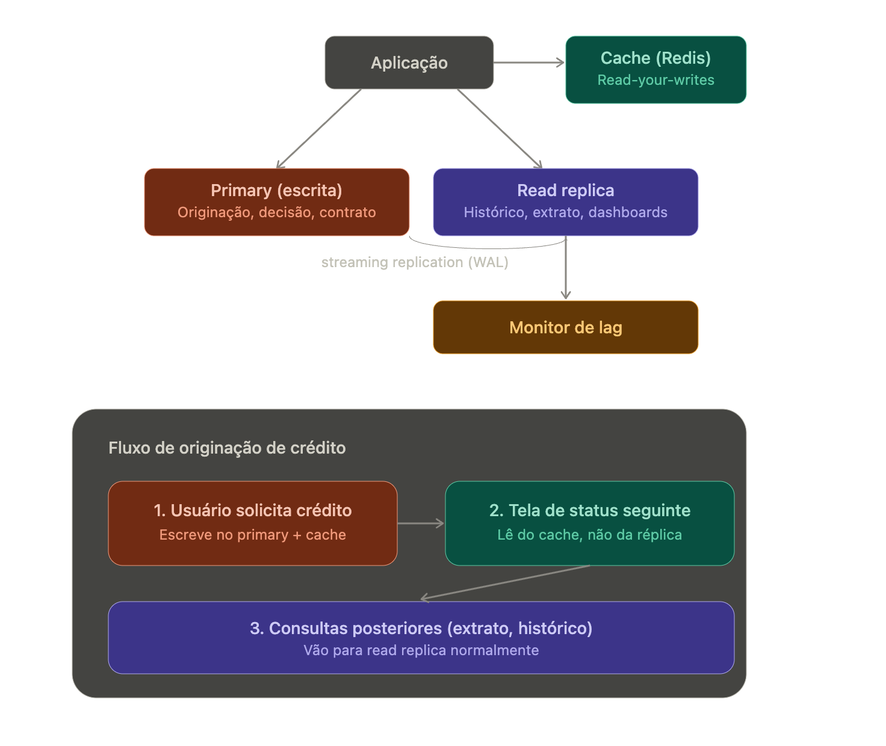

# Definicoes

É uma cópia somente leitura do seu banco de dados principal (primário). Ela serve para desafogar o banco de dados principal, permitindo que consultas de leitura pesadas, relatórios ou análises sejam processados em servidores separados

Como funciona e principais detalhes:

- Replicação Assíncrona: Os dados são copiados do servidor primário para a réplica de forma assíncrona. Isso significa que há uma pequena janela de atraso (conhecida como replication lag) entre uma alteração no primário e ela aparecer na réplica.

- Separação de Tráfego: A aplicação deve ser configurada para direcionar operações de escrita (INSERT, UPDATE, DELETE) para o banco principal e operações de leitura (SELECT) para as réplicas.- Escalabilidade: Você pode criar múltiplas réplicas (o limite varia conforme o serviço, como até 15 no Amazon RDS) para aumentar massivamente a capacidade de leitura do seu sistema.

- Redução de Latência: Réplicas podem ser distribuídas geograficamente (em diferentes regiões do mundo) para entregar dados mais perto dos usuários.

## 1. Quando usar

Read replicas resolvem escala de leitura, não de escrita. Fazem sentido quando:

Read/write ratio é alto (ex: consultas de status de crédito, histórico, dashboards)
Você quer isolar cargas analíticas/relatórios do tráfego transacional
Precisa de disponibilidade geográfica (réplica mais perto do usuário)

Não resolvem: latência de escrita, hot partitions de escrita, ou consistência forte entre múltiplas leituras.

## 2. Estratégias de replicação

### Streaming/Physical replication (ex: PostgreSQL streaming replication via WAL### )

- Réplica binária do banco inteiro, baixa complexidade operacional
- Lag tipicamente em ms, mas pode disparar sob carga pesada de escrita

### Logical replication (ex: PostgreSQL logical decoding, Debezium/CDC)

- Replica no nível de linha/tabela, permite transformação e replicação seletiva
- Útil quando você precisa replicar só parte do schema, ou para múltiplos destinos (ex: réplica de leitura + pipeline de eventos Kafka)

### Application-level / CDC para outro store

- Ex: Postgres → Kafka (via Debezium) → materializar em outro banco de leitura (Elasticsearch, DynamoDB) otimizado para o padrão de query

## 3. Decisões-chave de design

### Roteamento de queries

- Camada de roteamento (proxy como PgBouncer/PgPool, ou lógica na aplicação) decide o que vai pra primary vs replica
- Regra comum: escritas e leituras que exigem consistência imediata pós-escrita → primary; leituras "elegíveis a lag" → replica

### Read-your-writes

Esse é o problema mais comum em domínio de crédito: usuário faz uma ação (ex: solicita crédito) e a tela seguinte lê da réplica, que ainda não replicou. Estratégias:

- Sticky session: força leituras subsequentes à mesma request/sessão a irem pro primary por um tempo curto
- Read-after-write via cache: escreve no primary e no cache (Redis) simultaneamente, lê do cache primeiro
- Version/timestamp check: réplica expõe seu replication lag; a aplicação decide se a réplica está "fresca o suficiente"

### Monitoramento de lag

- Métrica crítica: replication lag (segundos ou bytes de WAL pendente)
- Alertar quando lag ultrapassa um threshold que quebra suas garantias de consistência
- No seu stack (Dynatrace/Grafana), isso vira um dashboard e alerta dedicados

### Failover

- Réplica pode ser promovida a primary em caso de falha (usar ferramentas como Patroni, ou serviços gerenciados tipo RDS/Aurora que automatizam isso)
- Definir RTO/RPO aceitável
