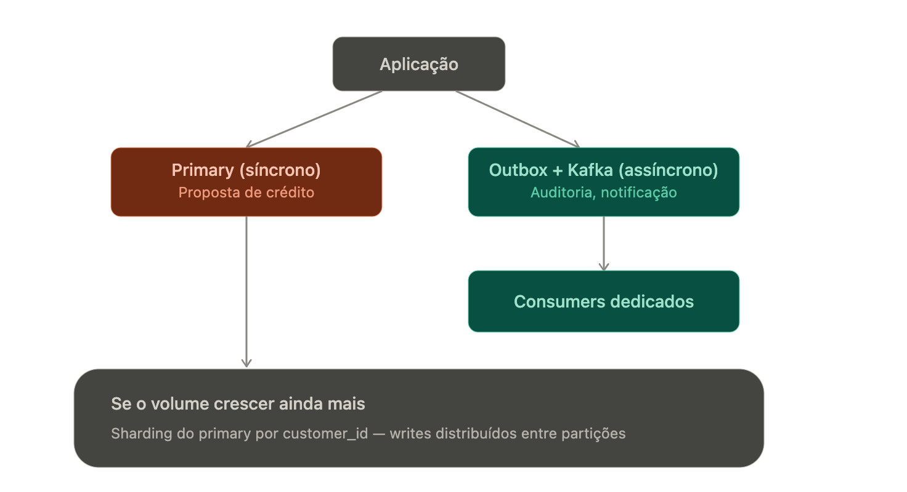

# Escala de escrita

Read replicas resolvem leitura. Escrita é um problema fundamentalmente diferente porque você não pode simplesmente "adicionar mais uma cópia" — cada escrita precisa ser consistente em algum lugar. Vou cobrir as estratégias principais, do mais simples ao mais complexo.

## 1. Por que escrita é mais difícil

Numa réplica de leitura, você tolera dados levemente desatualizados. Numa escrita, isso não existe: duas escritas conflitantes no mesmo dado precisam de uma ordem de verdade. Isso é o motivo de não existir "write replica" simples e transparente como existe read replica — você precisa de particionamento, coordenação, ou aceitar consistência eventual.

## 2. Estratégias principais

### Vertical scaling (scale-up)

- Aumentar CPU/RAM/IOPS da instância primary
- Simples, mas tem teto físico e custo cresce de forma não-linear
- É sempre o primeiro passo antes de qualquer coisa mais complexa

### Sharding (particionamento horizontal)

- Divide os dados em partições (shards), cada uma com seu próprio primary aceitando escritas
- Chave de sharding é a decisão mais importante: no seu domínio, provavelmente customer_id ou cpf hash
- Ganho real de throughput de escrita, mas você perde transações cross-shard fáceis (ex: se uma operação envolve dois usuários em shards diferentes, precisa de saga/2PC)
- Ferramentas: Citus (Postgres), Vitess (MySQL), ou sharding manual na camada de aplicação

### Particionamento funcional (database-per-service / bounded context)

- Ao invés de shardar o mesmo schema, você separa por domínio: banco de originação, banco de cobrança, banco de KYC
-Isso já é parcialmente o que DDD com bounded contexts te dá — cada serviço escreve no seu próprio banco
- Reduz contenção, mas exige orquestração entre domínios (Saga, eventos)

### Write-behind via fila (async write buffering)

- Aplicação não escreve direto no banco — publica um evento (Kafka/SQS), um consumer processa e persiste
- Desacopla o pico de escrita do throughput do banco; o banco processa no seu próprio ritmo
- Trade-off: consistência eventual — a escrita "aconteceu" do ponto de vista do usuário, mas pode levar alguns ms/segundos pra refletir no banco
- Isso é exatamente o padrão que você já estudou com Outbox + Kafka consumers

### Batching de escritas

- Ao invés de N inserts individuais, agrupar em batch inserts/upserts
- Reduz overhead de round-trip e de commit por transação
- Muito comum em pipelines de dados (Glue, ETL) mas também aplicável a APIs de alto volume

### Otimizações de banco em si

- Reduzir índices desnecessários (cada índice é custo extra por escrita)
- Ajustar synchronous_commit no Postgres (trade-off durabilidade vs throughput)
- Connection pooling bem dimensionado (PgBouncer) — muitas conexões concorrentes competindo por lock pode ser o gargalo real, não o hardware

## 3. Aplicado ao domínio de Crédito PF

Um cenário típico: pico de escrita na originação (muitos usuários solicitando crédito simultaneamente, cada um gerando múltiplos registros — proposta, análise, log de decisão, evento de auditoria).
Abordagem em camadas, do mais simples ao mais agressivo:

Escrita síncrona no essencial (o registro da proposta em si) no primary
Tudo que é auxiliar (log de auditoria, notificação, atualização de dashboard) vai assíncrono via Kafka — outbox pattern garante que não perde o evento mesmo se o consumer cair
Se o volume por si só do domínio de originação crescer muito, aí sim considerar sharding por customer_id, separando writes de diferentes clientes em diferentes partições

