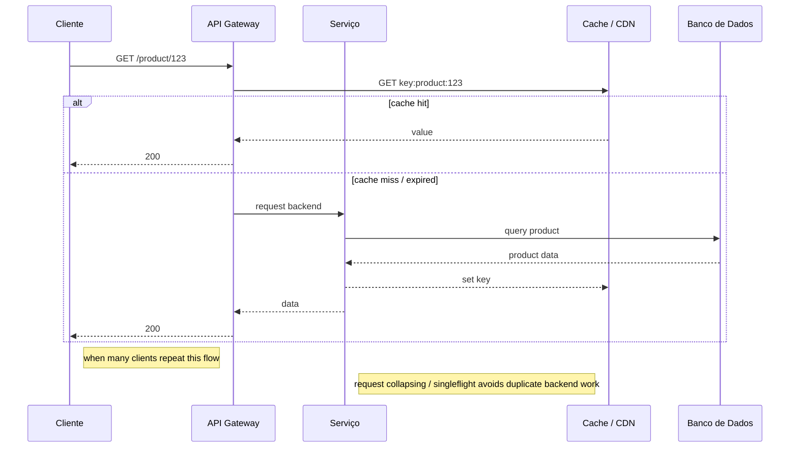

## 1. O que é

Um grande número de threads, processos ou requisições tenta acessar o mesmo recurso ao mesmo tempo, causando contenção e degradação do sistema.

O "recurso" pode ser qualquer coisa:

- Banco de dados
- Cache
- Uma linha da tabela
- Um lock
- Uma API externa
- Uma fila
- Um pool de conexões
- Um pool de threads
- Um disco
- Um serviço específico

Ou seja, ele descreve o padrão de concorrência, não a causa específica.

```md
Thundering Herd (conceito geral)
│
├── Cache Stampede
│      └── Muitas requisições disputando a reconstrução da mesma chave
│
├── Retry Storm
│      └── Milhares de clientes fazem retry ao mesmo tempo
│
├── Lock Contention
│      └── Muitas threads esperando o mesmo lock
│
├── Hot Row
│      └── Muitas transações atualizando a mesma linha do banco
│
├── Flash Sale
│      └── Milhares de usuários acessando a mesma rota
│
└── Connection Pool Exhaustion
       └── Todas as requisições disputando as conexões do banco
```

___

No contexto de API, thundering herd descreve um evento em que múltiplos clientes ou instâncias fazem requisições simultâneas ao mesmo endpoint, recurso ou operação logo após uma mudança de estado ou expiração de cache. O resultado é um pico de tráfego concentrado que atinge o backend, causando carga excessiva, aumento de latência e, em casos extremos, degradação do serviço.

Sinônimos/nomes usados no mercado:

- Herd effect
- Herding problem
- Dog-pile effect
- Stampede
- Cache stampede
- API surge

Variações/camadas/tipos reconhecidos no nível de API:

- Cache stampede em API de conteúdo ou lookup
- Retry storm em filas de clientes e retries automáticos
- Connection burst em pools de conexão ou voltagem de backend
- Service fan-out seguido de fallback simultâneo
- Emergência de cold starts em serverless/APIs em burst

## 2. Por que existe (o problema que resolve)

No mundo de APIs, o thundering herd existe porque múltiplos clientes podem reagir ao mesmo evento ou mesmo erro de maneira sincronizada. Exemplos típicos: expiração de cache em massa, rollout de nova versão, falha temporária seguida de retry de clientes, ou um endpoint de configuração que valida o estado de cada instância.

Antes de existirem mecanismos específicos de mitigação, os backends frequentemente passavam de um estado ocioso para um estado sobrecarregado instantaneamente. Isso causa:

- picos de carga em servidores e bancos de dados;
- filas de requisição excessivas no balanceador;
- degradação de endpoints dependentes;
- aumento de erros 500/503 em cascata.

A origem prática do conceito em APIs é menos um paper acadêmico e mais experiências de operação em sistemas web distribuídos, especialmente em grandes plataformas como Netflix, Amazon e Google, que documentaram o impacto de cache stampede e retry storms em microserviços.

## 3. Tipos e características

### Cache stampede em APIs

> Cache Stampede é um caso de Thundering Herd

Como funciona:

- uma chave de cache compartilhado expira ou é invalidada;
- múltiplos clientes, réplicas ou instâncias de API fazem a mesma requisição de recomputação ao backend;
- o backend recebe um volume redundante de trabalho.

Prós:

- a estratégia é simples e funciona bem em leituras baratas quando o backend aguenta o burst.

Contras:

- pode saturar o banco de dados ou serviço downstream;
- desperdício de CPU e chamadas redundantes.

Camada de infraestrutura:

- camada de cache/distribuição de conteúdo e API gateway.

Quando é a escolha certa:

- não é escolha; é um problema a ser mitigado, mas permite entender o cenário antes de aplicar singleflight/locking.

### Retry storm

Como funciona:

- um endpoint falha ou retorna timeout;
- muitos clientes ou serviços tentam novamente em curtos intervalos;
- as tentativas se acumulam e sobrecarregam o mesmo serviço.

Prós:

- retries são necessários para disponibilidade;
- ajudam a lidar com falhas transitórias se bem implementados.

Contras:

- sem jitter e limites, criam picos sincronizados e amplificam a falha original.

Camada de infraestrutura:

- lógica de cliente, gateway/API, e políticas de retry em proxy.

Quando é a escolha certa:

- use retries com jitter e limites para robustez;
- evite retry storm sem controles adaptativos.

### Connection burst / backend session surge

Como funciona:

- após uma escala de instância ou failover, muitas instâncias novas ou recuperadas estabelecem conexões simultâneas ao mesmo serviço;
- o serviço downstream vê uma explosão no número de conexões e requisições.

Prós:

- permite tolerância a falha quando várias réplicas são reiniciadas.

Contras:

- pode esgotar pools de conexão e saturar recursos upstream.

Camada de infraestrutura:

- orquestração, balanceador, pool de conexões e serviço backend.

Quando é a escolha certa:

- não é uma escolha ideal; é um cenário de risco que exige mitigação.

### Cold start herd em serverless/APIs

Como funciona:

- um serviço serverless escala de zero ou de baixa capacidade;
- muitas requisições chegam rapidamente e cada invocação aciona cold start;
- o provedor cria várias instâncias quase ao mesmo tempo.

Prós:

- permite autoescala rápida.

Contras:

- aumenta latência de resposta e custo de inicialização.

Camada de infraestrutura:

- plataforma serverless / FaaS e API gateway.

Quando é a escolha certa:

- novamente, é um cenário de problema e não uma configuração desejada.

## 4. Como funciona (mecanismo interno)

1. Evento de sincronização

- expiração de cache, lançamento de nova versão, falha transitória ou refresh de configuração.
- um estado compartilhado muda ao mesmo tempo para muitas instâncias.

1. Requisições simultâneas ao endpoint

- várias instâncias cliente ou usuários enviam requisições ao mesmo endpoint/API.
- pode ser o mesmo URL de dados, rota de configuração ou operação de autenticação.

1. Backend recebe burst concentrado

- o API gateway, load balancer e servidor de aplicação passam o tráfego para o backend.
- o backend pode iniciar múltiplas chamadas a serviços de dados ou recursos downstream.

1. Contenção e feedback

- o backend entra em contenção de CPU, DB ou threads;
- tempo de resposta aumenta, e o gateway aplica timeouts e retries;
- esses retries podem alimentar um novo burst.

1. Degradação em cascata

- endpoints dependentes entram em falha;
- circuit breakers podem abrir e isolar partes do sistema.
- se não houver limitação, o serviço pode ficar fora de escala.

Componentes envolvidos:

- API gateway / ingress controller: recebe e distribui requisições.
- Cache distribuído / CDN: guarda o estado do recurso.
- Serviço de backend / microserviço: computa ou acessa dados.
- Banco de dados ou storage: fonte de verdade eventual.
- Cliente / serviço consumidor: agente que dispara lots de requisições.

Algoritmos/estratégias usados na prática:

- request coalescing / singleflight para agrupar requisições idênticas;
- token bucket / rate limiting para suavizar bursts;
- retry com backoff exponencial e jitter;
- distributed lock / mutex de cache para evitar recomputação redundante;
- stale-while-revalidate e cache-aside com pré-população;
- circuit breaker para evitar que o serviço volte a receber carga após degradação.

## 5. Onde e como se aplica na prática

### Nível de máquina/processo único

- API local em Spring Boot/NestJS: o serviço pode proteger chamadas internas com sincronização por chave para evitar que múltiplas threads recalcularem o mesmo valor.
- caches locais de aplicação: `ConcurrentHashMap` ou `Map` com singleflight evitam threads concorrentes fazendo o mesmo trabalho.
- rate limiting interno: `Semaphore`, `TokenBucket` ou `Reactive Streams` no processo.

### Nível de infraestrutura on-premise/self-managed

- Nginx: `limit_req` e `proxy_cache` para suavizar bursts de requisições HTTP.
- HAProxy: `rate-limit` e `maxconn` para proteger backends.
- Redis / Memcached: locks distribuídos (`SETNX`, Lua scripts) e `GET`/`SET` com TTL para proteger cache stampede.
- Kong / Tyk: políticas de throttling e circuit breaker para APIs.
- Envoy: rate limit, retry budget, global and per-route limits.

### Nível de nuvem/managed service

- AWS API Gateway / ALB / NLB: limita solicitações por segundo e gerenciamento de conexão.
- AWS CloudFront e ElastiCache Redis: cache de conteúdo e validação de chaves com TTL.
- GCP Cloud Endpoints / API Gateway: aplicar quotas e ingressos.
- Azure API Management: políticas de rate-limit e quota.
- AWS Lambda / Azure Functions / Google Cloud Functions: cold start herd mitigado por provisioned concurrency ou ter custom warmers.

### Nível de orquestração/Kubernetes

- Kubernetes Ingress / Istio: usar rate limit e `retry` com `outlierDetection` para evitar reinício de bursts.
- Horizontal Pod Autoscaler: scale-up controlado e readiness probes para evitar tráfego súbito em pods recém-criados.
- Service Mesh: circuit breakers, load shedding e timeout policies.
- Operators e sidecars: caches compartilhados, locks distribuídos e singleflight implementado na camada de sidecar.

## 6. Casos de uso reais e quando NÃO usar

Casos reais:

1. API de catálogo de e-commerce: um item popular sai de cache e vários clientes consultam o mesmo endpoint de produto.
2. Serviço de feature flag ou configuração: dezenas de instâncias solicitam o mesmo valor após a invalidade de um cache compartilhado.
3. Microserviço de autenticação: um token de acesso expira e centenas de clientes tentam renovar ao mesmo tempo.
4. Endpoint de validade de sessão em serverless: burst de cold starts e repetidas chamadas ao mesmo endpoint.
5. Atualização canary / deploy: muitas instâncias de monitoramento requisitam o mesmo endpoint de health ou versão simultaneamente.

Quando NÃO usar ou evitar:

- confiar apenas em TTL de cache para evitar spikes; isso não impede que o backend receba a onda de recomputação.
- implementar retry sem jitter ou sem limite; isso transforma pequenas falhas em retry storms.
- usar locks globais para toda a API; isso elimina o herd mas destrói paralelismo e escalabilidade.
- permitir que o API Gateway faça retries agressivos no mesmo cliente sem circuit breaker.
- tratar cada requisição idêntica como independente quando uma única resposta poderia ser compartilhada.

## 7. Cenários práticos e trade-offs

### Cenário 1: pico de cache stampede em API de preço (escala/pico)

- uma rota `GET /product/{id}` usa cache distribuído com TTL de 60 segundos.
- após a expiração de um produto popular, centenas de instâncias fazem o mesmo request ao backend.
- sem proteção, o banco de dados recebe centenas de queries idênticas.
- com request collapsing, apenas uma instância recarrega o cache e as demais aguardam.

Resultado:

- reduz custo e latência no backend;
- evita saturação de database e mantém a API responsiva.

### Cenário 2: retry storm após timeout em API de pagamento (falha/borda)

- um downstream de pagamento retorna timeout para várias requisições.
- clientes aplicacionais começam a retry sem jitter imediato.
- o serviço de pagamento recebe uma segunda onda maior ainda e entra em throttling.
- com retry budget e backoff exponencial, apenas algumas tentativas continuam e o serviço se recupera.

Resultado:

- evita cascata de falhas;
- melhora disponibilidade geral do serviço.

### Cenário 3: cold start herd em serverless com gateway (falha/borda)

- uma aplicação serverless autoscalada de zero recebe uma onda de tráfego.
- o API Gateway encaminha requisições para várias instâncias em cold start.
- a latência aumenta, porque cada função inicializa.
- com provisioned concurrency ou warming control, algumas instâncias já estão prontas e o herd é suavizado.

Resultado:

- reduz picos de latência de inicialização;
- aumenta previsibilidade em bursts.

### Tabela de trade-offs

| Tipo / estratégia | Latência | Consistência | Custo operacional | Complexidade | Resiliência |
|---|---|---|---|---|---|
| Request collapsing / singleflight | baixo | alto | médio | médio | alto |
| Retry backoff com jitter | médio | alto | baixo | médio | alto |
| Rate limiting no API Gateway | médio | alto | baixo | baixo | alto |
| Distributed lock de cache | médio | alto | alto | alto | médio |
| Provisioned concurrency / warming | médio | alto | alto | médio | alto |

## 8. Diagrama e fluxo visual



Prompt para imagem em inglês:
"A conceptual technical diagram showing API clients simultaneously requesting the same endpoint after cache expiration, and how a gateway, cache, and request-collapsing mechanism consolidate the load. Include API calls, cache miss path, and a single backend recomputation flow."

## 9. Exemplo aplicado — Java + Spring

```java
package com.example.api;

import java.util.Map;
import java.util.concurrent.CompletableFuture;
import java.util.concurrent.ConcurrentHashMap;
import org.springframework.stereotype.Service;

@Service
public class ProductCacheService {
    private final Map<String, CacheEntry> cache = new ConcurrentHashMap<>();
    private final Map<String, CompletableFuture<String>> inFlight = new ConcurrentHashMap<>();

    public CompletableFuture<String> getProduct(String productId) {
        CacheEntry entry = cache.get(productId);
        if (entry != null && !entry.isExpired()) {
            return CompletableFuture.completedFuture(entry.value);
        }

        return inFlight.computeIfAbsent(productId, key -> {
            CompletableFuture<String> future = CompletableFuture.supplyAsync(() -> {
                try {
                    String value = fetchProductFromBackend(key);
                    cache.put(key, new CacheEntry(value));
                    return value;
                } finally {
                    inFlight.remove(key);
                }
            });
            return future;
        });
    }

    private String fetchProductFromBackend(String productId) {
        // Simula chamada de API ou DB
        return "product:" + productId;
    }

    private static class CacheEntry {
        final String value;
        final long expiresAt = System.currentTimeMillis() + 60_000;

        CacheEntry(String value) {
            this.value = value;
        }

        boolean isExpired() {
            return System.currentTimeMillis() > expiresAt;
        }
    }
}
```

Comentários chave:

- `inFlight` implementa singleflight no nível de API, evitando recomputar o mesmo valor em paralelo.
- `CompletableFuture.supplyAsync` permite que clientes aguardem a mesma resposta.
- o `cache` reduz chamadas ao backend se o valor estiver válido.

## 10. Exemplo aplicado — TypeScript + NestJS

```typescript
import { Injectable } from '@nestjs/common';

interface CacheEntry {
  value: string;
  expiresAt: number;
}

@Injectable()
export class ProductCacheService {
  private cache = new Map<string, CacheEntry>();
  private inFlight = new Map<string, Promise<string>>();

  async getProduct(productId: string): Promise<string> {
    const entry = this.cache.get(productId);
    if (entry && entry.expiresAt > Date.now()) {
      return entry.value;
    }

    let existing = this.inFlight.get(productId);
    if (existing) {
      return existing;
    }

    const promise = this.fetchProductFromBackend(productId)
      .then((value) => {
        this.cache.set(productId, {
          value,
          expiresAt: Date.now() + 60_000,
        });
        this.inFlight.delete(productId);
        return value;
      })
      .catch((error) => {
        this.inFlight.delete(productId);
        throw error;
      });

    this.inFlight.set(productId, promise);
    return promise;
  }

  private async fetchProductFromBackend(productId: string): Promise<string> {
    await new Promise((resolve) => setTimeout(resolve, 150));
    return `product:${productId}`;
  }
}
```

Comentários chave:

- o `inFlight` evita múltiplas requisições ao backend para a mesma chave enquanto a primeira está em andamento.
- o cache local serve como primeira linha de defesa contra stampede.
- essa abordagem é adequada para APIs que expiram dados compartilhados e precisam evitar bursts de recomputação.

## 11. Comparação e armadilhas comuns

Comparação com conceitos próximos:

- Thundering herd vs Cache stampede: em APIs, cache stampede é a forma mais comum do herd, com várias requisições para o mesmo recurso expirado.
- Thundering herd vs Retry storm: herd causa pico por cargas legítimas simultâneas; retry storm é gerado por políticas de retry mal projetadas após uma falha.

Erros comuns de implementação:

1. confiar apenas em TTL de cache para evitar herd
   - perigoso porque quando a chave expira, múltiplas instâncias podem repentinamente bombardear o backend.
2. retries sem jitter ou limites
   - perigoso porque sincroniza tentativas e amplifica a falha original.
3. tratar cada request como independente em vez de agrupar respostas
   - perigoso porque desperdiça recursos e acelera o burst.
4. usar lock global em vez de lock por chave
   - perigoso porque limita paralelismo de toda a API e cria um novo gargalo.

## 12. Perguntas para fixação

1. Qual a diferença entre thundering herd em API e em nível de kernel ou socket?
2. Como o singleflight ajuda a reduzir bursts de cache stampede em endpoints REST?
3. Por que retry com jitter e retry budget são cruciais em APIs distribuídas?
4. Quando um backend deve usar provisioned concurrency ou cache revalidation para evitar cold start herd?
5. Como você desenharia um fluxo API que protege um endpoint de configuração compartilhada contra thundering herd?

| Cenário                          | Estratégia                                    |
| -------------------------------- | --------------------------------------------- |
| Cache Stampede                   | Lock, Single Flight, Request Coalescing       |
| Retry Storm                      | Exponential Backoff + Jitter                  |
| Muitas requisições na mesma rota | Rate Limiting, Load Shedding, Filas           |
| Mesmo registro no banco          | Lock otimista/pessimista                      |
| Serviço externo sobrecarregado   | Circuit Breaker + Bulkhead                    |
| Banco saturado                   | Cache, Réplicas de leitura, Escala horizontal |
