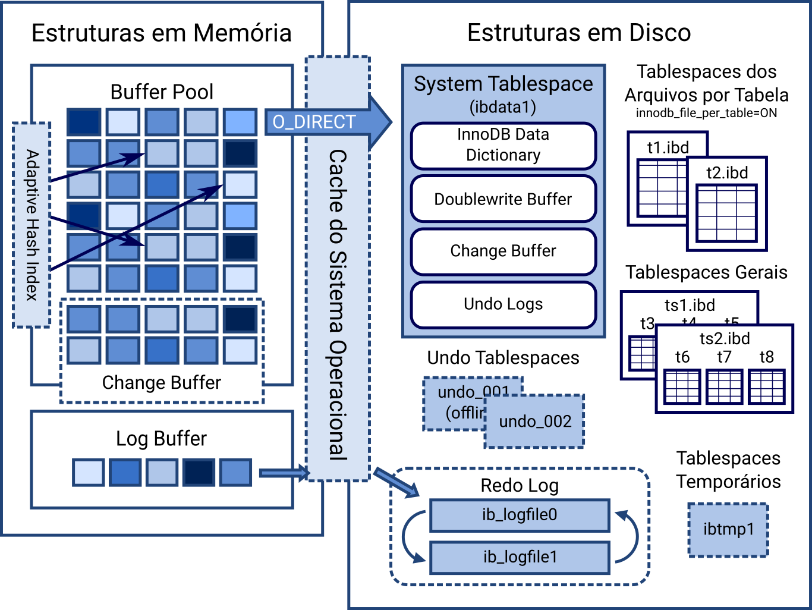

# Buffer Pool

Um buffer pool é uma área da memória principal (RAM) alocada por um sistema de gerenciamento de banco de dados (SGBD) para armazenar em cache dados e índices lidos do disco. Ele atua como uma memória de trabalho de curto prazo, permitindo que consultas frequentes sejam atendidas rapidamente na RAM, evitando o acesso lento ao disco

## Funcionamento e Estrutura

O buffer pool é dividido em blocos de tamanho fixo chamados frames. Quando o banco de dados precisa de uma página de dados, ele a copia do disco para um desses frames.

A estrutura é composta por dois elementos principais:

- Tabela de Páginas (Page Table): Um mapa interno que rastreia quais páginas do banco de dados estão armazenadas em quais quadros (frames) da memória, além de metadados de controle.
- Algoritmo de Substituição (LRU): Mecanismo de controle utilizado para remover dados antigos e menos acessados do buffer quando a memória fica cheia, liberando espaço para novas requisições.

## Gerenciamento de Dados e Concorrência

Para manter a integridade do sistema, o gerenciador do buffer pool utiliza metadados cruciais em suas páginas de dados

- Dirty Flag (Página Suja): Indica se uma página que está na memória foi modificada pela aplicação. Antes que esse quadro possa ser substituído, seu conteúdo precisa ser gravado no disco para evitar perda de dados.
- Pin/Reference Count: Um contador de referências que avisa o sistema se alguma thread ou consulta está utilizando aquela página no momento, impedindo que ela seja removida do buffer pool antes da hora.
- Latches: Travas de curtíssima duração aplicadas na estrutura de memória para permitir que múltiplas consultas leiam e alterem dados no buffer pool de forma simultânea e segura.

Se você quiser entender melhor como otimizar ou configurar essa área de memória, me informe qual é o seu SGBD principal (por exemplo, MySQL/InnoDB, SQL Server ou PostgreSQL) e qual é a sua maior dor de gargalo atual (lentidão em leituras, uso excessivo de CPU ou falta de memória RAM).

### _Links_

- <https://blog.4linux.com.br/mysql-cache-sistema-arquivos/>
