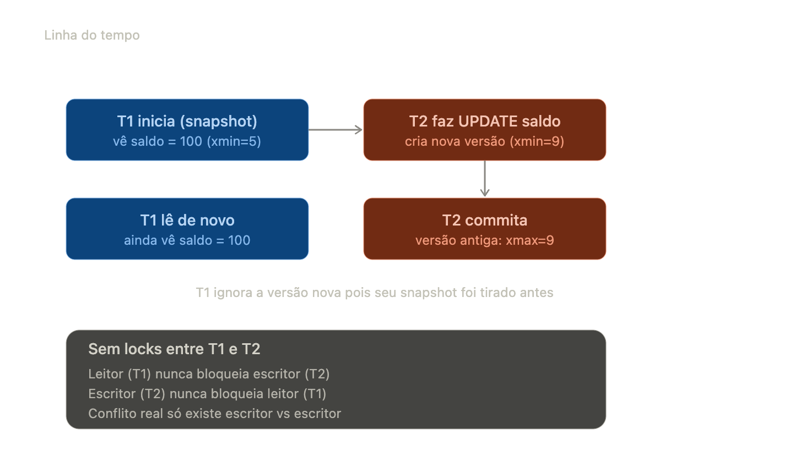

# MVCC — Controle de Concorrência Multi-Versão

## 1. O problema que o MVCC resolve

Bancos de dados tradicionais (lock-based) fazem controle de concorrência com locks: quando você lê uma linha, ela pode travar escritores; quando escreve, trava leitores. Isso funciona, mas cria um gargalo brutal em sistemas com alta concorrência — que é exatamente o seu caso em crédito/pagamentos, onde múltiplas transações leem e escrevem no mesmo saldo, contrato, ou status de análise simultaneamente.

MVCC resolve isso com uma ideia central: em vez de bloquear leitores contra escritores, o banco mantém múltiplas versões de cada linha. Leitores nunca bloqueiam escritores, e escritores nunca bloqueiam leitores. Só escritor-vs-escritor pode conflitar.

## 2. Como funciona por baixo dos panos

Cada linha (tuple) não é sobrescrita quando você faz um UPDATE. Em vez disso, o banco cria uma nova versão da linha, e marca a versão antiga como obsoleta (mas ainda visível para transações que começaram antes dela existir).

No PostgreSQL, cada linha tem metadados ocultos:

```md
xmin  → ID da transação que criou esta versão
xmax  → ID da transação que "deletou"/substituiu esta versão (NULL se ainda válida)
```

Quando você faz UPDATE, o Postgres:

1. Marca a linha antiga com xmax = ID da transação atual
2. Insere uma linha nova com xmin = ID da transação atual
3. A linha antiga não é removida na hora — fica lá até o VACUUM limpar (você já deve ter esbarrado nisso estudando isolamento).

Um DELETE só seta xmax, sem inserir nova versão. Um INSERT só cria xmin.

## 3. Snapshot e visibilidade

Cada transação, ao começar, tira um snapshot: basicamente "quais transações já commitaram até agora, e quais IDs de transação são visíveis pra mim".

Quando você lê uma linha, o banco checa: essa versão foi criada por uma transação que já commitou antes do meu snapshot? Ela foi invalidada por uma transação que também já commitou antes do meu snapshot? Com base nisso decide se te mostra aquela versão ou não — sem nunca precisar de lock de leitura.

É por isso que em READ COMMITTED cada SELECT dentro da mesma transação pega um snapshot novo, e em REPEATABLE READ/SERIALIZABLE o snapshot é fixado no início da transação — o que explica fenômenos como non-repeatable read que você já deve ter estudado nos seus arquivos de isolamento.



## 4. Anomalias e níveis de isolamento sob MVCC

Isso conecta direto com o que você já estudou sobre isolation levels:

1. READ COMMITTED: cada statement pega um snapshot novo. Evita dirty read, mas permite non-repeatable read e phantom read.
2. REPEATABLE READ (Postgres usa MVCC "puro" aqui, diferente do padrão SQL baseado em locks): snapshot fixado no início da transação. Evita non-repeatable read e phantom read, mas ainda pode ter write skew (duas transações leem dados disjuntos, cada uma valida uma regra de negócio baseada no que leu, e ambas commitam violando uma invariante que dependia das duas juntas).
3. SERIALIZABLE: no Postgres, usa SSI (Serializable Snapshot Isolation) — ainda é MVCC, mas com detecção adicional de dependências perigosas entre transações. Se detectar um padrão que poderia gerar anomalia de serialização, aborta uma das transações com erro de serialização, forçando retry.

Write skew é o ponto que mais cai em entrevista de fintech. Exemplo clássico pro seu domínio: duas transações de aprovação de crédito, cada uma verifica "soma dos limites aprovados hoje < X" e aprova um novo contrato. Se rodarem concorrentemente em REPEATABLE READ, cada uma vê o snapshot sem a aprovação da outra, e as duas passam — violando o limite agregado. Isso não é pego por REPEATABLE READ comum, só por SERIALIZABLE (com retry) ou lock explícito (SELECT FOR UPDATE).

## 5. Locks que ainda existem apesar do MVCC

MVCC elimina locks leitor-vs-escritor, mas não elimina todos os locks:

1. Row-level locks explícitos: SELECT ... FOR UPDATE, FOR SHARE — usados quando você precisa garantir que ninguém mais altere a linha até você commitar (típico em fluxo de aprovação de crédito, reserva de saldo, etc).
2. Escritor vs escritor ainda serializa: se duas transações tentam UPDATE a mesma linha concorrentemente, a segunda espera a primeira commitar ou abortar.
3. Predicate locks (usados no SSI do Postgres para SERIALIZABLE) — não bloqueiam de fato, mas rastreiam dependências para decidir se deve abortar alguém.

## 6. VACUUM — o "colecionador de lixo" do Postgres

Como o MVCC nunca sobrescreve, versões antigas (dead tuples) se acumulam. O VACUUM:

- Remove tuples cujas versões antigas não são mais visíveis para nenhuma transação ativa
- Atualiza estatísticas para o planner
- Evita o transaction ID wraparound (o contador de XID é finito — ~2 bilhões — e sem vacuum o banco pode travar por segurança)

Se você tiver transações muito longas (long-running transactions) abertas, elas seguram o vacuum de limpar tuples que ainda são "visíveis" para elas — isso é a causa clássica de table bloat em produção. Algo bem relevante em sistemas de crédito com jobs batch ou transações distribuídas mal fechadas.

### *Links*

- <https://blog.4linux.com.br/postgresql-e-o-controle-de-concorrencia-por-multiversao-mvcc/>
