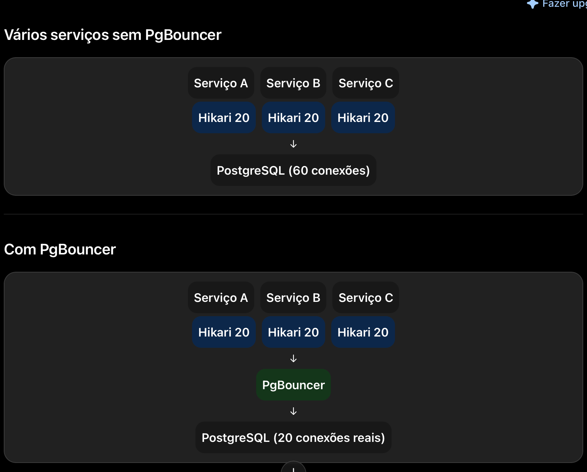
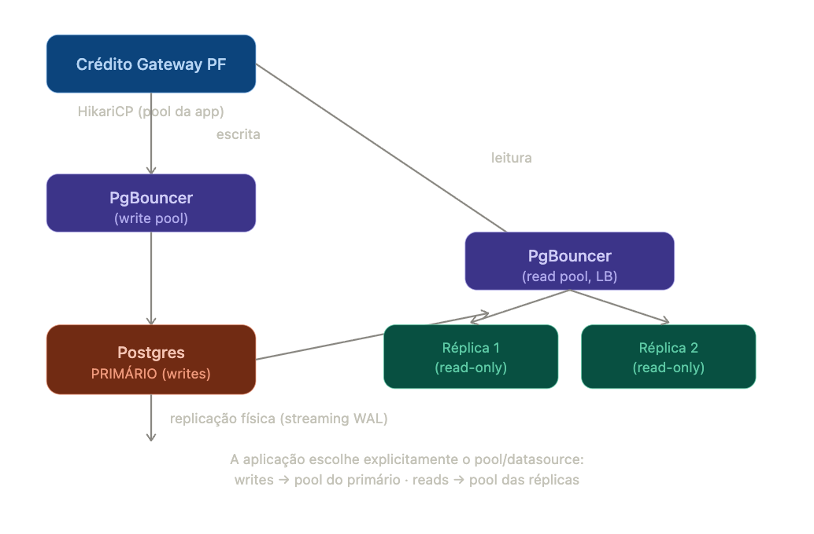
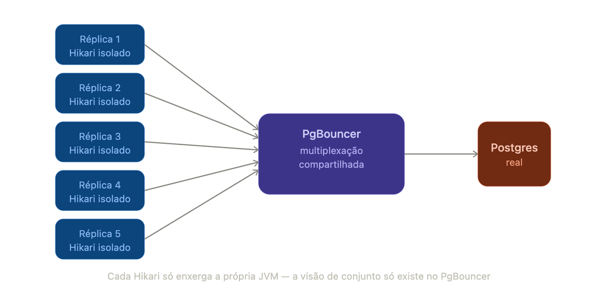
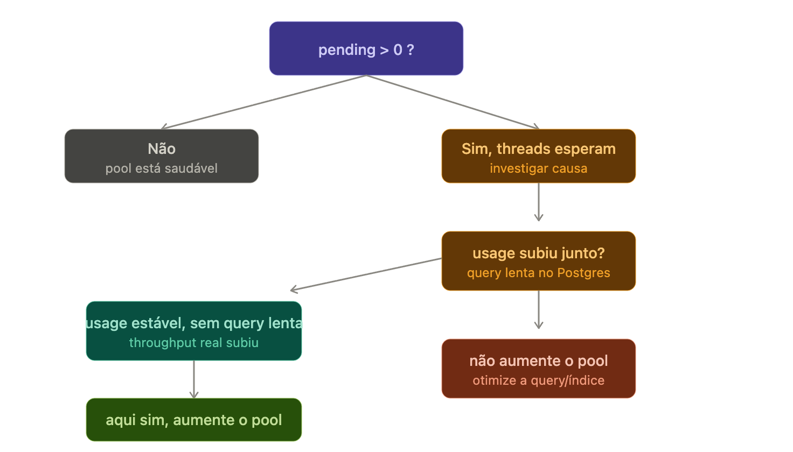

# PgBouncer

PgBouncer é um connection pooler externo e leve para PostgreSQL. É um processo separado — não faz parte do Postgres, não vem instalado com ele — que fica posicionado entre a aplicação e o banco de dados real, multiplexando muitas conexões lógicas vindas das aplicações em um número bem menor de conexões físicas reais contra o Postgres.

> Multiplexação é a técnica que permite enviar múltiplos sinais ou fluxos de dados de forma simultânea por um único meio físico.

> Ele nao executa SQL, so distribui as conexoes

> ele desacopla o número de clientes conectados do número de conexões que o PostgreSQL precisa manter abertas, reutilizando essas conexões de forma eficiente. É isso que o HikariCP, por estar limitado a uma única aplicação, não consegue fazer.



Em uma frase: é um pool de conexões que existe fora da sua aplicação, compartilhado entre várias aplicações, na frente do banco.

Do ponto de vista do HikariCP, o PgBouncer fala o mesmo protocolo de wire do Postgres — ele parece um Postgres normal. A aplicação nem sabe que existe algo no meio.

## Por que ele existe: o problema de fundo

Já vimos que o HikariCP (pool dentro da aplicação) resolve o custo de abrir e fechar conexão a cada request. Mas o HikariCP só enxerga a própria aplicação. Ele não sabe que existem outras 8 instâncias do mesmo serviço rodando em Kubernetes, nem que existem outros 20 microsserviços diferentes batendo no mesmo Postgres.

Cada conexão física no Postgres custa um processo inteiro do sistema operacional — não uma thread leve, um processo, com sua própria memória (work_mem, buffers de contexto). O Postgres, por padrão, tolera algo como max_connections = 100. Ele não foi desenhado pra sustentar milhares de processos simultâneos.

Quando você multiplica microsserviços × réplicas × tamanho do pool de cada um, o número exagera rápido:

```md
9 serviços × 5 réplicas × 30 conexões = 1.350 conexões potenciais
```

Isso estoura o limite do Postgres só de manter os pools "de prontidão" — nem precisa ter tráfego alto pra isso acontecer, é conta de infraestrutura ociosa.

## O que o PgBouncer resolve

Ele adiciona uma segunda camada de pooling, entre o pool de cada aplicação e o banco:

- Recebe centenas ou milhares de conexões lógicas das aplicações
- Mantém, internamente, um número muito menor de conexões físicas reais com o Postgres
- Reaproveita essas conexões físicas entre diferentes clientes, de acordo com o modo de pooling configurado

Ou seja: ele faz pro Postgres, em escala de infraestrutura, o mesmo que o HikariCP faz pra uma única aplicação — só que `multiplexando` entre muitos consumidores diferentes, não um

## Quem precisa implementá-lo

Depende de onde o banco roda:

| Ambiente | Quem cuida disso |
|---|---|
| Self-hosted / EC2 / infra própria | Você (ou o time de infra/DBA) instala e configura o `pgbouncer.ini` manualmente |
| RDS (AWS) | Existe o **RDS Proxy**, equivalente gerenciado — você ativa via console/Terraform, mas ainda precisa escolher habilitar |
| Supabase, Neon, Aurora Serverless | Geralmente já vem com um pooler na frente por padrão |

___

# Instância única vs. replicação

## Cenário 1 — instância única (sem réplicas)

Aqui o PgBouncer resolve exatamente o problema que descrevi antes: várias aplicações (ou várias réplicas da mesma aplicação) mantendo pools de HikariCP, todas mirando um único Postgres primário. O PgBouncer multiplexa tudo isso em menos conexões físicas reais.

```md
App A (5 réplicas × 20 conn) ─┐
App B (3 réplicas × 20 conn) ─┼─→ PgBouncer ─→ Postgres (1 instância)
App C (9 réplicas × 30 conn) ─┘
```

Sem PgBouncer, isso seria (5×20) + (3×20) + (9×30) = 430 conexões batendo direto no banco. Com PgBouncer no meio, você configura por exemplo default_pool_size: 20 por banco lógico, e o Postgres real só enxerga uma fração disso.

## Cenário 2 — com réplicas de leitura (read replicas)

Aqui a arquitetura fica em duas camadas, e o PgBouncer normalmente entra em cada nó, não como um único ponto central:



PgBouncer não faz replicação nem escolhe réplica sozinho. Ele só faz pooling — reduz o número de conexões físicas contra um Postgres alvo. A decisão de "essa query vai pro primário ou pra réplica" é geralmente feita:

- Na aplicação, via dois DataSource/HikariCP distintos (um apontando pro pool de escrita, outro pro pool de leitura) — é o padrão mais comum em Spring, geralmente com @Transactional(readOnly = true) roteando pro datasource certo

- Ou por uma camada intermediária mais sofisticada, tipo PgPool-II (diferente do PgBouncer — esse sim tem roteamento read/write e balanceamento entre réplicas embutido) ou um proxy como o pgcat

A replicação física em si (Postgres primário → réplicas, via streaming de WAL) é uma configuração nativa do Postgres, não tem nada a ver com pooling — são duas camadas ortogonais: replicação resolve "ter cópias dos dados", pooling resolve "gerenciar conexões eficientemente contra cada uma dessas instâncias".

- HikariCP otimiza a aplicação.
- PgBouncer protege e otimiza o PostgreSQL.

___

# O que cada um enxerga: Hikari vs pgBouncer

HikariCP vive dentro de uma instância da aplicação. Ele só sabe da existência da própria JVM onde está rodando. Se você tem 5 réplicas do Crédito Gateway PF no Kubernetes, existem 5 HikariCPs diferentes, cada um com seu próprio pool, sem nenhuma comunicação entre eles.

PgBouncer vive fora da aplicação, como uma peça de infra compartilhada. Ele enxerga conexões vindas de todas as réplicas, de todos os serviços que apontam pra ele — é um ponto central de multiplexação.

## Por que o Hikari sozinho não resolve o problema de escala

Cada HikariCP, isoladamente, é ótimo em resolver "não abrir/fechar conexão a cada request dentro dessa JVM". Mas ele não tem visão nenhuma do todo. Se você configura maximumPoolSize: 30 em cada uma das 5 réplicas, o Hikari de cada uma vai alegremente manter até 30 conexões físicas abertas — ele não sabe, e não tem como saber, que existem outras 4 réplicas fazendo o mesmo.



## Analogia rápida

Pense nos garçons de novo: o HikariCP é "cada restaurante tem seus próprios garçons de plantão". O PgBouncer é "vários restaurantes de um shopping compartilham um pool central de garçons freelancers, gerenciado por uma agência" — reduz o total de gente contratada no shopping inteiro, mesmo que cada restaurante individualmente já tenha resolvido bem o próprio atendimento.

## Quando o Hikari sozinho já é suficiente

Se você tem um único serviço, com poucas réplicas, e o Postgres tem folga de max_connections de sobra pra sustentar réplicas × maximumPoolSize, o Hikari sozinho resolve tudo. O PgBouncer só entra quando a soma agregada de conexões de todos os consumidores do banco (múltiplos serviços, múltiplas réplicas) ameaça estourar o limite físico do Postgres — isso é decisão de plataforma/infra, não de uma aplicação isolada.

Vale notar também: Se o PgBouncer está em transaction pooling, o Hikari por baixo dele precisa se comportar bem com isso (evitar SET de sessão, prepared statements nomeados fora de transação). Então não é só "empilhar" um em cima do outro sem pensar; a combinação dos dois exige atenção específica.

___

# Observabilidade

## Camada 1 — HikariCP: métricas nativas via Micrometer

O HikariCP já vem com métricas prontas se você tiver micrometer-core no classpath (que no seu stack Spring Boot já vem por padrão com actuator + micrometer-registry-*). Ele expõe essas métricas automaticamente, prefixadas com hikaricp.connections:

|Métrica|O que significa|O que observar|
|--|--|--|
|hikaricp.connections.active|conexões em uso agora|se fica colada no maximumPoolSize por longos períodos, é sinal de saturação|
|hikaricp.connections.idle|conexões ociosas disponíveis| disponíveisse sempre próximo de zero, o pool está no limite|
|hikaricp.connections.pending|threads esperando por conexão|essa é a métrica mais importante — qualquer valor consistentemente > 0 significa que threads estão na fila|
|hikaricp.connections.usage|tempo (histograma) que uma conexão fica emprestada por uso|se sobe, cada conexão está "presa" mais tempo — reduz o throughput efetivo do pool|
|hikaricp.connections.acquire|tempo pra conseguir uma conexão do pool|se sobe, indica fila/contenção crescente|
|hikaricp.connections.creation|tempo pra criar uma conexão física nova|se está lento, é sintoma de rede/banco, não do pool em si|
|hikaricp.connections.timeout|contador de timeouts ao esperar conexão|qualquer valor > 0 é um evento a investigar — request falhou por causa do pool|
|hikaricp.connections.max / .min|valores configurados|referência pra comparar com uso real|



#### Como isso chega no seu stack (Dynatrace/Grafana)

Como você já usa Spring Boot + Actuator, essas métricas saem via /actuator/prometheus (formato Micrometer/Prometheus) automaticamente, desde que:

```yaml
management:
  endpoints:
    web:
      exposure:
        include: prometheus, health, metrics
  metrics:
    enable:
      hikaricp: true
```

No Grafana, o painel clássico é: hikaricp_connections_active + hikaricp_connections_idle empilhados contra hikaricp_connections_max (linha de referência), com hikaricp_connections_pending num painel separado — porque pending > 0 é o alarme, não uma métrica de "volume normal".

No Dynatrace, se você já usa auto-instrumentação Java, o Hikari costuma aparecer automaticamente na aba de "Database" / "Connection pools" do serviço, com o mesmo conjunto de sinais.

## Camada 2 — PgBouncer: métricas via comandos administrativos

O PgBouncer não expõe Prometheus nativamente — ele tem um console administrativo acessível via protocolo Postgres normal, conectando num banco virtual chamado pgbouncer:

```sql
psql -h pgbouncer_host -p 6432 -U admin_user pgbouncer
SHOW POOLS;
SHOW STATS;
SHOW CLIENTS;
SHOW SERVERS;
```

`SHOW POOLS` é o comando mais direto — retorna, por banco/usuário, colunas como:

|Coluna|Significado|
|--|--|
|cl_active|clientes (conexões lógicas da app) atualmente servidos|
|cl_waiting|clientes esperando por uma conexão física livre — o equivalente ao pending do Hikari|
|sv_active|conexões físicas reais em uso contra o Postgres|
|sv_idle|conexões físicas ociosas no pool do PgBouncer|
|maxwait|tempo (segundos) que o cliente mais antigo na fila está esperando|

O sinal de alarme aqui é o mesmo princípio do Hikari: cl_waiting consistentemente > 0 ou maxwait crescendo significa que o default_pool_size do PgBouncer está pequeno pra demanda agregada.

Pra observabilidade contínua (não só consulta manual), o caminho padrão é rodar o pgbouncer_exporter (Prometheus exporter da comunidade), que faz esse SHOW POOLS/SHOW STATS por trás e expõe como métricas Prometheus (pgbouncer_pools_client_waiting, pgbouncer_pools_server_active, etc) — daí você integra no mesmo Grafana onde já visualiza Hikari.

### O critério de decisão, junto

A pergunta real não é "quando aumento o número", é "onde está a fila". A ordem de investigação correta é sempre de fora pra dentro:

1. hikaricp.connections.pending > 0 persistente? → threads da sua aplicação estão esperando conexão do Hikari
2. Antes de aumentar o Hikari, cheque hikaricp.connections.usage — se o tempo de uso por conexão subiu junto, o problema é query lenta no banco, não tamanho de pool. Aumentar o pool aqui só empurra a fila pro Postgres.
3. Se usage está estável mas pending sobe porque o volume de requests aumentou de verdade → aí sim, considere aumentar maximumPoolSize do Hikari
4. Do lado do PgBouncer, olhe cl_waiting e maxwait — se sobe mesmo com Hikari saudável, o gargalo é o default_pool_size do PgBouncer, ou o próprio Postgres saturado (aí olha sv_active batendo no teto configurado no PgBouncer)
5. Sempre cheque o Postgres em si por último: pg_stat_activity, uso de CPU, pg_stat_statements pra achar queries lentas — porque nenhum ajuste de pool resolve banco saturado, só distribui melhor a fila

Regra prática: nunca aumente um número de pool baseado só em "sinto que tá lento" — aumente quando pending/cl_waiting mostra fila real, e você já descartou que o motivo é query lenta ou banco sob carga (que é o cenário mais comum na prática, e que aumentar pool não resolve, só mascara temporariamente).

#### _Links_

- <https://www-scaleway-com.translate.goog/en/docs/tutorials/install-pgbouncer/?_x_tr_sl=en&_x_tr_tl=pt&_x_tr_hl=pt&_x_tr_pto=tc&_x_tr_hist=true>

- <https://kubedb-com.translate.goog/articles/deploy-pgbouncer-using-kubernetes-pgbouncer-operator/?_x_tr_sl=en&_x_tr_tl=pt&_x_tr_hl=pt&_x_tr_pto=tc>

___
___

Cenário 1 - Apenas HikariCP

Imagine:

20 microserviços
Cada um com maximumPoolSize = 20

Você terá, no pior caso:

20 serviços
× 20 conexões
---------------

400 conexões abertas no PostgreSQL

Onde começa o problema?

O problema aparece quando você escala horizontalmente.

Imagine agora:

20 microserviços

Cada serviço possui:

10 pods

Cada pod possui:

Hikari = 20

Agora temos

20 serviços
× 10 pods
× 20 conexões

= 4.000 conexões

Aí o PostgreSQL começa a sofrer.

Não porque existem 4.000 queries.

Mas porque existem 4.000 conexões abertas.

Cada conexão possui:

memória
processo/backend
buffers
locks
gerenciamento interno

No PostgreSQL uma conexão não é barata.

> O gatilho não é o número de requisições por segundo (RPS). O verdadeiro gatilho é quando a soma de todas as conexões dos pools Hikari (de todos os pods e microserviços) passa a representar um custo significativo para o PostgreSQL. Nesse momento, o PgBouncer permite que milhares de clientes lógicos compartilhem um número muito menor de conexões físicas com o banco, reduzindo drasticamente esse custo.
